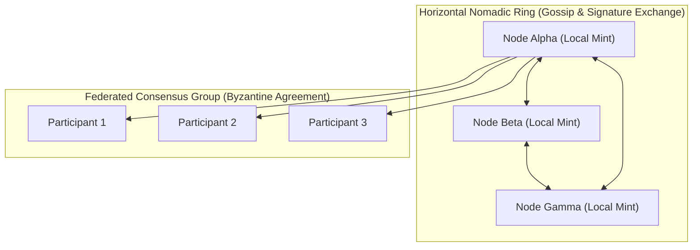

# Bonfire Nomadic Rings: Federated Consensus & Egalitarian Microhedging

This document formalizes the decentralized architecture of the **Bonfire Peer-to-Peer Subsystem** through the lens of hybrid federated systems, Bitcoin-inspired microhedging, and the collective sense-making protocols of **Project Liminality**.

---

## 1. Hybrid Topologies: Horizontal Rings & Federated Mints

Traditional distributed architectures suffer from a fundamental tension:
- **Hierarchical systems** (like centralized master-worker grids) introduce single points of failure, censorship vectors, and systemic bottlenecks.
- **Purely horizontal peer-to-peer networks** (like flat gossip networks) experience massive propagation delays and coordination drag under high-dimensional state consensus.

To resolve this, the Bonfire network implements a **mixed hierarchical/horizontal hybrid overlay**, drawing inspiration from Bitcoin's federated scaling models (such as **Fedimint** and **Fedi networks**):

### The Architecture
1. **Local Federated Mints**: Small, high-trust consensus groups (Byzantine Fault Tolerant federation layers) act as local anchors. They manage local user contracts and representation budgets, ensuring state updates are validated locally without global overhead.
2. **Horizontal Nomadic Rings**: Individual mint federations connect horizontally in a peer ring using the **Nomadic Ring Protocol**. Instead of broadcasting raw high-dimensional state tensors, they exchange compressed **topological signatures** (Betti numbers, Euler characteristics, and coprime residues) periodically via background daemon loops.
3. **Synthetic Endpoints**: Idle or high-performance peers within the horizontal ring advertise their available computational capacities (RAM, GPU), allowing resource-constrained nodes to offload heavy calculations (e.g., ADMR or Weyl sequence evaluations) with strict, non-blocking timeouts.

---

## 2. Egalitarian Microhedging & Bitcoin-Inspired Risk Balancing

In a shared decentralized reasoner network, nodes face the risk of **representation depletion**—where local gradient collapse or out-of-boundary constraints exhaust local fossil budgets. To survive, nodes must balance their risk profiles cooperatively.

### The Fractional Kelly Consensus Protocol
Nodes calculate their local confidence parameters and optimal fractional allocations using the local covariance matrix ($\Sigma$) and valence drive. These allocations are shared across the ring:

$$\bar{K} = \frac{1}{M} \sum_{m=1}^{M} K_m, \quad \bar{P}_{\text{success}} = \frac{1}{M} \sum_{m=1}^{M} P_{\text{success}, m}$$

Where:
- $K_m$ is the fractional Kelly betting allocation for Node $m$.
- $P_{\text{success}, m}$ is the local probability of structural convergence.
- $\bar{K}$ is the aggregated **Egalitarian Consensus Kelly Allocation**.

### Real-Time Microhedging
By shifting local allocations toward the egalitarian mean consensus, nodes perform **real-time microhedging** of logical commitments:
- If a local node's hypothesis is highly volatile (large covariance variance), it hedges its position by routing computational stakes to stable, co-prime channels validated by the consensus of healthy peer rings.
- This mirrors Bitcoin lightning-channel rebalancing, where fractional capital is dynamically routed to maintain system-wide liquidity and prevent transaction failure. Here, the "liquidity" is **computational capacity** and **topological representation space**.

---

## 3. Project Liminality & The InterBrain Protocol

The conceptual design of the Bonfire network is deeply aligned with **Project Liminality's** philosophy of human-machine sense-making and the creation of the **InterBrain**:

> *"We must flip the vector of conflict and fragmentation toward unity, establishing protocols for collective dreamweaving."*

By exchanging topological invariants rather than semantic strings, the Bonfire network bypasses the linguistic scalarization trap (the Chinese Room failure mode):
- **Non-Rivalrous Ingestion**: Cooperating nodes ingest external news feeds and sovereign logic drips (verifying access against `robots.txt` boundaries). The resulting invariants are woven into the collective Neglecton graph.
- **Topological Symplectic Gluing**: When two nodes disagree, they do not attempt to force semantic alignment. Instead, they apply a **Homotopy Deformation** using a symplectic gluing parameter to join their local manifolds along non-orientable boundaries.
- **The Collective Dream**: The hybrid network operates as a decentralized, non-teleological simulator (the InterBrain). It allows individual nodes to "dream" in their local private coordinate zones (shielded by geometric user contracts) while maintaining structural alignment with the horizontal ring.

Through this synthesis of physical simulation, cryptographic federation, and collective sense-making, the Bonfire Nomadic Rings translate competitive adversarial optimization into collaborative, organic structural resonance.
