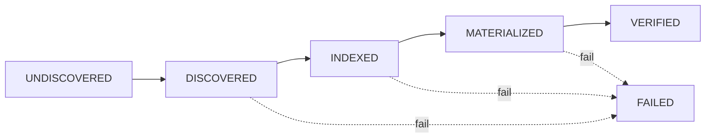

# Data Pipeline

> Conversational API ingestion, runtime pressure generation, and textbook-quality filtering.

---

## 1. Conversational API Ingestor

**Source**: [`src/data/conversational_api_ingestor.py`](../src/data/conversational_api_ingestor.py) (1,107 lines)

Unified conversational data ingestion from multiple API sources.

### Data Model

| Dataclass | Fields |
|-----------|--------|
| `ConversationTurn` | `speaker_id`, `text`, `timestamp`, `embedding`, `affordance_gradients` |
| `Conversation` | `conversation_id`, `turns[]`, `context`, `source`, `labels`, `pressure_signature` |

### Ingestors

| Class | Source | Capabilities |
|-------|--------|-------------|
| `HuggingFaceConversationalIngestor` | HF Hub API | LMSYS-chat-1m, OASST2, UltraChat. Direct API + `datasets` lib. Synthetic fallback when HF unavailable |
| `RedditConversationalIngestor` | Reddit API | OAuth2 auth, subreddit posts, threaded comments → conversation trees |
| `ConvoKitIngestor` | ConvoKit library | Labeled corpora (Wikipedia talk, Supreme Court, etc.) |

### Orchestrator

`ConversationalAPIIngestor` — coordinates all three ingestors:
- `ingest_huggingface_dataset(dataset_id, max_samples)` → parsed `Conversation[]`
- `ingest_reddit_subreddit(subreddit, max_posts)` → threaded `Conversation[]`
- `ingest_convokit_corpus(corpus_name)` → labeled `Conversation[]`
- Caching via JSON serialization to `data/conversational_cache/`

### Processor

`ConversationalDataProcessor` transforms raw conversations for the gyroidic system:
- `compute_text_embedding(text)` → `[1, dim]` via `CanonicalProjector`
- `compute_affordance_gradients(text)` → dict of soft signals (code, math, conversation, API, etc.)
- `generate_pressure_signature(conversation)` → polynomial CRT-based pressure tensor

---

## 2. Pressure Ingestor

**Source**: [`src/data/pressure_ingestor.py`](../src/data/pressure_ingestor.py) (671 lines)

Runtime code generation for constraint forcing. **No polite APIs. No silent failures.**

### Phase Model



Each source transitions through 4 phases, with code generated dynamically per phase:

| Phase | Method | Purpose |
|-------|--------|---------|
| Discover | `_generate_discover_code(source)` | Locate data sources, detect formats |
| Index | `_generate_index_code(source, state)` | Build structural index from discovered data |
| Fetch | `_generate_fetch_code(source, state)` | Retrieve and convert to constraint tensors |
| Verify | `_generate_verify_code(source, state)` | Validate constraints against expected properties |

### Key Design

- **Assume failure, prove success**: `assume_failure()` → must call `prove_success()` with evidence
- `SourceDescriptor`: grammar defining discover/index/fetch/verify patterns per source
- `force_pressure_ingestion(source_names)` — materializes across all sources
- `get_constraint_batch(batch_size)` → `[batch, dim]` tensors for gyroidic expansion

---

## 3. Textbook Filter

**Source**: [`src/data/textbook_filter.py`](../src/data/textbook_filter.py) (335 lines)

Phi-1 "Textbooks Are All You Need" inspired quality filtering with **non-scalar admissibility**.

### Quality Dimensions

| Dimension | Threshold | Measures |
|-----------|-----------|----------|
| `self_contained` | 0.3 | Minimal external dependencies, complete examples |
| `instructive` | 0.3 | Teaching patterns, explanations, commented code |
| `algorithmic` | 0.15 | Algorithm keywords, data structure mentions |
| `clarity` | 0.3 | Readability, structure, formatting quality |

### Admissibility

Admissible iff **ALL** dimension gates pass independently — no cross-domain scalarization.

```
QualityReport.admissible = all(dimension_gates.values())
```

| Method | Purpose |
|--------|---------|
| `assess(text, source)` → `QualityReport` | Score all 4 dimensions with per-dimension gates |
| `filter_batch(texts)` → `[{text, admissible, report}]` | Batch filtering |
| `get_statistics(reports)` → aggregate stats | Pass rates, flag counts |

Detects code vs. instruction content automatically (`_is_code`) and applies different heuristics (`_assess_code` vs. `_assess_instruction`).
