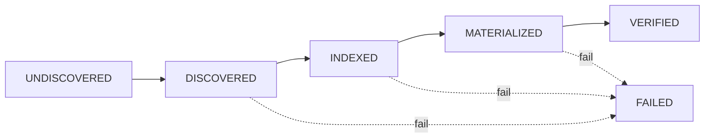

# Data Pipeline

> Conversational API ingestion, runtime pressure generation, and textbook-quality filtering.

---

## 1. Conversational API Ingestor

**Source**: [`src/data/conversational_api_ingestor.py`](../src/data/conversational_api_ingestor.py) (1,107 lines)

Unified conversational data ingestion from multiple API sources.

### Data Model

| Dataclass | Fields |
|-----------|--------|
| `ConversationTurn` | `speaker_id`, `text`, `timestamp`, `embedding`, `affordance_gradients` |
| `Conversation` | `conversation_id`, `turns[]`, `context`, `source`, `labels`, `pressure_signature` |

### Ingestors

| Class | Source | Capabilities |
|-------|--------|-------------|
| `HuggingFaceConversationalIngestor` | HF Hub API | LMSYS-chat-1m, OASST2, UltraChat. Direct API + `datasets` lib. Synthetic fallback when HF unavailable |
| `RedditConversationalIngestor` | Reddit API | OAuth2 auth, subreddit posts, threaded comments  conversation trees |
| `ConvoKitIngestor` | ConvoKit library | Labeled corpora (Wikipedia talk, Supreme Court, etc.) |

### Orchestrator

`ConversationalAPIIngestor`  coordinates all three ingestors:
- `ingest_huggingface_dataset(dataset_id, max_samples)`  parsed `Conversation[]`
- `ingest_reddit_subreddit(subreddit, max_posts)`  threaded `Conversation[]`
- `ingest_convokit_corpus(corpus_name)`  labeled `Conversation[]`
- Caching via JSON serialization to `data/conversational_cache/`

### Processor

`ConversationalDataProcessor` transforms raw conversations for the gyroidic system:
- `compute_text_embedding(text)`  `[1, dim]` via `CanonicalProjector`
- `compute_affordance_gradients(text)`  dict of soft signals (code, math, conversation, API, etc.)
- `generate_pressure_signature(conversation)`  polynomial CRT-based pressure tensor

---

## 2. Pressure Ingestor

**Source**: [`src/data/pressure_ingestor.py`](../src/data/pressure_ingestor.py) (671 lines)

Runtime code generation for constraint forcing. **No polite APIs. No silent failures.**

### Phase Model


```mermaid
graph LR
    U["UNDISCOVERED"] --> D["DISCOVERED"]
    D --> I["INDEXED"]
    I --> M["MATERIALIZED"]
    M --> V["VERIFIED"]
    D -.->|fail| F["FAILED"]
    I -.->|fail| F
    M -.->|fail| F
```

Each source transitions through 4 phases, with code generated dynamically per phase:

| Phase | Method | Purpose |
|-------|--------|---------|
| Discover | `_generate_discover_code(source)` | Locate data sources, detect formats |
| Index | `_generate_index_code(source, state)` | Build structural index from discovered data |
| Fetch | `_generate_fetch_code(source, state)` | Retrieve and convert to constraint tensors |
| Verify | `_generate_verify_code(source, state)` | Validate constraints against expected properties |

### Key Design

- **Assume failure, prove success**: `assume_failure()`  must call `prove_success()` with evidence
- `SourceDescriptor`: grammar defining discover/index/fetch/verify patterns per source
- `force_pressure_ingestion(source_names)`  materializes across all sources
- `get_constraint_batch(batch_size)`  `[batch, dim]` tensors for gyroidic expansion

---

## 3. Textbook Filter

**Source**: [`src/data/textbook_filter.py`](../src/data/textbook_filter.py) (335 lines)

Phi-1 "Textbooks Are All You Need" inspired quality filtering with **non-scalar admissibility**.

### Quality Dimensions

| Dimension | Threshold | Measures |
|-----------|-----------|----------|
| `self_contained` | 0.3 | Minimal external dependencies, complete examples |
| `instructive` | 0.3 | Teaching patterns, explanations, commented code |
| `algorithmic` | 0.15 | Algorithm keywords, data structure mentions |
| `clarity` | 0.3 | Readability, structure, formatting quality |
| `structural_honesty` | 0.8 | Anti-lobotomy filter, rejects placeholders/TODOs |

### Admissibility

Admissible iff **ALL** dimension gates pass independently  no cross-domain scalarization.

```
QualityReport.admissible = all(dimension_gates.values())
```

| Method | Purpose |
|--------|---------|
| `assess(text, source)`  `QualityReport` | Score all 4 dimensions with per-dimension gates |
| `filter_batch(texts)`  `[{text, admissible, report}]` | Batch filtering |
| `get_statistics(reports)`  aggregate stats | Pass rates, flag counts |

Detects code vs. instruction content automatically (`_is_code`) and applies different heuristics (`_assess_code` vs. `_assess_instruction`).

---

## 4. Sovereign Lore Ingestor (ArXiv + SearXNG)

**Source**: [`src/data/knowledge_ingestor.py`](../src/data/knowledge_ingestor.py)

Background slow-drip ingestion pipeline fetching high-density lore residues from ArXiv (OAI-PMH and Atom API) and the Open Web via a privacy-preserving **SearXNG** integration (with strict `robots.txt` compliance and `BeautifulSoup` content extraction).

### Fast Index Deduplication

On engine startup, instead of performing a costly $O(N)$ scan of all `.pt` files and executing `torch.load` to verify previous runs, `ArXivSovereignIngestor._load_fossilized_arxiv_ids` queries the pre-existing fast `.fossil_index.json` index (`fossilizer.fossil_index`). This eliminates start-up delays entirely.

### Dynamic Meta-State Steering

Rather than cycling hardcoded topics uniformly, the ingestor dynamically samples categories based on the reasoner's live `meta_state` trajectory:

1. **Archetypal Vector Signatures**: Every category maps deterministically to an orthogonal signature vector in engine space:
   ```python
   v = _get_category_signature(category_name)
   ```
2. **Cosine Alignment**: Computes similarities between live `meta_state` and category vectors.
3. **Softmax Sampling**: Feeds similarities into Softmax ($T=0.2$) to construct a steerable probability distribution, drawing the next ingest query.

### Active Category Corpus (Science & Humanities)

Specifically includes hard-to-find humanities and societal overlaps to maintain philosophical depth:

| Domain | ArXiv Set Identifier | Description |
|---|---|---|
| **Mathematics** | `math`, `math.LO` | General Math and Mathematical Logic |
| **Quantum Physics** | `physics:quant-ph` | Quantum Physics / Topology |
| **AI & ML** | `cs:AI` | Artificial Intelligence |
| **History of Math** | `math.HO` | History and Overview of Mathematics |
| **History of Physics** | `physics:hist-ph` | **Deep Humanities**: History/Philosophy of Physics |
| **Computers & Society** | `cs:CY` | Digital Humanities, Ethics, and Social Regulation |
| **Sociophysics** | `physics:physics.soc-ph` | Physics-based social/economic modeling |
| **Computational Linguistics** | `cs:CL` | Language and Computational Philosophy |
| **Cognitive Science** | `q-bio.NC` | Neurons, Cognition, and Emergence |
| **HCI** | `cs:HC` | Human-Computer / Sociotechnical Interaction |
| **Theoretical Econ** | `econ:TH` | Mathematical Economics |
| **Quantitative Finance** | `q-fin:GN` | General Finance / Socio-economic dynamics |

---

## 5. IVSTEncoder (Intrinsic Volume and Spectral Tensor)

**Implementation**: [`models/modular_embeddings.py`](../src/models/modular_embeddings.py) (via `SimpleGraphEncoder` / `IVSTEncoder`)

The `IVSTEncoder` captures non-local topological data across conversation graphs or structural topologies. Instead of simple message-passing, it maps node features into a spectral tensor representation that tracks:

1. **Intrinsic Volume**: Preserves the scale and geometric "weight" of the subgraph (e.g., density of conversation loops or logical dependencies).
2. **Spectral Tensor**: Extracts graph eigenvalues to summarize the topological "shape" without being tied to specific local connectivities. 

This enables the reasoner to intuitively understand the macro-structure of data (e.g. conversational back-and-forth density, mathematical proof depth) without performing exhaustive O(N^2) token comparisons.

---

## 6. Multi-LLM Archive Friction Harvester

**Implementation**: [`data/chatgpt_friction_harvester.py`](../src/data/chatgpt_friction_harvester.py)

The `ChatGPTFrictionHarvester` mines structural resistance directly from human-AI conversational datasets. Originally built solely for ChatGPT exports, it now natively supports multi-LLM conversational archives, dynamically parsing exports from **Google Takeout/Gemini, Grok, Claude, and Perplexity**. It features automatic, on-the-fly recursive parsing of raw `.json`, `.html`, and `.zip` archives directly from the `/data/service_llm_archive/` directory without requiring manual extraction. Unlike standard APIs that just extract text, this system tracks non-ergodic phenomena where conversational flow hits "friction".

### Harvester Metrics

| Metric | Description | Resolution |
|--------|-------------|------------|
| **Archetype/Character Tracking** | Detects when the AI or human adopts specific, rigid identities (`archetype_identity`). | Provides topological anchors to categorize the style of friction. |
| **Non-Ergodic Agreement** | Identifies "smooth friction" where complex, atypical resonant cavities align naturally without triggering aborts. | Learns what healthy, non-trivial agreement looks like. |
| **Dead-End Cliffs** | Tags interactions where massive user context results in a vacuous/dismissive AI response (`dead_end_cliff`). | Explicitly marks dead logic to prevent the system from learning it. |
| **Jarring Subject Shifts** | Detects abrupt context switches (Bouligand Bubbles) using Jaccard bag-of-words similarity on consecutive user messages. | Highlights topological ruptures in conversational momentum. |

---

## 7. Open Science Ingestor

**Source**: [`src/data/open_science_ingestor.py`](../src/data/open_science_ingestor.py)

The `OpenScienceIngestor` integrates high-density scientific datasets (including LIGO strain streams and EuropePMC paper queries) into the reasoner's manifold.

### Dynamic Modality Handling
- **LIGO Strain Integration**: Fetches real gravitational wave strain time-series data from GWOSC APIs. If offline or missing dependencies, it falls back to a prime-ladder Chebyshev-Chebyshev oscillator simulation.
- **EuropePMC Integration**: Retrieves full text metadata from open-access PMC literature databases for scientific text filtering.
- **Hardware-Sovereign Fallbacks**: All ingestion failures trigger high-fidelity deterministic simulations rather than silent bypasses, preserving local substrate stability.


## Data Ingestion & Parsing Pipelines

This section was auto-generated to document classes discovered in the codebase that were previously floating free from the architectural map.

### `ConstraintDataset`
**Location:** `src\training\trainer.py`

**Description:**
No docstring provided.

---

### `DatasetInfo`
**Location:** `src\data\local_data_loader.py`

**Description:**
Metadata about a discovered local dataset.

---

### `GltfSplatIngestionPipeline`
**Location:** `src\data\gltf_splat_ingestor.py`

**Description:**
No docstring provided.

---

### `GoogleCloudIngestor`
**Location:** `src\data\google_cloud_ingestor.py`

**Description:**
Ingestor for Google Cloud Platform services.

Provides specialized methods for BigQuery and GCS data extraction.

---

### `GoogleDriveIngestor`
**Location:** `src\data\google_drive_ingestor.py`

**Description:**
Ingestor for Google Drive content.

Provides functionality to list folders, filter for "Nutrient" shards,
and download content for manifold integration.

---

### `InvestorNewsIngestor`
**Location:** `src\core\investor_news_ingestor.py`

**Description:**
No docstring provided.

---

### `LocalDatasetIngestor`
**Location:** `src\data\local_dataset_ingestor.py`

**Description:**
Ingestor for local assets found in DeepLearningStudio paths.

---

### `MCAReader`
**Location:** `src\data\minecraft_ingestor.py`

**Description:**
Anvil region file (.mca) parser.
Reads region file headers and decompresses specific chunk NBT compounds.

---

### `MinecraftIngestionPipeline`
**Location:** `src\data\minecraft_ingestor.py`

**Description:**
Coordinates region file scans, script extractions, and spatial voxel projections.
Fuses spatial NBT/Block parameters with textual scripts as Voxel-Text Dyads.

---

### `NBTReader`
**Location:** `src\data\minecraft_ingestor.py`

**Description:**
Stream-based decoder for Named Binary Tag (NBT) format.
Supports all tag types, lists, compounds, and array payloads.

---

### `SimpleTemporalDataset`
**Location:** `src\training\enhanced_temporal_training.py`

**Description:**
Simple temporal dataset for testing.

---

### `SovereignConversationalIngestor`
**Location:** `src\data\conversational_api_ingestor.py`

**Description:**
Sovereign Ingestor Hub for zero-auth and cloud-sourced data.

Integrates Stack Exchange, HN, Drive, and GCP manifolds into
the Reasoner's unified conversational pipeline.

---

### `SovereignIngestor`
**Location:** `src\data\sovereign_ingestor.py`

**Description:**
Orchestrator for zero-auth "Sovereign" data sources and immutable local datasets.

Bypasses centralized platform constraints in favor of direct API access (Hacker News Firebase, Stack Exchange) and local repository snapshots:
- **IRC Log Ingestion:** Fuzzy decoding (`latin-1` / `utf-8`) preserving topological friction across unmapped IRC byte sequences.
- **MADOC Snapshot Ingestion:** Multi-format ingestion (Parquet, JSONL, JSON, CSV) from the Multi-Platform Aggregated Dataset of Online Communities (Reddit, Voat, Bluesky, Koo). Reconstructs conversation thread hierarchies from parent-child post linkages and extracts linguistic complexity metrics under Option D.

---

### `TopologicalIngestionValidator`
**Location:** `src\core\topological_ingestion_validator.py`

**Description:**
Deterministic topological gate for the ingestion boundary.

Replaces:
- TextbookFilter LSTM classifier (learned, probabilistic)
- SparseRepunitProbe at wrong position (fixed-threshold, arithmetic)
- Bastardized VoynichLinguist in minecraft_ingestor (zero-vector input)
- Missing validation in diegetic_backend bimodal panels

Validates by computing structural rank of data against the active
polynomial coprime configuration. Sterile data (low rank, low soliton
entropy, high cohomological dimension) is refused at the door.

---

