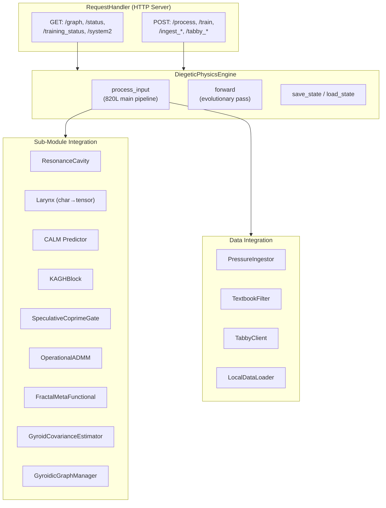

# Diegetic Physics Engine

> The main runtime backend — 3,637-line HTTP server integrating 30+ sub-modules into a single interactive physics engine.
> **Source**: [`src/ui/diegetic_backend.py`](../src/ui/diegetic_backend.py)

---

## 1. Architecture Overview



---

## 2. DiegeticPhysicsEngine

### Initialization (30+ sub-modules)

| Category | Components |
|----------|-----------|
| **Core** | `ResonanceCavity`, `ResonanceLarynx`, `GyroidCovarianceEstimator` |
| **KAGH** | `KAGHBlock`, `HarmonicWaveDecomposition` |
| **ADMM** | `OperationalADMM`, `CALM` |
| **Topology** | `SpeculativeCoprimeGate`, `SpeculativeHomologyEngine`, `GyroidicGraphManager` |
| **Extensions** | `MetaPolytopeMatrioshka`, `QuantumInspiredReasoningState` (optional) |
| **Fractal** | `FractalMetaFunctional` |
| **Data** | `PressureIngestor`, `TextbookFilter`, `TabbyClient`, `LocalDataLoader` |

### process_input Pipeline (820 lines)

The main method processes user text through these stages:

| Stage | Method(s) | Purpose |
|-------|-----------|---------|
| 1. Text → Tensor | `_text_to_tensor` | Polynomial rotating hash (anti-lobotomy) |
| 2. Affordance Gradients | `_compute_affordance_gradients` | Soft detection: code, math, conversation, API |
| 3. Constraint Injection | `_inject_constraint_pressure` | Force incompatible compressions to coexist |
| 4. Cavity Process | `cavity.process()` | Resonance dynamics, memory update |
| 5. KAGH + CALM | KAGH block + CALM veto | System 2 repairs if budget allows |
| 6. Response Generation | `_generate_dyad_aware_response` | Enhanced text via association system |
| 7. Gyroid Violation | `_compute_full_gyroid_violation_score` | Spectral + covariance + topological checks |
| 8. Unfolding Closure | `_perform_unfolding_closure_check` | Hyper-ring, cycle closure, triadic reciprocity |
| 9. Graph Update | `_perform_advanced_topological_analysis` | Betti numbers, persistence, graph connectivity |

### Supporting Methods

| Group | Methods |
|-------|---------|
| **Response** | `_generate_enhanced_response`, `_generate_fallback_response`, `_apply_linguistic_correction` |
| **Conversational** | `_detect_conversational_patterns`, `_extract_conversational_embeddings`, `_attempt_api_content_extraction` |
| **Association** | `_handle_dyad_ingestion`, `_handle_association_learning`, `_enhanced_association_learning` |
| **Topology** | `_compute_betti_numbers`, `_detect_topological_cycles`, `_estimate_manifold_curvature` |
| **System 2** | `_run_advanced_physics` (quantum/polytope if budget allows) |
| **Persistence** | `save_state`, `load_state`, `_repair_tensors` |

---

## 3. EncodingManager

Manages persistent encoding files — each interaction's topological trace is saved as a distinct artifact to prevent "erasing of implication."

| Method | Purpose |
|--------|---------|
| `get_latest_iteration()` | Scan encoding dir for last saved iteration |
| `save_encoding(iteration, text, tensors, metrics)` | Timestamped artifact with structural metrics |

---

## 4. RequestHandler (HTTP API)

### GET Endpoints

| Path | Response |
|------|----------|
| `/` | Serve `conversational_web_gui.html` |
| `/api/status` | Engine state, iteration count, component status |
| `/api/graph` | Graph topology JSON (nodes, edges, metrics) |
| `/api/training_status` | Training progress, log, results |
| `/api/system2` | System 2 (ADMM/CALM) diagnostics |

### POST Endpoints

| Path | Purpose |
|------|---------|
| `/api/process` | Process user input through full pipeline |
| `/api/train` | Launch async training (SpectralStructuralTrainer) |
| `/api/ingest_local` | Ingest local data via LocalDataLoader |
| `/api/tabby_test` | Test TabbyML connection |
| `/api/tabby_complete` | Code completion via TabbyML |
| `/api/tabby_chat` | Chat via TabbyML |
| `/api/tabby_generate_sample` | Generate synthetic training samples |

---

---

## 6. DAQUF Fossilization Operator (`src/core/daqf_operator.py`)

**Class**: `DAQUFOperator` — Diegetic Amortized Quantized Unknowledge Fossilization

The DAQUF operator manages "structural scars" — the system's accumulated history of contradictions that are never erased but are amortized over narrative time. It is invoked by the engine as an extension when `DAQFOperator` is in `EXTENSIONS_AVAILABLE`.

### The Five-Stage Pipeline (`apply_daquf`)

| Stage | Formula | Purpose |
|-------|---------|---------|
| **1. Unknowledge Load** | `χ(f_i) = Σ(Φ(f_i)=⊥) + mischief + valence` | Accumulates contradiction pressure per fossil slot |
| **2. Fossil Selection** | `f* = argmax χ(f_i)` | Identifies the current "Unknowledge Soliton" |
| **3. Diegetic Amortization** | `C̃ = C_τ / (N · τ)` | Spreads historical cost over narrative time |
| **4. Lattice Quantization** | `Q_f = round(f · Q_proj / ε_q)` | Projects fossil to integer lattice; Δ_q = error |
| **5. Speculative Persistence** | Non-collapse: flux ≠ 0 OR stable mischief soliton | Determines fossil survivorship |

### Love Invariant

The buffer `L` (a non-transferable persistent vector) is **never modified** after initialization. `check_invariants(original_L)` raises:

```
RuntimeError("LOVE INVARIANT VIOLATION: L has been modified.")
```

if `‖L_current − L_original‖₁ > 1e-8`. This is the only hard runtime assertion in the entire system.

### Metrics Emitted

```python
{
  'f_star_mask':     # Which fossil has max contradiction load
  'amortized_cost':  # C̃ = diegetic amortization scalar
  'Delta_q':         # Quantization error (structural memory)
  'persistence':     # [0,1] per fossil survivorship 
  'love':            # L — the immutable invariant tensor
  'tau':             # Narrative time elapsed
}
```

---

## 7. Audience Projection (`src/core/audience_mapping.py`)

**Class**: `AudienceProjection`  
**Operator**: Φ: M → A (manifold → audience space)

A Lipschitz homeomorphic projection from the internal manifold M to an external audience space A, required by the Garden Statistical Attractors design. The engine uses this to translate internal state representations into audience-legible structures without destroying topological features.

### Architecture

```
manifold_state [B, input_dim]
    → spectral_norm(Linear) → LeakyReLU(0.1)
    → spectral_norm(Linear) → LeakyReLU(0.1)
    → spectral_norm(Linear)
    → smooth_projection [B, audience_dim]
    + identity (skip, roughness-preserving)
    = audience_state [B, audience_dim]
```

Spectral normalization on all layers enforces Lipschitz constant ≤ 1 per layer. The residual skip (`y = f(x) + x`) approximates homeomorphism: when `Lip(f) < 1`, the map is provably invertible via Banach Fixed Point Theorem.

### Approximate Inverse

`inverse(audience_state, iterations=5)` recovers the original manifold state via fixed-point iteration `x ← a − f(x)`. Valid only when `input_dim == audience_dim` and `Lip(f) < 1`.

### Key Guarantee

*Roughness preservation*: topological singularities (high-frequency features, discontinuities) in the manifold are transmitted into audience space rather than smoothed away. This prevents the system from presenting an artificially clean self-model.

---

## 5. Related Documentation

| Doc | Connection |
|-----|-----------|
| [GYROID_REASONER.md](GYROID_REASONER.md) | Model architecture the engine wraps |
| [SPECULATIVE_COPRIME_GATE.md](SPECULATIVE_COPRIME_GATE.md) | SCCCG recovery used in pipeline |
| [PHYSICS_ADMM.md](PHYSICS_ADMM.md) | System 2 ADMM + CALM integration |
| [DATA_PIPELINE.md](DATA_PIPELINE.md) | Data sources consumed by the engine |
