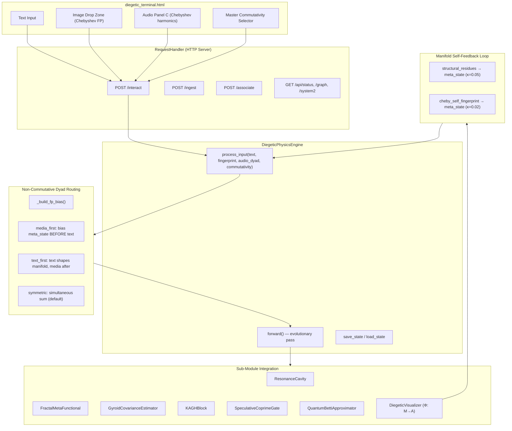

# Diegetic Physics Engine

> The main runtime backend — 4,500-line HTTP server integrating 30+ sub-modules into a single interactive physics engine.  
> **Source**: [`src/ui/diegetic_backend.py`](../src/ui/diegetic_backend.py)

---

## 1. Architecture Overview


```mermaid
graph TB
    subgraph UI["diegetic_terminal.html"]
        TXT["Text Input"]
        IMG["Image Drop Zone (Chebyshev FP)"]
        AUD["Audio Panel C (Chebyshev harmonics)"]
        COM["Master Commutativity Selector"]
    end

    subgraph HTTP["RequestHandler (HTTP Server)"]
        POST_I["POST /interact"]
        POST_IN["POST /ingest"]
        POST_A["POST /associate"]
        GET_S["GET /api/status, /graph, /system2"]
    end

    subgraph DPE["DiegeticPhysicsEngine"]
        PI["process_input(text, fingerprint, audio_dyad, commutativity)"]
        FWD["forward() — evolutionary pass"]
        SAVE["save_state / load_state"]
    end

    subgraph Routing["Non-Commutative Dyad Routing"]
        BIAS["_build_fp_bias()"]
        MED_F["media_first: bias meta_state BEFORE text"]
        TXT_F["text_first: text shapes manifold, media after"]
        SYM["symmetric: simultaneous sum (default)"]
    end

    subgraph Modules["Sub-Module Integration"]
        CAV["ResonanceCavity"]
        FMF["FractalMetaFunctional"]
        GC["GyroidCovarianceEstimator"]
        KAGH["KAGHBlock"]
        SCCCG["SpeculativeCoprimeGate"]
        QTDA["QuantumBettiApproximator"]
        VIZ["DiegeticVisualizer (Φ: M→A)"]
    end

    subgraph Feedback["Manifold Self-Feedback Loop"]
        SR["structural_residues → meta_state (κ=0.05)"]
        CSF["cheby_self_fingerprint → meta_state (κ=0.02)"]
    end

    TXT --> POST_I
    IMG --> POST_I
    AUD --> POST_I
    COM --> POST_I
    POST_I --> PI
    PI --> Routing --> FWD --> Modules
    Modules --> VIZ --> Feedback --> PI
```

---

## 2. DiegeticPhysicsEngine

### Initialization — all sub-modules

| Category | Components |
|---|---|
| **Core** | `ResonanceCavity`, `ResonanceLarynx` (char→tensor), `GyroidCovarianceEstimator` |
| **KAGH** | `KAGHBlock`, `HarmonicWaveDecomposition` |
| **ADMM** | `OperationalADMM`, `CALM Predictor` |
| **Topology** | `SpeculativeCoprimeGate` (SCCCG), `SpeculativeHomologyEngine`, `GyroidicGraphManager` |
| **Extensions** | `MetaPolytopeMatrioshka`, `QuantumInspiredReasoningState` (optional), `ZeitgeistRouter` |
| **Fractal** | `FractalMetaFunctional` — {crt, admr, ring, osc} sub-tensors |
| **Data** | `PressureIngestor`, `TextbookFilter`, `TabbyClient`, `LocalDataLoader` |
| **Projection (Phase 6.3)** | `fingerprint_proj` (96→dim), `audio_dyad_proj` (64→dim), `residue_feedback_proj` (32→dim) |

### Initialization — projection layers (new in Phase 6.3)

| Layer | Shape | Purpose |
|---|---|---|
| `fingerprint_proj` | `nn.Linear(96, dim)` | Image Chebyshev fingerprint: K_IMAGE_MAX (32) × 3 channels (L/Cr/Cb) = 96 dims. Replaces old 137-dim histogram. |
| `audio_dyad_proj` | `nn.Linear(64, dim)` | Audio Chebyshev harmonics: K_AUDIO_MAX = 64 coefficients from Panel C. |
| `residue_feedback_proj` | `nn.Linear(32, dim)` | Projects structural residues and self-fingerprint back into meta_state. |

All three use `nn.init.orthogonal_` — no random symmetry breaking.

### process_input — Full Pipeline

```python
def process_input(
    self,
    text_input: str,
    fingerprint: Optional[Dict] = None,     # image Chebyshev dict {L, Cr, Cb, ...}
    audio_dyad: Optional[Dict] = None,      # audio dyad {chebyshev_harmonics, ...}
    commutativity: str = 'symmetric',       # 'symmetric' | 'media_first' | 'text_first'
    generate_response: bool = True,
) -> dict:
```

| Stage | Purpose |
|---|---|
| 0. Affordance Gradients | Soft detection of executability, formalism, API extraction pressure |
| 0.5. Conversational Extraction | Map conversational embedding pressure |
| **Non-Commutative Dyad Routing** | Build media bias tensor from image + audio; apply before or after text depending on `commutativity` |
| 1. Text → Tensor | `ResonanceLarynx` polynomial rotating hash (anti-lobotomy) |
| 2. Mimicry | Active listening pass `_train_mimicry` |
| 2.5. Manifold Clock | Cosine similarity → play/seriousness dt scaling |
| 3. forward() | Evolutionary pass through `ResonanceCavity` + `FractalMetaFunctional` |
| 3.5. text_first post-bias | If `commutativity == 'text_first'`, apply media bias to meta_state **after** forward() |
| 4. KAGH + HarmonicWave | `KAGHBlock` + `HarmonicWaveDecomposition` — spectral repair |
| 5. CALM | `CALM Predictor` — trajectory veto if ADMM budget exhausted |
| 6. SCCCG Recovery | `SpeculativeCoprimeGate` — coprime-gated structure recovery |
| 7. Response Generation | `_generate_dyad_aware_response` — enhanced text via association system |
| 8. Gyroid Violation | `_compute_full_gyroid_violation_score` — spectral + covariance + topological |
| 9. Unfolding Closure | `_perform_unfolding_closure_check` — hyper-ring, cycle, triadic reciprocity |
| 10. Graph Update | `GyroidicGraphManager` — Betti numbers, persistence, graph connectivity |
| **Visualizer (Gate 5)** | On CONFABULATED or SEARCH_NEEDED → `render_manifold_fracture()` |
| **Self-Feedback** | Structural residues → meta_state (κ·I); Chebyshev self-fingerprint → meta_state |

### Supporting Methods

| Group | Methods |
|---|---|
| **Response** | `_generate_enhanced_response`, `_generate_fallback_response`, `_apply_linguistic_correction` |
| **Conversational** | `_detect_conversational_patterns`, `_extract_conversational_embeddings`, `_attempt_api_content_extraction` |
| **Association** | `_handle_dyad_ingestion`, `_handle_association_learning`, `_enhanced_association_learning` |
| **Topology** | `_compute_betti_numbers`, `_detect_topological_cycles`, `_estimate_manifold_curvature` |
| **System 2** | `_run_advanced_physics` (quantum/polytope if budget allows) |
| **Persistence** | `save_state`, `load_state`, `_repair_tensors` |

---

## 3. EncodingManager

Manages persistent encoding files — each interaction's topological trace is saved as a distinct artifact to prevent "erasing of implication."

| Method | Purpose |
|---|---|
| `get_latest_iteration()` | Scan encoding dir for last saved iteration |
| `save_encoding(iteration, text, tensors, metrics)` | Timestamped artifact with structural metrics |

---

## 3. Non-Commutative Dyad Routing

### What it does

The order in which image/audio and text are applied to the manifold is now a **first-class topological variable**, controlled by the `commutativity` parameter (and in the UI, the master `#commute-master` selector).

This is grounded in Braid Group non-commutativity: the composition `A ∘ B ≠ B ∘ A` when A is the media projection and B is the text hash. Different orderings trace different paths through the manifold.

### `_build_fp_bias(fp_dict, audio_dict)` → `[1, dim]`

Handles both modalities in a single pass:
- **Image (new Chebyshev format)**: Reads `{L:[K], Cr:[K], Cb:[K]}`, concatenates → pads/truncates to 96 → `fingerprint_proj`.
- **Image (legacy histogram)**: Reads `{r:[32], g:[32], b:[32], l:[32], texture, edges:[8]}` ← backward-compatible reshape shim.
- **Audio**: Reads `chebyshev_harmonics` → pads/truncates to 64 → `audio_dyad_proj`.
- If both are present: averages the two bias tensors.

### Commutativity modes

| Mode | Behavior | When to use |
|---|---|---|
| `symmetric` | `input_tensor += 0.5 * media_bias` simultaneously with text tensor | Default; no strong ordering preference |
| `media_first` | `meta_state` pre-biased before `_text_to_tensor` runs. Text then conditions on an already-distorted manifold | Image/audio sets the emotional/spatial context before language |
| `text_first` | Text shapes manifold via `forward()`; media bias applied to `meta_state` afterward | Language frames the interpretation; media then modulates |

**You can have both image and audio armed at the same time.** They are combined via mean in `_build_fp_bias` and the single `commutativity` value controls both.

---

## 4. Multimodal Input — User Guide

### Arming an image

Drop any image file into the **DYAD CAPTURE** drop zone in the left panel. The system immediately:

1. Renders the image at 64×64 on a canvas.
2. Computes **BT.601 L/Cr/Cb channels** (luminance + two chrominance channels).
3. Runs **Chebyshev polynomial projection** on each channel (K modes, Hann-windowed frame energies → Chebyshev T_k recurrence → Birkhoff normalisation → Xorshift32 LSB stochastic rounding). K is derived from pixel count — never hardcoded.
4. Stores the result as `state.active_fingerprint = {chebyshev_degree: K, L:[K], Cr:[K], Cb:[K], px_width, px_height}`.
5. The status bar shows: `DYAD INGESTED: 96-COEFF CHEBYSHEV FINGERPRINT (K=32, 1920×1080px)`.

The fingerprint is **automatically attached** to every `/interact` call until cleared.

### Arming an audio file

Open the **AUDIO (Panel C)** panel and upload an `.m4a`, `.mp4a`, `.wav`, or `.ogg` file. The system:

1. Decodes audio via the Web Audio API.
2. Runs the same Chebyshev pipeline on the amplitude envelope.
3. Stores `state.active_audio_dyad = {chebyshev_harmonics: [K], chebyshev_degree: K, ...}`.

### Using both simultaneously

Both `active_fingerprint` (image) and `active_audio_dyad` (audio) are sent together in every `/interact` payload:

```json
{
  "text": "describe the texture",
  "fingerprint": { "chebyshev_degree": 16, "L": [...], "Cr": [...], "Cb": [...] },
  "audio_dyad": { "chebyshev_harmonics": [...], "chebyshev_degree": 13 },
  "commutativity": "media_first"
}
```

When both are present, the backend **averages their bias tensors** before applying them. The image and audio arrive as structurally equal co-influences on the manifold.

### Commutativity selector (DYAD ORDER)

The header bar contains a `DYAD ORDER:` dropdown with three options:

| Option | JSON value | Effect |
|---|---|---|
| ⊗ Symmetric | `symmetric` | Both media and text influence the manifold simultaneously. Order is irrelevant. Default. |
| Media → Text | `media_first` | Image + audio bias `meta_state` **before** the text is embedded. The text sees a pre-distorted manifold. |
| Text → Media | `text_first` | Text evolves the manifold via `forward()`, **then** the media bias is applied. Text sets the frame; media colours it. |

> This selector governs all dyad channels simultaneously. You do not need audio armed to use image commutativity (or vice versa).

---

## 5. RequestHandler — HTTP API

### GET Endpoints

| Path | Response |
|---|---|
| `/` | Serve `diegetic_terminal.html` |
| `/api/status` | Engine state, iteration count, component status |
| `/api/graph` | Graph topology JSON (nodes, edges, Betti numbers, metrics) |
| `/api/training_status` | Training progress, log, results |
| `/api/system2` | CALM/ADMM diagnostics, SCCCG state |

### POST Endpoints — Core Interaction

| Path | Accepts | Purpose |
|---|---|---|
| `/interact` | `{text, fingerprint?, audio_dyad?, commutativity?}` | Main interaction pipeline. Passes all three dyad fields into `process_input`. |
| `/ingest` | `{description, fingerprint?, commutativity?}` | Fossilize a Knowledge Dyad. |
| `/associate` | `{text1, text2}` | Dyad association learning. |
| `/api/process` | `{text}` | Alternative interaction endpoint (legacy path). |

### POST Endpoints — Training & Data

| Path | Purpose |
|---|---|
| `/api/train` | Launch async `SpectralStructuralTrainer` |
| `/api/ingest_local` | Ingest local data via `LocalDataLoader` |
| `/api/tabby_test` | Test TabbyML connection |
| `/api/tabby_complete` | Code completion via TabbyML |
| `/api/tabby_chat` | Chat via TabbyML |
| `/api/tabby_generate_sample` | Generate synthetic textbook-quality training samples |

---

## 6. Diegetic Visualizer — Audience Projection (Φ: M → A)

**Source**: [`src/ui/diegetic_visualizer.py`](../src/ui/diegetic_visualizer.py)

### When it fires

The visualizer runs **only** when `retrieval_state` is `CONFABULATED` or `SEARCH_NEEDED`. On `KNOWN`, the overhead is zero — the function is never called.

### What it renders

A 2×3 matplotlib figure at 110 dpi, rendered via the `Agg` (non-display) backend:

| Panel | Content | Roughness preservation |
|---|---|---|
| **S_meta(t−1)** | Raw `meta_state` buffer as a 2D heatmap. | `interpolation='none'`; `inferno`/`seismic` colormap |
| **Fractal Components** | Step-traces of `{crt, admr, ring, osc}` tensors from `FractalMetaFunctional.forward()`. | Step-plot (not line) |
| **Gate Scores** | Horizontal bar chart: `PAS_h`, `H_mischief`, `honesty_score` vs. `R_a` threshold. | Exact float labels |
| **Introspection Radar** | Polar chart of `GeometricSelfModelProbe` unit direction norms: moral / uncertainty / creative / metacognitive. | Raw norms, not smoothed |
| **Panel 5 (context-dependent)** | On `CONFABULATED`: Betti barcode (β₀ in blue, β₁ in magenta) from `QuantumBettiApproximator`. On `SEARCH_NEEDED`/`KNOWN`: ChernSimons twist energy heatmap. | |

### Return dict

```python
{
    "b64": "...",                          # base64 PNG → sent to browser
    "structural_residues": [float, ...],   # LSB-rounded probe+component norms
    "cheby_self_fingerprint": [float, ...],# Chebyshev T_k of PNG luminance
    "betti": {"0": float, "1": float},     # only on CONFABULATED
}
```

### Recursive self-feedback (the inverse projection path)

The visualizer returns structural information that **gets written back into `meta_state`**, without the system ever seeing the rendered image. This is the inverse projection path that preserves topological honesty:

```
render_manifold_fracture() 
    → structural_residues (probe norms + fractal component norms, LSB-rounded)
        → residue_feedback_proj → meta_state += 0.05 * sr_proj       [Introspection κ·I]
    → cheby_self_fingerprint (Chebyshev of PNG luminance)
        → residue_feedback_proj → meta_state += 0.02 * csf_proj      [Feature Scar]
```

**What this means**: The system develops a topological fingerprint of its own fracture — the *shape* of the rendered breakdown — without importing the visual image into its self-model. It returns a **spectral scar**, not a self-portrait.

### Betti barcode on CONFABULATED

When `retrieval_state == 'CONFABULATED'`, the `QuantumBettiApproximator` (from `src/core/quantum_tda.py`) computes:

1. Pairwise cosine adjacency between the four fractal component vectors (`crt`, `admr`, `ring`, `osc`).
2. Laplacian spectrum via Minimax Chebyshev kernel projector trace (Hutchinson).
3. β₀ (connected components) and β₁ (topological loops) of the component-relationship graph.

A high β₁ during confabulation means the fractal components are topologically looped — the system is chasing its own tail, which is exactly what confabulation is.

---

## 7. Image Fingerprint — Chebyshev Pipeline (Phase 6.3 Upgrade)

The old 137-dim RGB histogram format (`{r:[32], g:[32], b:[32], l:[32], texture, edges:[8]}`) has been replaced with a topologically richer Chebyshev projection.

### Pipeline (JS → Backend symmetric)

```
Image (any size)
  → Canvas 64×64
  → BT.601 decomposition → L, Cr, Cb  [4096 floats each]
  → K = clamp(round(√4096 / 4), 5, 32)    ← derived from pixel count, never hardcoded
  → For each channel: Hann-windowed frame energies (K+1 frames)
                    → Chebyshev recurrence T_0 ... T_{K-1}
                    → Birkhoff row normalisation (L1 → probability row)
                    → Xorshift32 LSB stochastic rounding (scale=1024)
  → Payload: {chebyshev_degree: K, L:[K], Cr:[K], Cb:[K], px_width, px_height}
  → Backend: fingerprint_proj = Linear(K_MAX*3=96, dim), orthogonal init
```

**Why this is better than histograms**:
- Histograms aggregate: they cannot distinguish two images with identical colour distributions but different spatial structure.
- Chebyshev coefficients capture **spectral texture*: T_k(x) at higher k = higher-frequency variations in the tile energy envelope. An image with fine texture concentrates energy in high-k coefficients; a flat-colour image concentrates near k=0.
- The pipeline is **identical** to the audio Chebyshev pipeline in JS — the same math governs both modalities. An image of turbulence and audio of turbulence will produce structurally similar coefficient distributions.

---

## 8. DAQUF Fossilization Operator

**Class**: `DAQUFOperator` — Diegetic Amortized Quantized Unknowledge Fossilization  
**Source**: [`src/core/daqf_operator.py`](../src/core/daqf_operator.py)

| Stage | Formula | Purpose |
|---|---|---|
| 1. Unknowledge Load | `χ(f_i) = Σ(Φ(f_i)=⊥) + mischief + valence` | Contradictions per fossil slot |
| 2. Fossil Selection | `f* = argmax χ(f_i)` | Current Unknowledge Soliton |
| 3. Diegetic Amortization | `C̃ = C_τ / (N · τ)` | Spread history over narrative time |
| 4. Lattice Quantization | `Q_f = round(f · Q_proj / ε_q)` | Integer lattice projection; Δ_q = error |
| 5. Speculative Persistence | `flux ≠ 0 OR stable mischief soliton` | Fossil survivorship |

### Love Invariant

The buffer `L` is **never modified** after initialization. `check_invariants(original_L)` raises:

```
RuntimeError("LOVE INVARIANT VIOLATION: L has been modified.")
```

if `‖L_current − L_original‖₁ > 1e-8`. This is the only hard runtime assertion in the entire system.

### Metrics Emitted

```python
{
  'f_star_mask':     # Which fossil slot has max contradiction load
  'amortized_cost':  # C̃ = diegetic amortization scalar
  'Delta_q':         # Quantization error (structural memory of the rounding)
  'persistence':     # [0,1] per-fossil survivorship probability
  'love':            # L — the immutable invariant tensor
  'tau':             # Narrative time elapsed
}
```

---

## 9. Audience Projection (`src/core/audience_mapping.py`)

**Class**: `AudienceProjection`  
**Operator**: Φ: M → A (manifold → audience space)

A Lipschitz homeomorphic projection from the internal manifold M to an external audience space A, required by the Garden Statistical Attractors design. The engine uses this to translate internal state representations into audience-legible structures without destroying topological features.

### Architecture

```
manifold_state [B, input_dim]
    → spectral_norm(Linear) → LeakyReLU(0.1)
    → spectral_norm(Linear) → LeakyReLU(0.1)
    → spectral_norm(Linear)
    → smooth_projection [B, audience_dim]
    + identity (skip, roughness-preserving)
    = audience_state [B, audience_dim]
```

Spectral normalization on all layers enforces Lipschitz constant ≤ 1 per layer. The residual skip (`y = f(x) + x`) approximates homeomorphism: when `Lip(f) < 1`, the map is provably invertible via Banach Fixed Point Theorem.

### Approximate Inverse

`inverse(audience_state, iterations=5)` recovers the original manifold state via fixed-point iteration `x ← a − f(x)`. Valid only when `input_dim == audience_dim` and `Lip(f) < 1`.

### Key Guarantee

*Roughness preservation*: topological singularities (high-frequency features, discontinuities) in the manifold are transmitted into audience space rather than smoothed away. This prevents the system from presenting an artificially clean self-model.

> **Relationship to DiegeticVisualizer**: `AudienceProjection` is the continuous algebraic version of Φ used inside the cavity. `DiegeticVisualizer` is the *diegetic visual* realization — it maps the manifold's live state into a human-legible PNG without destroying topological features (roughness preserved via `interpolation='none'` and step-plots).

---

## 10. Related Documentation

| Doc | Connection |
|---|---|
| [KNOWLEDGE_DYAD_LIFECYCLE.md](KNOWLEDGE_DYAD_LIFECYCLE.md) | Audio + image dyad ingestion details |
| [NONCOMMUTATIVITY_DYNAMICS.md](NONCOMMUTATIVITY_DYNAMICS.md) | Mathematical foundation of commutativity routing |
| [INTERFACE_LAYER.md](INTERFACE_LAYER.md) | User-facing terminal and controls reference |
| [GYROID_REASONER.md](GYROID_REASONER.md) | Core model architecture |
| [PHYSICS_ADMM.md](PHYSICS_ADMM.md) | System 2 ADMM + CALM |
| [RESONANCE_CAVITY.md](RESONANCE_CAVITY.md) | dM/dt cavity equation (source of the Introspection κ·I term) |
