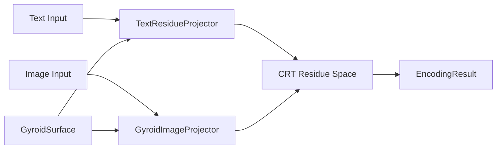

# Gyroidic Codec: Non-Abelian Image-Text Encoding

**Implementation**: `src/codec/gyroidic_codec.py` (848 lines)

---

## 1. Overview

The Gyroidic Codec encodes text-image pairs into a **CRT (Chinese Remainder Theorem) residue space** using non-commutative path ordering on a gyroid surface. This is not a standard autoencoder — it is a **topology-preserving projection** where the encoding order matters (non-Abelian).

### Purpose
- Encode multimodal (text + image) inputs into a shared residue representation
- Preserve topological structure during encoding via gyroid surface modulation
- Enforce non-commutativity: encoding text-then-image ≠ image-then-text

---

## 2. Architecture



### 2.1 `CodecConfig` (Configuration)

Dataclass controlling codec parameters:
- `num_residues` — Number of CRT residue channels (default: from polynomial co-prime config)
- `gyroid_resolution` — Sampling density on the gyroid surface
- `image_patch_size` — Patch decomposition size for image encoding
- `text_dim` — Embedding dimension for text tokens

### 2.2 `GyroidSurface`

Evaluates the triply periodic minimal surface:

$$G(x, y, z) = \sin(x)\cos(y) + \sin(y)\cos(z) + \sin(z)\cos(x)$$

Methods:
- `evaluate(coords)` — Computes gyroid field value at given coordinates
- `mean_curvature_estimate(coords)` — Estimates mean curvature $H$ for local topology detection

The mean curvature modulates encoding weights: high-curvature regions receive more encoding precision (analogous to attention allocation at topological complexity).

### 2.3 `TextResidueProjector`

Projects text token embeddings into CRT residue space:

1. **Input**: Token embeddings `[Batch, SeqLen, TextDim]`
2. **Gyroid modulation**: Token positions mapped to gyroid surface coordinates; curvature modulates projection weights
3. **Residue projection**: Linear projection `TextDim → K × (Dim//K)` where $K$ = number of co-prime residue channels
4. **Output**: Residue tensor `[Batch, K, Dim//K]`

### 2.4 `GyroidImageProjector`

Encodes image patches via gyroid-modulated adaptive pooling:

1. **Input**: Image tensor `[Batch, Channels, H, W]`
2. **Patch decomposition**: `_prepare_image()` splits into `[Batch, NumPatches, PatchDim]`
3. **Adaptive pooling**: `_adaptive_pool()` selects encoding precision per patch based on gyroid curvature
4. **Residue projection**: Maps to the same `[Batch, K, Dim//K]` residue space as text

### 2.5 `EncodingResult`

Output dataclass containing:
- `residues` — CRT residue tensor `[Batch, K, Dim//K]`
- `gyroid_scores` — Per-element gyroid violation scores
- `path_ordering` — Record of the non-commutative encoding order

---

## 3. Mathematical Formulation

### 3.1 CRT Residue Encoding

Given a multimodal input $x = (x_{\text{text}}, x_{\text{image}})$, the encoding is:

$$r_k(x) = \phi_k(x) \bmod p_k, \quad k = 1, \dots, K$$

where $\phi_k$ are the polynomial co-prime functionals from [MATHEMATICAL_DETAILS.md §1](MATHEMATICAL_DETAILS.md#1-polynomial-co-prime-functionals) and $p_k$ are generated from polynomial evaluations (no hardcoded primes).

### 3.2 Non-Commutative Path Ordering

The encoding respects non-Abelian composition. For text residues $r_T$ and image residues $r_I$:

$$r_{T \circ I} \neq r_{I \circ T}$$

This is implemented via ordered application of the gyroid modulation and residue projection, preserving the **holonomy** (§26.2 in MATHEMATICAL_DETAILS.md) of the encoding path.

### 3.3 Gyroid Modulation

The gyroid surface provides a **curvature-dependent weighting**:

$$w(x, y, z) = |H(x, y, z)| \cdot \text{softmax}(G(x, y, z))$$

where $H$ is the mean curvature and $G$ is the gyroid field value. High-curvature points receive more encoding resolution.

---

## 4. Connection to System Architecture

- **CRT Reconstruction** (§3): Residues can be reconstructed to the original space via CRT
- **Birkhoff Polytope** (§2): Residue routing uses doubly-stochastic constraint projection
- **Gyroid Covariance** (§5): Gyroid violation scores feed back into the covariance estimator
- **Non-Abelian Probability** (§26): The codec's non-commutative path ordering is a concrete instance of the braid group belief updates

---

## 5. Implementation Context (AI Hints)

**Module**: `src/codec/gyroidic_codec.py`

**Class hierarchy**:
```
CodecConfig (dataclass)
EncodingResult (dataclass)
GyroidSurface (utility)
TextResidueProjector (nn.Module)
GyroidImageProjector (nn.Module)
```

**Key tensor shapes**:
| Tensor | Shape | Description |
|--------|-------|-------------|
| Text input | `[B, S, D_text]` | Batch × SeqLen × TextDim |
| Image input | `[B, C, H, W]` | Standard image tensor |
| Residues | `[B, K, D//K]` | CRT residue representation |
| Gyroid coords | `[B, 3]` | Surface evaluation points |
| Curvature | `[B, 1]` | Mean curvature estimates |
