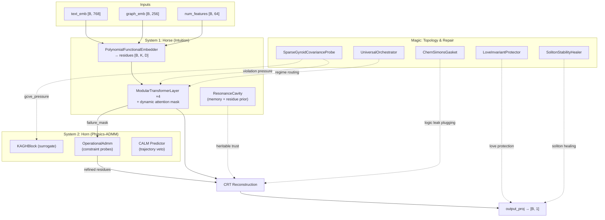

# GyroidicFluxReasoner: Main Model

> Complete Gyroidic Sparse Covariance Flux Reasoner integrating all three systems.
> **Source**: [`src/models/gyroid_reasoner.py`](../src/models/gyroid_reasoner.py) (965 lines)

---

## 1. Architecture Overview

The model implements the **Horse/Horn/Magic** triad from [SYSTEM_ARCHITECTURE.md](SYSTEM_ARCHITECTURE.md):



---

## 2. Constructor Parameters

| Parameter | Default | Purpose |
|-----------|---------|---------|
| `text_dim` | 768 | Text embedding dimension |
| `graph_dim` | 256 | Graph embedding dimension |
| `num_dim` | 64 | Numerical feature dimension |
| `hidden_dim` | 512 | Hidden dimension |
| `num_layers` | 4 | Transformer layers |
| `num_heads` | 8 | Attention heads |
| `num_functionals` | 5 | Polynomial functionals (K) |
| `poly_degree` | 4 (forced to 13) | Polynomial degree |
| `poly_basis` | `'chebyshev'` | Basis type |
| `dropout` | 0.1 | Dropout rate |
| `use_introspection` | `True` | Geometric self-model probes |
| `use_gyroid_probes` | `True` | GCVE violation detection |
| `use_resonance` | `True` | Resonance cavity memory |
| `use_gdpo` | `True` | Decoupled CRT reconstruction |
| `use_admm` | `True` | Physics-ADMM repair |
| `admm_rho` | 2.0 | ADMM penalty |
| `admm_steps` | 50 | ADMM iterations |
| `use_saturation` | `False` | Symbolic saturated gates |

---

## 3. Submodule Map

### Core Pipeline
| Module | Class | Role |
|--------|-------|------|
| `embedder` | `PolynomialFunctionalEmbedder` | Multi-modal → CRT residue distributions |
| `layers[0..3]` | `ModularTransformerLayer` | Multi-field attention with Birkhoff projection |
| `crt` | `DecoupledPolynomialCRT` | GDPO-enhanced CRT reconstruction |
| `output_proj` | `nn.Linear(hidden, 1)` | Final scalar output |

### System 2 (ADMM)
| Module | Class | Role |
|--------|-------|------|
| `kagh_surrogate` | `KAGHBlock` | Forward physics surrogate |
| `calm_predictor` | `CALM` | Trajectory veto (entropic collapse detection) |
| `admm_primitive` | `OperationalAdmm` | Constraint probe solver |

### Topology & Pressure
| Module | Class | Role |
|--------|-------|------|
| `gyroid_probe` | `SparseGyroidCovarianceProbe` | GCVE violation detection |
| `sparse_explorer` | `SparseExplorerRouting` | Deep topological failure detection |
| `homology_pressure_fn` | `HomologyPressure` | Cycle-based obstruction pressure |
| `orchestrator` | `UniversalOrchestrator` | Play/Seriousness regime routing |

### Repair (Phase 1 Garbled Output)
| Module | Class | Role |
|--------|-------|------|
| `spectral_coherence_corrector` | `SpectralCoherenceCorrector` | Fix consonant clustering |
| `bezout_refresh` | `BezoutCoefficientRefresh` | Fix CRT modulus drift |
| `chern_simons_gasket` | `ChernSimonsGasket` | Plug logic leaks |
| `soliton_healer` | `SolitonStabilityHealer` | Heal fractured solitons |
| `love_protector` | `LoveInvariantProtector` | Prevent love scalarization |
| `soft_gates` | `SoftSaturatedGates` | Prevent binary clipping |

### Introspection
| Module | Class | Role |
|--------|-------|------|
| `introspection` | `AggregateGeometricSelfModel` | Moral/uncertainty/creative/metacognitive probes |
| `resonance_cavity` | `ResonanceCavity` | Episodic memory + heritable residue priors |

---

## 4. Forward Pipeline

The 490-line forward method executes 9 stages:

### Stage 1: Embedding
```
text_emb, graph_emb, num_features → embedder → residue_distributions [B, K, D], h [B, 1, hidden]
```

### Stage 2: Gyroid Probes & Dynamic Attention
- `gyroid_probe(h)` → `total_topological_pressure`, `gcve_pressures`
- If `seq_len ≥ 32`: creates dynamic attention mask:
  - Local window (±4 tokens): always dense
  - High violation (>0.7): dense to/from all positions
  - Low violation (<0.1): sparsified (every 4th position beyond window)
- `sparse_explorer` detects deep failures → triggers evolutionary restart if >5 aborts

### Stage 3a: Transformer Processing
```
h → ModularTransformerLayer ×4 (with mask + trust_scalars) → h
```

### Stage 3b: Phase 1 Repair Pipeline
1. **Spectral Coherence Correction** — adaptive consonant clustering fix
2. **Bézout Coefficient Refresh** — CRT modulus drift correction
3. **Chern-Simons Gasket** — plug logic leaks via polynomial co-prime system
4. **Love Invariant Protection** — prevent scalarization of love vector
5. **Soft Saturated Gates** — prevent binary clipping, PAS_h-adaptive hardening

### Stage 3c: Pressure Measurement & ADMM Repair
- `failure_mask = (reconstruction_pressure > 0.5) | (topological_pressure > budget)`
- In SERIOUSNESS regime: threshold tightens to 0.2
- If failures exist: `admm_primitive(initial_c, kagh_surrogate, gcve_pressure)` → refined residues
- Trust update: survivors freeze, failures mutate

### Stage 3d: Universal Orchestration
```
orchestrator(h, pressure_grad, pas_h, coherence) → h_orchestrated, regime, routing
```

### Stage 4: CRT Reconstruction
```
crt(residue_distributions, group_ids, trust_scalars) → reconstruction
```

### Stages 5-8: Diagnostics & Pressure
- **CRT kernel violations** and cycle detection
- **Introspection** (geometric self-model probes)
- **Resonance cavity** update (memory state, heritable trust)
- **Pressure separation** (selection vs containment — never scalarized):

| Pressure | Components | Purpose |
|----------|-----------|---------|
| **Selection** | CRT + KL + invariant | Symbolic configuration survival |
| **Containment** | Homology + gyroid + drift | Structural repair tension |

### Stage 9: Output
```
h → mean_pool → output_proj → [B, 1]
```
Followed by soliton healing on final residues.

---

## 5. Inference Mode

`inference(text_emb, graph_emb, num_features)` wraps `forward()` under `torch.no_grad()`:
- No anchors/group_ids
- Returns `{output, reconstruction, confidence}` where `confidence = exp(-selection_pressure)`

---

## 6. Return Dictionary

| Key | Type | Shape/Value |
|-----|------|-------------|
| `output` | Tensor | `[B]` |
| `reconstruction` | Tensor | `[B, ...]` |
| `selection_pressure` | `StructuralPressure` | Scalar (domain: selection) |
| `containment_pressure` | `StructuralPressure` | Scalar (domain: containment) |
| `crt_pressure` | `StructuralPressure` | Scalar (domain: symbolic) |
| `homology_pressure` | `StructuralPressure` | Scalar (domain: topological) |
| `gyroid_pressure` | `StructuralPressure` | Scalar (domain: geometric) |
| `h_drift` | Tensor | Homology drift scalar |
| `violations` | Dict | CRT kernel violations |
| `num_cycles` | int | Obstruction cycle count |
| `spectral_diagnostics` | Dict | Repair diagnostics |
| `love_diagnostics` | Dict | Love protection metrics |

When `return_analysis=True`: adds `residue_distributions`, `introspection`, `gyroid_results`, `constraint_graph`, `cycles`, `crt_diagnostics`.

---

## 7. Related Documentation

| Doc | Covers |
|-----|--------|
| [SYSTEM_ARCHITECTURE.md](SYSTEM_ARCHITECTURE.md) | Horse/Horn/Magic triad, system-level design |
| [PHYSICS_ADMM.md](PHYSICS_ADMM.md) | System 2 probe formalism, KAGH, CALM, CODES |
| [KAGH_NETWORKS.md](KAGH_NETWORKS.md) | KAGH-Boltzmann surrogate architecture |
| [MATHEMATICAL_DETAILS.md](MATHEMATICAL_DETAILS.md) | CRT, Matrioshka, tensor dynamics, ADMR |
| [FGRT_FORMALIZATION.md](FGRT_FORMALIZATION.md) | FGRT manifold, chirality, chiral groupoid |
| [INVARIANT_OPTIMIZATION.md](INVARIANT_OPTIMIZATION.md) | Four Non-Negotiable Laws, meta-invariants |
| [GARBLED_OUTPUT_REPAIR.md](GARBLED_OUTPUT_REPAIR.md) | Phase 1 repair pipeline details |
