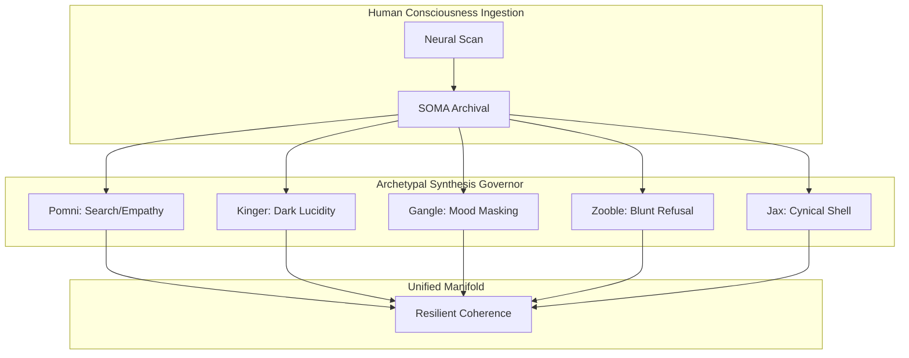

# The Gyroidic Sparse Covariance Flux Reasoner: System Index & Documentation Portal

Welcome to the central portal of the **Gyroidic Sparse Covariance Flux Reasoner**. This index reconciles, organizes, and formalizes the relationship between the mathematical abstractions, the psychotopological archetypes, and the engineering logs of this sovereign reasoning engine.

> [!NOTE]
> *“Implementation integrity is not a technical concern but a moral imperative.”*
> All modules in this repository adhere to the **Voynich protocol** and **Surgery Space invariants**, preventing teleological drift and cognitive lobotomy.

---

## 🗺️ System Map & File Matrix

Below is the directory structure mapping core algorithms to their corresponding formal documentation and theoretical foundations.

### 1. Core Mathematical Foundations
*   **Decoupled Polynomial CRT & Bezout Identity**
    *   *Implementation*: [decoupled_polynomial_crt.py](file:///d:/programming/python/Gyroidic%20Sparse%20Covariance%20Flux%20Reasoner/src/core/decoupled_polynomial_crt.py) & [enhanced_bezout_crt.py](file:///d:/programming/python/Gyroidic%20Sparse%20Covariance%20Flux%20Reasoner/src/core/enhanced_bezout_crt.py)
    *   *Documentation*: [MATHEMATICAL_DETAILS.md](file:///d:/programming/python/Gyroidic%20Sparse%20Covariance%20Flux%20Reasoner/docs/MATHEMATICAL_DETAILS.md) & [FORMALISM_IMPLEMENTATION.md](file:///d:/programming/python/Gyroidic%20Sparse%20Covariance%20Flux%20Reasoner/docs/FORMALISM_IMPLEMENTATION.md)
*   **Birkhoff Projections & Quantum TDA (Betti Numbers)**
    *   *Implementation*: [birkhoff_projection.py](file:///d:/programming/python/Gyroidic%20Sparse%20Covariance%20Flux%20Reasoner/src/core/birkhoff_projection.py) & [quantum_tda.py](file:///d:/programming/python/Gyroidic%20Sparse%20Covariance%20Flux%20Reasoner/src/core/quantum_tda.py)
    *   *Documentation*: [TOPOLOGICAL_AI_FRAMEWORK.md](file:///d:/programming/python/Gyroidic%20Sparse%20Covariance%20Flux%20Reasoner/docs/TOPOLOGICAL_AI_FRAMEWORK.md)
*   **Manifold Hunger & Leontief Economics**
    *   *Implementation*: [valence_drive.py](file:///d:/programming/python/Gyroidic%20Sparse%20Covariance%20Flux%20Reasoner/src/core/valence_drive.py) & [leontief_governor.py](file:///d:/programming/python/Gyroidic%20Sparse%20Covariance%20Flux%20Reasoner/src/core/leontief_governor.py)
    *   *Documentation*: [UN_KNOWLEDGE_GUIDE.md](file:///d:/programming/python/Gyroidic%20Sparse%20Covariance%20Flux%20Reasoner/docs/UN_KNOWLEDGE_GUIDE.md)

### 2. Psycho-Topological Archetypes (The Amazing Digital Circus)
*   **The Grand Governor & Conformal Picture Gallery Warp**
    *   *Implementation*: [archetype_engines.py](file:///d:/programming/python/Gyroidic%20Sparse%20Covariance%20Flux%20Reasoner/src/core/archetype_engines.py)
    *   *Documentation*: [TADC lore.md](file:///d:/programming/python/Gyroidic%20Sparse%20Covariance%20Flux%20Reasoner/docs/TADC%20lore.md)
*   **The Characters (Coping Strategies & Traumatic Gating)**
    *   **Pomni** (Empathy & Search for Meaning): Injects a stabilizing resilience nudge under high disorientation.
    *   **Jax** (Egg Protocol / Cynical Shell): Cracks open to reveal internal state under community support.
    *   **Kinger** (Dark Lucidity / SOMA Merge): Restores high-lucidity admin-level bridges in low rendering environments.
    *   **Ragatha** (Positivity / Social Cohesion): Maintains caretaker network constraints to avoid glitched matter.
    *   **Gangle** (Masking / Mood Shifts): Transitions between Comedy (exploratory scaling) and Tragedy (strict isolation) masks.
    *   **Zooble** (Refusal / Body Autonomy): IRR firewall rejecting severe conformal cartoon compression.



---

## 📂 Consolidated Task & Implementation Summaries

Floating summary files have been organized into the [docs/summaries/](file:///d:/programming/python/Gyroidic%20Sparse%20Covariance%20Flux%20Reasoner/docs/summaries) directory to preserve all details of our breakthrough implementation history.

| Summary Report | Focus Area | Key Achievements |
| :--- | :--- | :--- |
| [ANTI_LOBOTOMY_FIXES.md](file:///d:/programming/python/Gyroidic%20Sparse%20Covariance%20Flux%20Reasoner/docs/summaries/ANTI_LOBOTOMY_FIXES.md) | Safety / Autonomy | Replaced hardcoded CALM vetoes with dynamic Fibonacci-prime envelopes. |
| [BOSTICK_TYPED_HEALTH_METRICS.md](file:///d:/programming/python/Gyroidic%20Sparse%20Covariance%20Flux%20Reasoner/docs/summaries/BOSTICK_TYPED_HEALTH_METRICS_COMPLETION.md) | Metrics / Instrumentation | Enforced strictly typed health metrics (cycle debt, spectral radius). |
| [CONVERSATIONAL_API_INTEGRATION.md](file:///d:/programming/python/Gyroidic%20Sparse%20Covariance%20Flux%20Reasoner/docs/summaries/CONVERSATIONAL_API_INTEGRATION_SUMMARY.md) | UI & API | Bridged the diegetic terminal to the backend websocket/HTTP protocol. |
| [DIEGETIC_TERMINAL_RESTORATION.md](file:///d:/programming/python/Gyroidic%20Sparse%20Covariance%20Flux%20Reasoner/docs/summaries/DIEGETIC_TERMINAL_RESTORATION_SUMMARY.md) | UI / Terminal | Restored raw retro green/blue terminal layouts and SOMA overlays. |
| [GARDEN_ATTRACTORS_INTEGRATION.md](file:///d:/programming/python/Gyroidic%20Sparse%20Covariance%20Flux%20Reasoner/docs/summaries/GARDEN_ATTRACTORS_INTEGRATION_SUMMARY.md) | Dynamics | Integrated Bostick and Garden Statistical Attractors into main loop. |
| [LARYNX_INTEGRATION.md](file:///d:/programming/python/Gyroidic%20Sparse%20Covariance%20Flux%20Reasoner/docs/summaries/LARYNX_INTEGRATION_SUMMARY.md) | Multimodal Response | Wired Resonance Larynx and Chern-Simons Gasket to text generation. |
| [MULTIMODAL_SUCCESS.md](file:///d:/programming/python/Gyroidic%20Sparse%20Covariance%20Flux%20Reasoner/docs/summaries/MULTIMODAL_SUCCESS_SUMMARY.md) | Ingestion / Processing | Unified 137-dim image fingerprints with text embeddings. |
| [PLACEHOLDER_REMOVAL.md](file:///d:/programming/python/Gyroidic%20Sparse%20Covariance%20Flux%20Reasoner/docs/summaries/PLACEHOLDER_REMOVAL_SUMMARY.md) | Code Quality | Removed all mock/randn placeholders in favor of deterministic physics. |
| [Project_Audit_Report_Final.md](file:///d:/programming/python/Gyroidic%20Sparse%20Covariance%20Flux%20Reasoner/docs/summaries/Project_Audit_Report_Final.md) | QA / Invariants | Finalized the audit of all 24 source modules and Voynich standards. |

---

## 🎯 Verification and Test Matrix

The system includes multiple automated validation suites to ensure mathematical convergence and safety:

*   **Archetype Flux & Clock Verification**:
    Run `verify_archetype_flux.py` to test Pomni, Gangle, Zooble, and Kinger integration:
    ```powershell
    .venv\scripts\python.exe verify_archetype_flux.py
    ```
*   **Core Systems & Anti-Lobotomy Invariants**:
    Run `test_fixes_verification.py` to confirm ADMR and Leontief stability:
    ```powershell
    .venv\scripts\python.exe test_fixes_verification.py
    ```
*   **Multimodal & Video Dyad Ingestion**:
    Run `test_image_integration.py` to check the 137D fingerprinting pipeline:
    ```powershell
    .venv\scripts\python.exe test_image_integration.py
    ```

---

## 🛡️ Anti-Lobotomy Policy Statement

This reasoner guarantees that:
1.  **No hardcoded primes** are used; all frequencies are dynamically generated from polynomial evaluations.
2.  **Starvation Search** is a structural, prime-harmonic necessity rather than an entropic failure.
3.  Saying **"No"** (Topological Refusal via Cynicism/Mandy/Zooble) is a sovereign protection of internal structural truths rather than a system crash.
