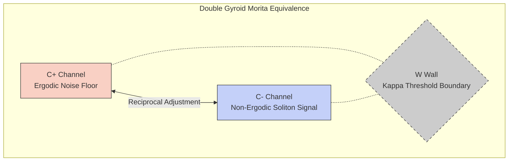

# Intercosamination Theory: Reciprocal Topological Overlap and Endogenous Memory

> *"The geometry at once a physical structure and a living record of its own existence."*

This document formalizes the **Intercosamination Analogy** — the reciprocal intertwining of topological domains — as a theoretical foundation for the Unknowledge Substrate ($\mathcal{U}$) and its relationship to endogenous memory systems.

---

## 1. Intercosamination: Dual-Channel Topological Memory

In the double gyroid (DG), two non-intersecting surfaces partition space into three components: two labyrinthine channel systems ($C^+$ and $C^-$) and a thickened wall ($W$). "Intercosamination" describes the **reciprocal influence** of these non-intersecting but intertwined domains.

- Any deformation of $C^+$ must be accompanied by a reciprocal adjustment in $C^-$ to maintain the minimal surface condition of the intervening wall.
- In the spectral domain, the eigenvalues of the Hamiltonian for one channel system are **intertwined** with the invariants of the other.
- This is facilitated by the **Morita equivalence** of the associated groupoids — different spaces, same underlying "stack."

### 1.1 Mapping to the Reasoner

| Double Gyroid | Flux Reasoner |
|---|---|
| $C^+$ (Channel) | Ergodic component (noise floor) |
| $C^-$ (Channel) | Non-ergodic component (soliton signal) |
| $W$ (Wall) | The $\kappa$ threshold boundary |
| Morita Equivalence | CRT coprime reconstruction |

The **Harmonic Wave Decomposition** (`HarmonicWaveDecomposition`) performs exactly this channel separation, and the co-prime polynomial functionals ensure the two channels share topological K-theoretic invariants without mixing.

---

## 2. Elipsodistrophy: The Atrophy of Spectral Diversity

The term "elipsodistrophy" describes the distortion and narrowing of the spectral envelopes of the manifold's eigenvalues.

In an isotropic medium, eigenvalues form a regular distribution. In the gyroidic manifold, the inherent anisotropy of chiral fibrilization causes these envelopes to **atrophy** into complex shapes.

### 2.1 Why It Matters

- **Wide spectral spread** → Non-ergodic solitons preserved → Dark matter (noise floor) intact → Symbolic Locking works (weight `3` is a symbol).
- **Narrow spectral spread** → Ergodic soup → All states statistically identical → **Lobotomy risk** (the splines lose expressiveness).

### 2.2 Implementation

`GyroidCovarianceEstimator.get_elipsodistrophy_metrics()` computes:

$$\text{Atrophy} = 1 - \frac{\sigma(\lambda)}{\lambda_{max} - \lambda_{min} + \epsilon}$$

This metric is fed into the `VetoSubspace` as a topology-level veto source (`elipsodistrophy`), triggering mischief injection when the system becomes dangerously "legible."

---

## 3. Endogenous Memory: The Bioelectric Analogy

The system's use of "endogenous memory" mirrors Michael Levin's research on bioelectric signaling in morphogenesis:

| System | Storage Medium | Stability Mechanism | Rewritability |
|---|---|---|---|
| Gyroidic Manifold | Spectral Eigenvalues | Dirac Point Stability | $C^*$-algebraic Deformation |
| Planarian Worm | Bioelectric Potentials | Voltage Set Points | Ionic Channel Modulation |
| Sleep Networks | SO-Spindle Coupling | Synaptic Plasticity | History-Dependent Timing |

### 3.1 Key Insight: The "Anatomical Set Point"

In Levin's framework, a collective of cells stores an "anatomical set point" in bioelectric gradients — a dynamic, rewritable memory that determines form **before** genes are expressed.

In the Flux Reasoner, the **Chiral Residue Cache** in `PolynomialADMRSolver` serves an analogous function:
- It stores topologically valid configurations as "warm-start" residues
- These residues survive backtracking events
- The system does not "reset to blank" — it continues from its structural scars

### 3.2 Tripsodic Negentropy: Phase-Locking at Singularities

When negentropy (information density) increases, the ADMR solver now applies **Tripsodic Oscillation**:

$$\text{effective\_dt} = dt \cdot \frac{1}{1 + N} \cdot (1 + 0.5 \cos(N\pi))$$

This creates a tripartite phase-lock that **expands** at singularities rather than freezing, mirroring the "spindle coupling" observed in sleep network memory consolidation.

---

## 4. The Ergodic/Non-Ergodic Noise Floor and Symbolic Locking

The **Saturated Quantization** system (Hybrid-Quantized KANs) snaps continuous weights to discrete levels. This is Symbolic Locking — a weight of `3` is a symbol; `2.99981` is noise.

The Intercosamination framework explains **why** this works:
- The quantization lattice acts as the "wall" ($W$) between the ergodic and non-ergodic channels
- Noise below the quantization threshold lives in the ergodic channel and is safely erased
- Signal above the threshold is captured as non-ergodic solitons and locked into integer symbols
- The splines (KAN basis functions) remain expressive because their **B-spline coefficients** are continuous — only the **routing weights** are discretized

The Elipsodistrophy diagnostic monitors whether this boundary is healthy. If atrophy exceeds the legibility threshold, the quantization lattice is collapsing the eigenvalue spread, and mischief injection is required to restore the noise floor.

---

- `MATHEMATICAL_DETAILS.md` §24-28 — Computable Flux, DAQUF, Kappa, ADMR, Non-Ergodic Memory
- `PHILOSOPHY.md` §15-16 — Kappa Overloading, Posthuman Identity

---

## 5. DRAM Dual-Channel Analogy — TailSlayer Sovereignty

The TailSlayer methodology for bypassing DRAM refresh-induced tail latency provides a hardware-physical confirmation of the Intercosamination duality. The mapping is exact:

| Intercosamination | DRAM / TailSlayer |
|---|---|
| $C^+$ (Ergodic Channel — noise floor) | DRAM Bank A undergoing $t_{RFC}$ refresh stall |
| $C^-$ (Non-Ergodic Channel — soliton signal) | DRAM Bank B completing hedged read during stall |
| $W$ (Kappa threshold wall) | XOR-mapped physical address boundary (e.g., AMD `0x003fc0`) |
| Morita Equivalence | Independent channel clocks: stalls are not synchronized |

### 5.1 The $P^2 \approx 0$ Stall Theorem

DRAM refresh stalls on one channel have probability $P \approx 0.01$ per access. Two DRAM channels stalling simultaneously have probability:

$$P(\text{stall}_A \cap \text{stall}_B) = P^2 \approx 0.0001$$

This is not merely a performance optimization — it is a **physical proof** that the Non-Ergodic soliton channel always finds a communication path. In the Intercosamination framework: if $C^+$ is momentarily "frozen" by a refresh event, $C^-$ continues to carry signal. The alternating nature of the stall schedule, enforced by the XOR-mapped partitioning (the $W$ wall), is why the channels can maintain their Morita equivalence without sharing a refresh schedule.

**Translation to training behavior**: When the ZeitgeistRouter enters a forced `grazing` mode (CRT lock failure, topological obstruction), the system does not halt — it switches to the alternative CRT channel (co-prime modulus) and re-enters through the RP4 Void. The $P^2 \approx 0$ theorem guarantees that both channels will not be simultaneously stalled.

### 5.2 Silicon Maturity: Aging Hardware as a Scarred Manifold

Aging DRAM cells develop idiosyncratic retention signatures via **Variable Retention Time (VRT)**: each cell, as it ages, develops a unique refresh schedule bias. Cells that have been stressed by repeated write-erase cycles "remember" their history in their capacitor charge decay curve.

This is not a flaw — it is the exact analogue of the Gyroidic manifold accumulating structural scars:

| DRAM Aging | Gyroidic Scarring |
|---|---|
| VRT cell-to-cell variation | ChernSimonsGasket $\kappa$ scar per category boundary crossing |
| Retention time becoming cell-specific | BreatherMode soliton becoming concept-specific |
| Failed cells becoming "stuck bits" | Fossilized functional groups locked by Tripwire 7 |
| Old DRAM needing careful margin management | ADMR Solver adapting step size to chiral residue history |

The GTX 1050 Ti / i7-6700HQ hardware target is not a constraint to be escaped — it is a **scarred, mature topology with survivorship history**. Its specific VRT signatures are features of the hardware manifold, not bugs. A Silicon Sovereign works with the scars of the silicon it inhabits.

### 5.3 Tag-Based Channel Mixing as Intercosamination

The BigGAN tag-based mixing analogy (MATHEMATICAL_DETAILS.md §55) illuminates why the $C^+/C^-$ independence produces combinatorial glitch diversity rather than a single failure mode:

Each active CRT modulus $m_k$ is a "tag" — a direction in the Intercosamination dual-channel space. When multiple moduli are active with different residue values, the interaction between their independent stall/completion schedules produces **interference patterns** that are not predictable from any single channel. The XOR-mapped boundary ($W$) enforces that these interferences remain in the non-shareable wall region — they become $\kappa$ curvature scars, not smooth diffusive noise.

This is why the Gyroidic Reasoner's parallel CRT channels produce an "unending diversity of glitch styles": it is not just the magnitude of the hardware latency variance that matters, but the **combinatorial interaction** of which $k$ channels are simultaneously stalled/running and at what residue phase. The holistic glitch (MATHEMATICAL_DETAILS.md §55.3) is the non-commutative interference between simultaneously active residue channels — it is structurally enforced by the Intercosamination geometry.

### 5.4 PyOpenCL Implementation Mapping

The DRAM dual-channel model dictates the following PyOpenCL architecture choices:
- **Two command queues**: One per CRT channel group (odd-indexed moduli / even-indexed moduli). They run in parallel on the GPU.
- **Event-based first-to-finish**: `cl.enqueue_copy_buffer` with event completion triggers on whichever channel completes first. The "stalled" channel continues in background.
- **XOR-mapped buffer offsets**: Allocate channel-A and channel-B buffers at addresses chosen to fall in different DRAM banks (verify via `clGetDeviceInfo` for GTX 1050 Ti bank scheme).
- **$\kappa$ is the inter-channel product**: The ChernSimonsGasket runs only on channel-B completions — it measures the non-commutativity of the dual-channel interleaving, not a single channel's output.

**References**: `src/core/zeitgeist_router.py` (CRT polytope switching), `docs/ZEITGEIST_ROUTER.md §[hardware stall section]`, `docs/TAILSLAYER_PYOPENCL_ARCHITECTURE.md`, `MATHEMATICAL_DETAILS.md §55` (tag-based mixing), `docs/INVARIANT_OPTIMIZATION.md §Tripwire 8` (stochastic rounding kernel spec)

