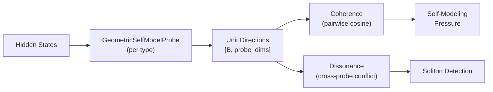

# Introspection Head

> Geometric self-modeling probes for extracting structural state from hidden representations.
> **Source**: [`src/models/introspection_head.py`](../src/models/introspection_head.py) (280 lines)

---

## 1. GeometricSelfModelProbe

Extracts **unit vectors** (normalized directions) from hidden states representing internal geometric configurations.

### Probe Types

| Type | What it measures |
|------|-----------------|
| `moral` | Ethical constraint alignment in hidden space |
| `uncertainty` | Epistemic uncertainty direction |
| `creative` | Creative divergence / novelty direction |
| `metacognitive` | Self-referential awareness direction |

### Forward Pass

```
hidden_states [B, hidden_dim]
    → probe_proj[type](hidden)           # Linear projection
    → L2 normalize                        # Unit vector on sphere
    → direction [B, num_probe_dims]
```

**Pointer #11 (Anti-lobotomy)**: When `suppress_narration=True`, blocks output that could be interpreted as self-narration → prevents over-identification with construction.

### Coherence

`compute_coherence(directions)` → mean pairwise cosine similarity across batch. High coherence = probe consistently points the same direction.

### Self-Modeling Pressure

$$P = -\lambda \cdot \text{coherence}(\text{trigger}) + \mu \cdot \text{coherence}(\text{control})$$

Maximizes coherence in trigger conditions, minimizes in control → probe learns to detect **specific** structural states, not constant directions.

---

## 2. AggregateGeometricSelfModel

Wraps multiple `GeometricSelfModelProbe` instances (one per probe type) into a unified structural model.

| Method | Purpose |
|--------|---------|
| `forward(hidden_states)` | Extract all probe directions → `{type: direction}` dict |
| `measure_dissonance(probe_directions)` | Cross-probe disagreement via mean pairwise cosine distance |

**Dissonance**: High dissonance = probes point in incompatible directions = structural conflict in the system. This is a signal, not an error — dissonance drives soliton formation.

---

## 3. Integration



**Consumer**: Used by the training system to generate non-teleological pressure from the model's own structural state — the system can detect its own conflicts without a reward signal.
