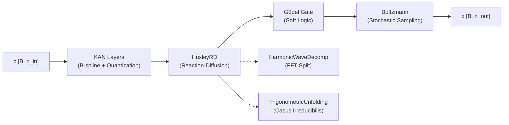

# KAGH-Boltzmann Networks

> Hybrid geometric architecture for Physics-ADMM surrogates.
> **Source**: [`src/surrogates/kagh_networks.py`](../src/surrogates/kagh_networks.py) (401 lines)

---

## 1. Overview

**KAGH** = **K**olmogorov-**A**rnold + **G**ödel + **H**uxley + **B**oltzmann — a four-part hybrid architecture that bridges continuous physics dynamics and discrete symbolic constraints.



**Consumers**: [`gyroid_reasoner.py`](../src/models/gyroid_reasoner.py), [`sic_fa_admm.py`](../src/optimization/sic_fa_admm.py), [`diegetic_backend.py`](../src/ui/diegetic_backend.py)

---

## 2. SaturatedQuantizer

**Role**: Inter-domain bridge between continuous (physics) and discrete (symbolic) regimes.

| Direction | Operation |
|-----------|-----------|
| Forward | Snap to `levels` discrete steps: $\text{round}(x \cdot L/2) / (L/2)$ |
| Backward | Straight-Through Estimator (STE) — gradient passes unchanged |

**Implementation**: `torch.autograd.Function` subclass. Default `levels=64`.

---

## 3. KANLayer (Kolmogorov-Arnold Network)

True B-spline implementation with:
- **Cox-de Boor recursion** for basis functions (order `k=3` default)
- **Hybrid-quantized weights** via `SaturatedQuantizer`
- **Fixed structural grids** (non-teleological — grid is immutable topology)

### Forward Pass

$$y = \underbrace{W_{\text{base}} \cdot x}_{\text{linear residual}} + \underbrace{\sum_{i} \hat{w}_i \cdot B_i^{(k)}(x)}_{\text{spline activation}}$$

where $\hat{w}_i = \text{SaturatedQuantizer}(w_i)$.

### Tensor Shapes

| Tensor | Shape | Notes |
|--------|-------|-------|
| Input `x` | `[B, in]` | Assumed normalized $[-1, 1]$ |
| `base_weight` | `[out, in]` | Kaiming init |
| `spline_weight` | `[out, in, G+k]` | Normal init, quantized in forward |
| `grid` | `[in, G+2k+1]` | Buffer (frozen) |
| Output | `[B, out]` | |

---

## 4. HarmonicWaveDecomposition

FFT-based spectral split into **ergodic** (low-frequency, mixing) and **non-ergodic** (high-frequency, solitonic) components.

$$x_{\text{freq}} = \text{RFFT}(x)$$
$$x_{\text{ergodic}} = \text{IRFFT}(x_{\text{freq}} \cdot \sigma(g)), \quad x_{\text{non-ergodic}} = \text{IRFFT}(x_{\text{freq}} \cdot (1 - \sigma(g)))$$

where $g$ is a learnable spectral gate `[dim//2 + 1]`.

**Returns**: `(ergodic_component, non_ergodic_component)`, both `[B, dim]`.

---

## 5. TrigonometricUnfolding

Handles **casus irreducibilis** — when polynomial bases degenerate, this operator unfolds hidden negentropic solitons via triple-angle decomposition.

### Algorithm

1. **Phase computation**: $\cos(3\phi) = \frac{3V - \text{tr}(C)/\tau}{2(-\det(\text{PAS}))^{3/2}}$
2. **Branch unfolding** (k = 0, 1, 2): $u_h^{(k)} = 2\sqrt{\lambda_{\min}/3} \cdot \cos(\phi + 2\pi k/3) \cdot e^{-|\chi|k}$
3. **Negentropic selection**: Choose branch $k^* = \arg\max_k \|u_h^{(k)}\|$

### Inputs

| Arg | Shape | Purpose |
|-----|-------|---------|
| `u_h` | `[B, features]` | Non-ergodic component |
| `gcve_pressure` | `[B]` | Gyroid violation score |
| `chirality` | `[B]` | Global chirality index |

---

## 6. HuxleyRD (Reaction-Diffusion)

Splits signal into two dynamical regimes:

### Ergodic Channel (Reaction-Diffusion)
$$\frac{du}{dt} = \underbrace{u(u-a)(1-u)}_{\text{Huxley reaction}} + \gamma \underbrace{K * u}_{\text{1D diffusion}}$$

where $K = [0.1, -0.2, 0.1]$ is a learnable diffusion kernel and $a$ is a threshold parameter.

### Non-Ergodic Channel (Soliton Transport)
Pure **phase shift** in frequency domain — soliton propagation without spreading:

$$\hat{u}_{\text{ne}}(\omega) \mapsto \hat{u}_{\text{ne}}(\omega) \cdot e^{-j 2\pi \omega v / N}$$

where $v$ = learnable soliton velocity.

### Fusion
**Ergodic Soliton Fusion Gate**:

$$\text{output} = \sigma(u_e + u_{\text{ne}}) \odot (u_e + u_{\text{ne}})$$

Internal submodules: `HarmonicWaveDecomposition` (step 0), `TrigonometricUnfolding` (step 2.5).

---

## 7. Gödel Logic Gate

Standalone function `goedel_positivity(x, epsilon, active)`:

$$x \leftarrow x \cdot \sigma(100 \cdot (x - \epsilon))$$

- **Active** (training, no violations): Enforces soft $x \geq 0$
- **Inactive** (inference or repair): No-op — allows signed residues

---

## 8. KAGHBlock (Full Pipeline)

Composes all components into a single admissibility block.

### Pipeline

```
Input c [B, n_in]
    │
    ▼
┌─────────────────┐
│  KAN Layers ×d  │ ← B-spline + quantized weights
│  (depth=3)      │
└────────┬────────┘
         ▼
┌─────────────────┐
│  HuxleyRD       │ ← Reaction-diffusion + soliton fusion
│  + Unfolding    │    (receives gcve_pressure, chirality)
└────────┬────────┘
         ▼
┌─────────────────┐
│  Gödel Gate     │ ← Soft positivity (training only, no violations)
└────────┬────────┘
         ▼
┌─────────────────┐
│  Boltzmann      │ ← Gaussian noise scaled by learnable temperature
│  Sampling       │    (training only, no violations)
└────────┬────────┘
         ▼
Output x [B, n_out]
```

### Parameters

| Parameter | Default | Purpose |
|-----------|---------|---------|
| `n_in` | — | Input dimension |
| `n_out` | — | Output dimension |
| `width` | 64 | Hidden KAN layer width |
| `depth` | 3 | Number of KAN layers |
| `alpha` | 0.7 | Mixing coefficient |

### Fossilization

`block.fossilize()` freezes all KAN skeletal layers — prevents gradient updates to structural topology. This is **facet lock-in** (see [SYSTEM_ARCHITECTURE.md §9.2](SYSTEM_ARCHITECTURE.md)).

---

## 9. Integration Points

| Consumer | Usage |
|----------|-------|
| `gyroid_reasoner.py` | Primary surrogate for Physics-ADMM constraint evaluation |
| `sic_fa_admm.py` | CALM predictor uses KAGH for speculative exit confidence |
| `diegetic_backend.py` | Embedded in generation pipeline |

**Related Documentation**:
- [PHYSICS_ADMM.md](PHYSICS_ADMM.md) — ADMM constraint framework that KAGH approximates
- [MATHEMATICAL_DETAILS.md §21](MATHEMATICAL_DETAILS.md) — Energy-based learning context
- [INVARIANT_OPTIMIZATION.md](INVARIANT_OPTIMIZATION.md) — Meta-invariant enforcement
