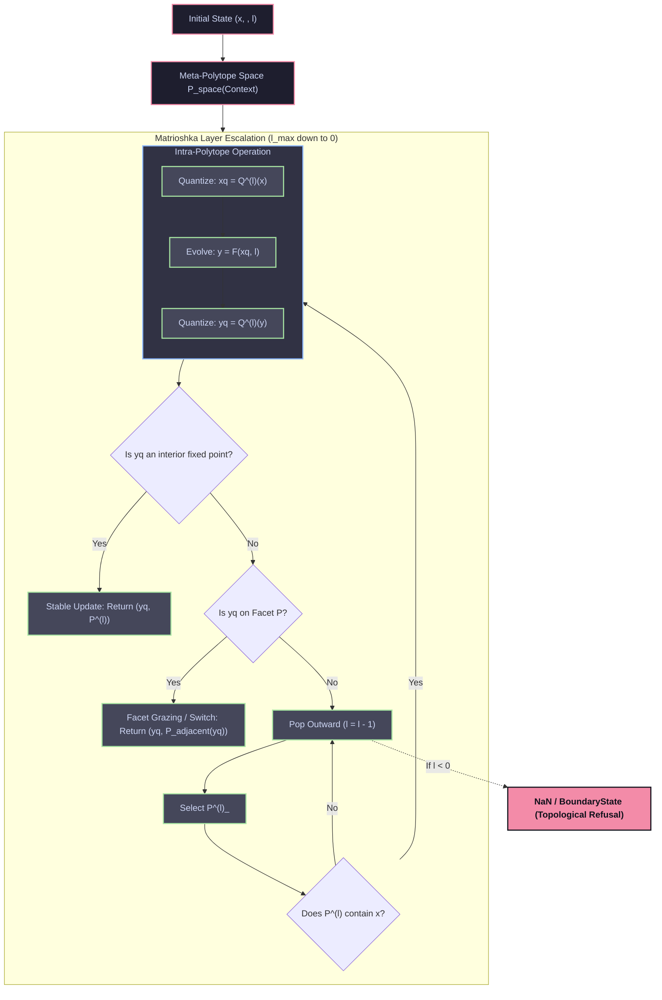

# Matrioshka Nested Polytope Dynamics Map

This diagram illustrates the flow of the Gyroidic Sparse Covariance Flux Reasoner when operating within the Matrioshka nested polytope framework, as well as the transition policies between different meaning systems governed by the Chinese Remainder Theorem (CRT) index.

## Key Architectural Principles

1. **Intra-polytope traversal (Interior):** Scalarization and traditional logic apply. The state is quantized to the layer's local resolution `(l)`.
2. **Facet Grazing (Boundary):** The state has reached an incompatibility boundary. A switch to an adjacent meaning system (via CRT index ``) is initiated.
3. **Topological Refusal (NaN / BoundaryState):** If no layer's polytope can claim the state, the system correctly refuses to map the state, throwing a `BoundaryState` stress tensor (NaN). This represents an epistemic limit, preventing "lobotomized" hallucinations outside of valid reasoning polytopes.
4. **IVST Side-Chaining and Lazarus Rehydration (Dropout):** When the state pressure drops below the chaotic envelope $y = \cos(\tau / Z)(\sin(30x) + 1)$, where $Z = 2^{-\text{level}}$ is the recursive Matrioshka shell scale, the corresponding dimensions are dropped out (`NaN`). To conserve mass, vanished energy is redistributed across the remaining active dimensions (Birkhoff constraint). The `NaN` values are then rehydrated using honest jitter via `apply_energy_based_stabilization`, breaking state collapse stasis.
