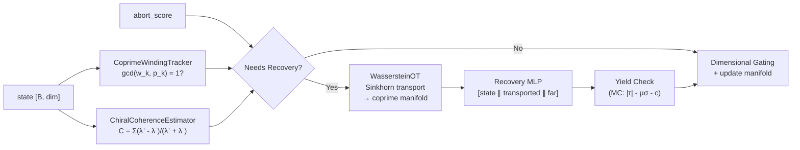

# Speculative Coprime Chiral Coherence Gating (SCCCG)

> Recovery of structure from "converged" states using coprime parity, chiral coherence, and Wasserstein optimal transport.
> **Source**: [`src/core/speculative_coprime_gate.py`](../src/core/speculative_coprime_gate.py) (641 lines)

---

## 1. Overview

When the system detects structural collapse — low chiral score, broken coprime parity, or CALM abort — the SCCCG module attempts **speculative recovery** via optimal transport rather than emitting a failure token.



**Recovery triggers** (any one):
- CALM abort score > 0.5
- Chiral score < `recovery_threshold` (default 0.1)
- Coprime parity lock broken (any head violates `gcd(w_k, p_k) = 1`)

---

## 2. WassersteinOptimalTransport

Approximates the W₂ distance using Sinkhorn iterations with entropic regularization.

$$W_\varepsilon(P, Q) = \min_T \langle T, C \rangle - \varepsilon H(T)$$

| Method | Input | Output |
|--------|-------|--------|
| `compute_cost_matrix(source, target)` | `[n, dim]`, `[m, dim]` | `C [n, m]` — chiral-modulated squared distances |
| `sinkhorn(C, a, b)` | cost matrix + marginals | `T [n, m]` — optimal transport plan |
| `transport(source, target)` | `[n, dim]`, `[m, dim]` | `(transported [n, dim], W₂ scalar)` |

The cost modulator is a learnable linear layer (initialized to identity) that emphasizes asymmetric dimensions in the transport cost.

---

## 3. CoprimeWindingTracker

Tracks phase-angle winding numbers around each functional head to enforce the coprime parity condition:

$$\gcd(w_k, p_k) = 1 \quad \forall k$$

| Step | Computation |
|------|-------------|
| Project | `head_proj(state)` → `[B, 2·num_heads]` (sin/cos pairs) |
| Phase | `atan2(sin, cos)` → phases per head |
| Winding | Accumulate `phase / 2π` over time |
| GCD check | Quantize winding to integer, check `gcd(w_k, p_k) == 1` |

**Anti-lobotomy**: `p_k` values use Legendre polynomial coefficients `P_k(0.7)` instead of hardcoded primes.

Returns:
- `coprime_lock`: `True` iff all heads satisfy coprimality
- `parity_violations`: `[num_heads]` boolean mask

---

## 4. ChiralCoherenceEstimator

Estimates chiral coherence via spectral asymmetry of the covariance matrix:

$$C = \frac{\sum_i |\lambda_i^+ - \lambda_i^-|}{\sum_i (\lambda_i^+ + \lambda_i^-)}$$

| Regime | Method |
|--------|--------|
| Buffer < 4 samples | FFT spectral flux asymmetry (low/high frequency power ratio) |
| Buffer ≥ 4 samples | Eigenvalue decomposition of positive/negative sector covariances |

High chiral score = strong asymmetric structure (healthy).
Low chiral score = symmetric/collapsed (triggers recovery).

---

## 5. SpeculativeCoprimeGate (Main Module)

Combines all three sub-modules plus Mohr-Coulomb yield checking and dimensional gating.

### 5.1 Constructor Parameters

| Parameter | Default | Purpose |
|-----------|---------|---------|
| `dim` | — | State dimensionality |
| `num_heads` | 8 | Coprime winding heads |
| `recovery_threshold` | 0.1 | Minimum chiral score before recovery |
| `sinkhorn_iters` | 20 | Sinkhorn iterations for OT |
| `wasserstein_epsilon` | 0.1 | Entropic regularization |

### 5.2 Speculative Recovery Pipeline

1. **Transport**: Sinkhorn OT moves collapsed state → coprime reference manifold
2. **Near-Far Coupling**: Far component = mean of target manifold × learned coupling ε
3. **Recovery MLP**: `[state ∥ transported ∥ far]` → recovery delta
4. **Yield Check**: MC yield `|τ| - μσ - c > 0` confirms rupture is generative
5. **Dimensional Gating**: Suppress dimensions with parity violations (×0.1)
6. **Manifold Update**: If generative, FIFO-update reference manifold

### 5.3 Forward Decision Tree

```
if abort_score > 0.5 OR chiral_score < threshold OR ¬coprime_lock:
    → speculative_recovery(state)
else:
    → update_manifold(state) + gated_output(state)
```

---

## 6. Return Dictionary

| Key | Type | When |
|-----|------|------|
| `coprime_lock` | bool | Always |
| `chiral_score` | float | Always |
| `wasserstein_distance` | float | Always (0.0 if no recovery) |
| `winding_numbers` | `[num_heads]` | Always |
| `parity_violations` | int | Always |
| `recovery_attempted` | bool | Always |
| `yield_pressure` | float | Recovery only |
| `is_generative` | bool | Recovery only |

---

## 7. Related Documentation

| Doc | Section |
|-----|---------|
| [MATHEMATICAL_DETAILS.md](MATHEMATICAL_DETAILS.md) | §18.2 Coprime Parity |
| [INVARIANT_OPTIMIZATION.md](INVARIANT_OPTIMIZATION.md) | §7.3 Chiral Drift Optimizer |
| [PHYSICS_ADMM.md](PHYSICS_ADMM.md) | §3.2 CALM Predictor (abort signal source) |
| [KAGH_NETWORKS.md](KAGH_NETWORKS.md) | §6 Gödel Logic Gate (related saturated gating) |
