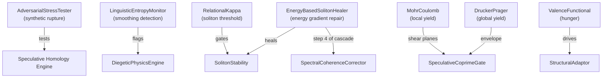

# Structural Monitors & Yield Criteria

> Adversarial stress testing, entropy monitoring, soliton detection, yield projections, and hunger drives.

---

## 1. AdversarialStressTester

**Source**: [`src/core/collapse_poisoner.py`](../src/core/collapse_poisoner.py) (155 lines)

Generates synthetic "rupture" events to verify the Speculative Homology Engine detects structural failures correctly.

### Capabilities

| Method | Purpose |
|--------|---------|
| `generate_synthetic_rupture(manifold)` | Creates orthogonal perturbation via Gram-Schmidt that should change Betti numbers |
| `compute_cycle_debt(state)` | Measures topological "boredom" — cosine similarity to history (>0.9 = repeat) |
| `forward(manifold, trigger_rupture)` | Returns `{cycle_debt, debt_warning}` ± optional rupture tensor |

**Cycle Debt**: `debt = repeats / filled_history`. When `debt > 0.5`, the system is looping and needs structural perturbation.

---

## 2. LinguisticEntropyMonitor

**Source**: [`src/core/narrative_collapse.py`](../src/core/narrative_collapse.py) (108 lines)

Monitors reasoning chain smoothness to detect hallucination loops and artificial smoothing.

| Check | Method | Trigger |
|-------|--------|---------|
| **Entropy** | `calculate_entropy(hidden)` → softmax entropy | `entropy < 0.01` → smoothing warning |
| **Trajectory** | `detect_smoothing(current, recent)` → cosine sim of consecutive deltas | `smoothness > 0.99` → linear trajectory |

Uses `ResidueObstructionGraph` for PAS_h integration. Forward returns `{entropy, smoothing_warning, is_linear, smoothness_score}`.

---

## 3. RelationalKappa

**Source**: [`src/core/relational_kappa.py`](../src/core/relational_kappa.py) (149 lines)

Context-dependent soliton threshold — never learned, always architectural.

$$\kappa(t) = \mu_{\text{rupture}}(t) + \lambda \cdot \sigma_{\text{rupture}}(t)$$

| Parameter | Value | Constraint |
|-----------|-------|-----------|
| `λ (temperament)` | 4.5 | **NOT** `nn.Parameter` — chosen, not learned |
| `window_size` | 50 | Rolling statistics window |
| `min_history` | 5 | Minimum before κ computation |

**Key invariant**: Learning κ turns solitons into rewards → rewarded solitons become attractors → attractors destroy rupture sensitivity.

| Method | Returns |
|--------|---------|
| `is_soliton(tension)` | `(bool, κ)` — exceeds threshold? |
| `check_kappa_flatline()` | `True` if σ → 0 (forced topological thaw) |

---

## 4. Yield Criteria

**Source**: [`src/core/yield_criteria.py`](../src/core/yield_criteria.py) (76 lines)

Dual-regime plasticity for information flow:

### MohrCoulombProjection (Sharp/Local)
$$\tau = c + \sigma \tan\phi$$

Projects pressure onto the MC yield surface. When `|τ| > strength`, the system ruptures locally — the brittle edge is **preserved**, not smoothed.

### DruckerPragerProjection (Smooth/Global)
$$\alpha I_1 + \sqrt{J_2} - k = 0$$

Provides a convex envelope over MC rupture sites. Smoothly scales back pressure exceeding `k`.

| Class | Regime | Behavior at yield |
|-------|--------|------------------|
| `MohrCoulombProjection` | Local/brittle | Sharp rupture (preserves edges) |
| `DruckerPragerProjection` | Global/smooth | Convex envelope (navigability) |

---

## 5. ValenceFunctional

**Source**: [`src/core/valence_drive.py`](../src/core/valence_drive.py) (54 lines)

Measures the manifold's "hunger" — the drive to resolve structural dissonance.

$$V = \eta \cdot \max(0, \; P_{\text{current}} - S_{\text{satisfaction}})$$

where $S$ is an EMA baseline updated as `S ← 0.99·S + 0.01·P`.

| Parameter | Default | Purpose |
|-----------|---------|---------|
| `decay` | 0.99 | EMA decay for satisfaction baseline |
| `hunger_scale` (η) | 1.0 | Amplification of hunger signal |

Returns scalar hunger tensor. Zero hunger = system is at or below its historical satisfaction level.

---

## 6. Integration Map

---

## 6. EnergyBasedSolitonHealer (`src/core/energy_based_soliton_healer.py`)

**Class**: `EnergyBasedSolitonHealer`

Heals structurally damaged solitons by gradient descent on a learnable energy surface, invoked during the **Spectral Coherence Repair Cascade** (Step 4 of 4).

### 6.1 Energy Surface

$$E(W, \text{state}, \text{target}) = \|\underbrace{A(\text{state} - \text{target})}_{\text{quadratic}}\|^2 + \underbrace{b \cdot \text{state}}_{\text{linear bias}}$$

where $A \in \mathbb{R}^{d \times d}$ (`energy_weights`) and $b \in \mathbb{R}^d$ (`energy_bias`) are learnable. Lower energy = more stable/compatible configuration. When no explicit target is provided, the **soliton template** is used.

### 6.2 Soliton Template

The stable reference point is constructed analytically:

$$\text{template}_i = \cos\!\left(\frac{2\pi i}{\phi}\right) + \sum_{p \in \text{primes}} 0.1 \cdot \sin\!\left(\frac{2\pi i}{p}\right)$$

normalized to unit energy. $\phi = (1+\sqrt{5})/2$ (golden ratio) provides harmonic stability; prime-based modulation (dynamically generated — no hardcoded lists) adds number-theoretic grounding.

### 6.3 Healing Protocol

`heal_soliton(state, iteration_count)` applies gradient descent on `−∇E`:

| Energy level | Healing rate |
|---|---|
| `E > energy_margin` | `healing_rate` (strong correction) |
| `E < energy_margin` | `0.1 × healing_rate` (gentle stabilization) |

Terminates when `‖−∇E‖ < stability_threshold` or max steps `iteration_count × 10` reached. Numerical safety: state clamped to `[−10, 10]` after each step.

### 6.4 Contrastive Energy Shaping

`update_energy_function(positive_states, negative_states)` uses a hinge loss:

$$\mathcal{L} = \max\!\left(0,\; \text{margin} + E(\text{positive}) - E(\text{negative})\right)$$

Shapes the energy surface so that soliton states have lower energy than anti-soliton configurations.

### 6.5 Diagnostics

`get_stability_metrics()` returns rolling statistics over last 10 healings:

| Key | Meaning |
|-----|---------|
| `stability_score` | Fraction of healings reaching `E < margin` |
| `healing_efficiency` | `1 − (avg_steps / max_steps)` |
| `avg_energy_level` | Mean final energy |
| `healing_consistency` | `1 − std(final_energy)` |

---

## 7. Integration Map

