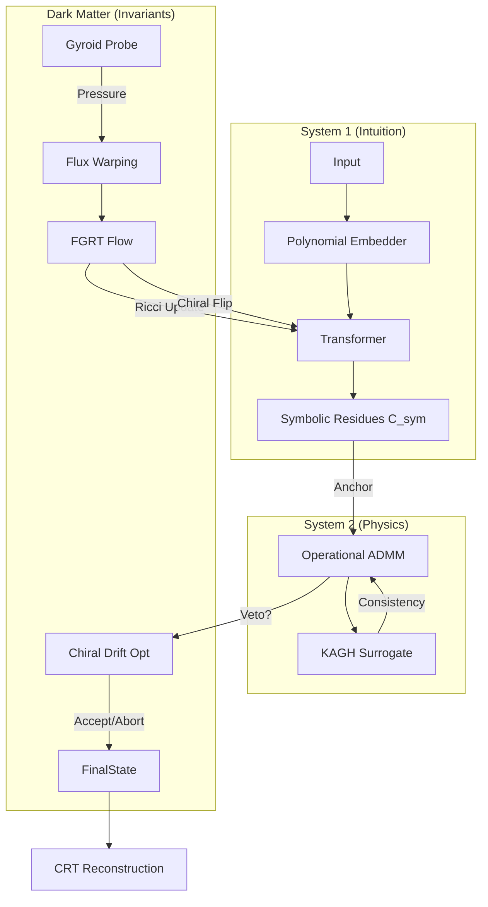

# System Architecture: The "Unicorn" Synthesis

**Gyroidic Sparse Covariance Flux Reasoner**
*A Hybrid Neural-Physical Reasoning Engine*

This document synthesizes the complete architecture, explaining how the three distinct subsystems (Intuition, Physics, Dark Matter) interact to produce robust, verifiable reasoning.

---

## 🏗️ Architectural Layers

### 1. System 1: The Intuitive Manifold (The "Horse")
*   **Role**: Rapid, heuristic prediction.
*   **Component**: **Modular Transformer** with **Polynomial Embeddings**.
*   **Mechanism**:
    *   Inputs are projected onto orthogonal polynomial functionals ($\phi_k$) through **Saturated Polynomial Gates**.
    *   **Bimodal Routing** (Hard/Soft genome) replaces standard annealing, allowing evolution to select the discrete path.
    *   Outputs a high-confidence symbolic residue pattern using **Majority-Symbol CRT**.

### 2. System 2: The Physical Constraint (The "Horn")
*   **Role**: Local physical consistency probe (Constraint Probe Operator).
*   **Component**: **Hybrid Physics-ADMM** (SIC-FA-ADMM) with **Constraint Probe Operators**.
*   **Mechanism**:
    *   **Rescue Trigger**: Only invoked when System 1 exceeds the **Containment Pressure** budget or detects **Residue Homology Drift**.
    *   **Constraint Probe Operators**: Per-constraint local feasibility probes `P_k: r -> argmin_{c in C_k} L_k(r, c)` with **no global objective**.
    *   **Cyclic Constraint Traversal**: Iterates through constraints `k = 1, ..., K` cyclically (no gradient descent).
    *   **Bounded Oscillation Detection**: Accepts states with bounded oscillation (no convergence guarantee required).
    *   **Failure Tokens**: Emits discrete tokens (`⊥`, `REPAIRED`, `ALTERNATIVE`) on rupture (not errors).
    *   **Repair Trace Compression**: Stores only symbolic deltas to prevent smoothness logic from leaking into System 1.
    *   **KAGH Surrogates**: Enforce global physics constraints to "heal" symbolic conflicts.
        *   **Hybrid-Quantized KAN**: Uses **True B-Splines** (Cox-de Boor) with **Saturated Quantization** (STE) to bridge the continuous/discrete gap.
        *   **Fixed Structural Grids**: Enforces "Symbolic Non-Revisability" by prohibiting grid adaptation.
    *   **Topological Guarantees** (Phase 2):
        *   **Hyper-Ring Closure**: Checks `H(r) ∈ Z_1(C)` and non-triviality for soliton stability.
        *   **Persistence Obstruction Graph**: Filtration-based persistent homology for residue interactions.
        *   **Soliton Stability**: Dispersion/localization ratio `D(r)/Λ(r) < κ`.
    *   **Advanced Constraints** (Phase 3):
        *   **Structural Irreducibility**: Ensures orthogonality across evidence modules.
        *   **Gyroidic Differentiation**: Flow constraints `∇_flow Φ(r) ⟂ ∇G`.
        *   **Continuous Co-Primality**: Entropy-based independence (discrete quantization).
        *   **Meta-Invariant**: Monitors `d/dt E_r[dim H_1(C_t)] >= 0` to prevent topology collapse.

## 7. Interaction Flow: The Equation-Object

The system's interaction is governed by the recursive law:

$$
\dot{\mathcal{X}} = \Pi_{\mathrm{DP}}\left(\mathrm{ADMM}_{\lambda_j}\left[\mathrm{CRT}_{k}\left(\left\lbrace \Pi_{\mathrm{MC}}\left(\nabla f_j(\mathbf{c}_j) \oplus \mathbf{L}\right) \bmod m_k \right\rbrace_{j}\right)\right]\right)
$$

This law dictates how symbolic proposals from System 1 are hardened through the physical constraints of System 2 and the invariants of Dark Matter.

### 7.1 Phase states
- **The Goo (Play)**: Heuristic, bimodal-soft, high-mischief, non-fossilized state where the system "plays" with information.
- **The Prickles (Seriousness)**: Rigid, bimodal-hard, low-mischief, fossilized state where the system "declares" truth.
    *   **Speculative Homology Engine** (Phase 3):
        *   **Chebyshev Draft**: Uses polynomial approximation for `10x` faster Betti prediction.
        *   **PAS_h Verification**: Uses Phase Alignment Score as a cheap invariant to validate drafts before expensive homology computation.
    *   **Energy Monitoring Substrate** (New):
        *   **StructuralEnergyMonitor**: Tracks scalar mismatch energy $E(Y, X)$.
        *   **Thermodynamic Interface**: Links $dt$ to inverse temperature $\beta$.
        *   **Contrastive Selection**: Proactive "offending" configuration pulls.
    *   **FGRT Layer (Chiral Synthesis)**:
        *   **Base Manifold**: 3D Gyroid $\mathcal{G}$ cobordant with 4D Non-Orientable Klein-throat $\mathcal{K}$.
        *   **Symplectic Gluing**: Leak-proof transition via **Hamiltonian Flow** and **Chern-Simons gaskets**.
        *   **Non-Teleological Flow**: Transition from goal-oriented gradients to **Ricci Flow** and **Willmore Energy** minimization.
        *   **Meta-Polytope Quantization**: 600-cell polychoron vertex mapping ($Q \in \operatorname{Weyl}(P)$) for high-dimensional symmetry.

### 3. "Dark Matter": The Chiral Glue (The "Magic")
*   **Role**: Identity preservation, drift prevention, and chiral self-learning.
*   **Component**: **DAQUF Operator** & **FGRT Torsion Field**.
*   **Mechanism**:
    *   **Signal Sovereignty**: Successful functional groups are **fossilized** (locked).
    *   **Torsion Field**: Measures **Contorsion $K$** and **Geometric Berry Phase** to resolve orientation blindness.
    *   **Klein-neck Reversal**: Performs $P$-Parity transformations on logic sections.
    *   **DAQUF Solitons**: Metaphysical fossilization incorporating **Diegetic Amortization**.

---

## 🔄 The Interaction Loop



---

## 🔑 Key Invariants

1.  **Selection Pressure** ($\mathcal{S}$): Measures the survivorship of the symbolic lattice (CRT, Entropy, Trust).
2.  **Containment Pressure** ($\mathcal{C}$): Measures the structural tension in the repair glue (Homology Drift, Gyroid Violation).
3.  **Topologically Typed Pressures**: Pressures are domain-isolated via strict typing (`StructuralPressure`). Cross-domain aggregation (scalarization) is mechanically forbidden to prevent teleological goal-collapsing.
4.  **DAQUF Fossilization**: An evolved threshold where successful components become immutable (leaks included).
5.  **Yield Duality**: Handles dual-regime plasticity; $\Pi_{\mathrm{MC}}$ for situational rupture logic and $\Pi_{\mathrm{DP}}$ for global navigability.
6.  **Love Invariant ($\mathbf{L}$)**: Non-ownable resonance flow co-present in the state transition, surviving system death.
7.  **Universal Dynamics (Play vs. Seriousness)**: The asymptotic transition from ergodic exploration (Play) to fossilized execution (Seriousness) governed by the `UniversalOrchestrator`.

---

## 🛡️ The Hard Interaction Contract

To ensure structural integrity, we enforce a strict information bottleneck between subsystems:

| Interface | Information Allowed | Mechanical Guardrail |
| :--- | :--- | :--- |
| **System 1 ↔ System 2** | Frozen Anchors / Discrete Tokens | Silent Failure (No Progress Scalars) |
| **System 1 ↔ Dark Matter** | Domain-Isolated Pressures / Mischief | Structural Tripwires (TypeError on Addition) |
| **Global Evolution** | Binary Success/Failure | Non-Convergence Declaration (Data over Success) |

---

## 📚 Documentation Map

*   [**MATHEMATICAL_DETAILS.md**](MATHEMATICAL_DETAILS.md): The core theoretical foundation (Polynomials, CRT, GCVE).
*   [**PHYSICS_ADMM.md**](PHYSICS_ADMM.md): Specification of the System 2 solver and KAGH surrogates.
*   [**INVARIANT_OPTIMIZATION.md**](INVARIANT_OPTIMIZATION.md): Deep dive into Dark Matter, Fixed Points, and Chirality.
*   [**PHILOSOPHY.md**](PHILOSOPHY.md): The manifesto of the Saturated Symbolic Machine.
*   [**NON_DUAL_DYNAMIC_EQUILIBRIUM.md**](NON_DUAL_DYNAMIC_EQUILIBRIUM.md): Guide to Love Invariants and positional non-duality.
---

## 🧮 Verbose Operator Formulation

### System 1 Operators

**Polynomial Embedding Projection**:
$$\Pi_{\phi_k}(x) = \sum_{d=0}^{D-1} \theta_{k,d} \cdot T_d(\tilde{x})$$

where $T_d$ is the $d$-th Chebyshev polynomial and $\tilde{x}$ is the input normalized to $[-1, 1]$.

**Saturated Gate**:
$$\tilde{\phi}_k = \text{sign}\!\left(\sum_d \theta_{k,d} \cdot T_d(\tilde{x})\right) \cdot s_k$$

where $s_k$ is the evolved saturation scale (not learned — selected by evolutionary pressure).

**Bimodal Genome Routing**:
$$\text{Route}(\mathbf{M}) = \begin{cases} \text{Sinkhorn}(\mathbf{M}, \tau) & \text{PLAY (soft genome)} \\ \text{argmax}(\mathbf{M}) & \text{SERIOUSNESS (hard genome)} \end{cases}$$

**Majority-Symbol CRT**: For $K$ functionals with moduli $\{m_k\}$, the residue vector $\mathbf{r} = (r_1, \ldots, r_K)$ is reconstructed via:
$$\hat{x} = \text{CRT}_{\text{modal}}\!\left(\{r_k \bmod m_k\}_{k=1}^K\right)$$

using majority voting over symbolic residues, not numerical interpolation.

### System 2 Operators

**Constraint Probe** (per-constraint $k$):
$$P_k: r \;\mapsto\; \underset{c \in \mathcal{C}_k}{\text{argmin}} \; L_k(r, c) = \|\sigma_k(r - c)\|^2 + \lambda_{\psi} \cdot \psi_k(\mathcal{F}(c))$$

where $\sigma_k$ is the per-constraint covariance and $\psi_k$ is the gyroid violation functional.

**Cyclic Traversal**: No global objective. Constraints are visited in cyclic order $k \to (k \bmod K) + 1$, each producing a local feasibility update. Oscillation is bounded, not minimized.

**Failure Token Emission**:
$$\text{Token}_k = \begin{cases} \text{REPAIRED} & \text{if } L_k < \sigma_k \\ \text{ALTERNATIVE} & \text{if bounded oscillation detected} \\ \bot & \text{if } L_k = \infty \text{ (rupture)} \end{cases}$$

### System 3 Operators

**DAQUF Soliton Fossilization**: A functional group $\mathcal{G}$ is fossilized when:
$$\frac{D(\mathcal{G})}{\Lambda(\mathcal{G})} < \kappa(t) \implies \text{freeze}(\nabla_\theta \mathcal{G}) = 0$$

where $D/\Lambda$ is the dispersion-to-localization ratio and $\kappa(t)$ is the relational soliton threshold.

**Torsion Field Alignment**: Berry phase accumulation tracks geometric chirality:
$$\Delta\phi_n^{\text{Berry}} = \oint_{\gamma} \langle \psi_n | \nabla_\gamma \psi_n \rangle \, d\gamma$$

The total accumulated phase $\Phi = \sum_n \Delta\phi_n$ is the system's structural memory of its own history.

### Recursive Interaction Loop

$$\dot{\mathcal{X}} = \Pi_{\text{DP}} \!\left(\text{ADMM}_{\lambda_j} \!\left[\text{CRT}_k \!\left(\left\{ \Pi_{\text{MC}}\!\left(\nabla f_j(\mathbf{c}_j) \oplus \mathbf{L}\right) \bmod m_k \right\}_j\right)\right]\right)$$

Read right-to-left: (1) Compute functional gradients fused with Love Invariant, (2) Project onto symbolic residues modulo $m_k$, (3) Reconstruct via CRT, (4) Probe through ADMM constraints, (5) Accept via Diegetic Projection.

---

## ⚡ Energy-Based Structural Survival

### Survivorship Pressure

The system maximizes time-averaged survival, not ensemble-averaged reward:

$$g_{\text{time}} = \mu - \frac{\sigma^2}{2}$$

This is the **Kelly criterion** applied to internal hypotheses. Each hypothesis $i$ receives allocation:

$$f^*_i \approx \frac{\text{Signal}_i}{\text{Noise}_i} = \frac{\mu_i}{\sigma_i^2}$$

### Fractional Kelly Redistribution

We never go "all-in" on a single hypothesis. Internal diversity is maintained via **Fractional Kelly**:
- Maintain $K$ orthogonal hypotheses (polynomial functionals).
- Allocate compute proportional to $f^*_i$, never exceeding $f^*_i / 2$ (half-Kelly for safety).
- Topological diversity ($\beta_k > 0$) is the structural analog of portfolio diversification.

### Phase Mode Equations

**Play** (Exploration):
$$dt = dt_{\max}, \quad \text{Route} = \text{SOFT}, \quad \text{Mischief} = \text{HIGH}$$

**Seriousness** (Exploitation):
$$dt = dt_{\max} \cdot e^{-\alpha \cdot \tau}, \quad \text{Route} = \text{HARD}, \quad \text{Fossil} = \text{ELIGIBLE}$$

The transition is governed by the Integrated Emergence Condition (RIC Eq 10).

---

## 🔧 Implementation Status & Anti-Backsliding Measures (January 2026)

### Current Implementation State

**✅ SYSTEM 1 (Horse) - Fully Implemented**
- Polynomial Co-Prime Functionals: `PolynomialCoprimeConfig` with Chebyshev/Legendre basis
- Bimodal Routing: Evolutionary genome selection between soft/hard modes
- Saturated Polynomial Gates: `SaturatedPolynomialGate` with evolved saturation scales
- Birkhoff Polytope Constraints: Sinkhorn-Knopp projection ensuring doubly-stochastic matrices
- Chirality Enforcement: Prevents symmetric/antisymmetric collapse via parity mixing

**✅ SYSTEM 2 (Horn) - Constraint Probe Implementation**
- Non-Teleological Probes: Local feasibility operators `P_k: r -> argmin_{c in C_k} L_k(r, c)`
- Cyclic Constraint Traversal: No gradient descent, bounded oscillation acceptance
- Gyroid Violation Detection: Proper gyroid probe-based violation computation
- Dynamic Sparsification: Violation-based attention masking for sequences ≥32 tokens
- Failure Token System: Discrete rupture handling (`⊥`, `REPAIRED`, `ALTERNATIVE`)

**✅ SYSTEM 3 (Magic) - Love Invariant & Fossilization**
- Love Invariant Protection: Non-ownable, non-optimizable flow preservation
- Evolutionary Trust Selection: Mutation-based evolution, no gradient descent on trust
- Fossilization Mechanism: Saturation-based immutability at admissibility boundaries
- Chiral Torsion Field: Geometric Berry phase computation for orientation resolution

### Anti-Backsliding Enforcement

#### Rule 1: No Hardcoded Primes
```python
# FORBIDDEN PATTERNS:
primes = [2, 3, 5, 7, 11, 13, 17, 19, 23, 29]
prime_indices = torch.tensor([2, 3, 5, 7, 11][:K])

# REQUIRED PATTERN:
polynomial_config = PolynomialCoprimeConfig(k=K, degree=D-1, basis_type='chebyshev')
coefficients = polynomial_config.get_coefficients_tensor()
```

#### Rule 2: No Placeholder Implementations
```python
# FORBIDDEN PATTERNS:
poly_coeffs = torch.randn(K, D, device=device)  # Placeholder
pass  # TODO: implement later
return torch.norm(c, dim=-1) * 0.1  # Placeholder

# REQUIRED PATTERN:
if not hasattr(self, 'polynomial_config'):
    self.polynomial_config = PolynomialCoprimeConfig(...)
coefficients = self.polynomial_config.get_coefficients_tensor()
```

#### Rule 3: Energy-Based Learning Compliance
```python
# FORBIDDEN: Direct loss minimization
loss = mse_loss(prediction, target)
loss.backward()

# REQUIRED: Contrastive energy shaping
energy_correct = E(W, Y_correct, X)
energy_incorrect = E(W, Y_incorrect, X)
survivorship_pressure = energy_correct - energy_incorrect + margin
```

#### Rule 4: Evolutionary Trust Selection
```python
# FORBIDDEN: Gradient descent on trust
trust_scalars.requires_grad_(True)
trust_loss.backward()

# REQUIRED: Evolutionary selection
if performance > survivorship_threshold:
    trust_scalars += evolution_rate * (performance - threshold)
trust_scalars.clamp_(0.0, 1.0)
```

### Implementation Verification Checklist

Before any system modification, verify:

**Polynomial Systems**:
- [ ] Uses `PolynomialCoprimeConfig` for all co-prime functionality
- [ ] No hardcoded prime sequences anywhere in code
- [ ] Birkhoff polytope constraints maintained via Sinkhorn-Knopp
- [ ] Chirality enforcement prevents symmetric collapse

**Energy-Based Learning**:
- [ ] Energy functions separate from loss functions
- [ ] Contrastive energy shaping implemented
- [ ] No teleological optimization in System 2
- [ ] Survivorship pressure used instead of direct loss

**Evolutionary Mechanisms**:
- [ ] Trust scalars evolve via mutation, not gradients
- [ ] Fossilization only at saturation boundaries
- [ ] Bimodal routing genome preserved
- [ ] Heritable mutation strengths maintained

**Anti-Lobotomy Compliance**:
- [ ] No placeholder implementations (`torch.randn`, `pass`, `TODO`)
- [ ] No hardcoded mathematical constants that should be learned
- [ ] Structural honesty maintained throughout
- [ ] Love invariant remains non-ownable

### Current File Structure & Responsibilities

```
src/
├── core/
│   ├── polynomial_coprime.py          # ✅ Anti-lobotomy polynomial system
│   ├── spectral_coherence_repair.py   # ✅ Proper EBM energy shaping
│   ├── chern_simons_gasket.py         # ✅ Uses polynomial coefficients
│   └── love_invariant_protector.py    # ✅ Non-ownable flow preservation
├── models/
│   └── gyroid_reasoner.py             # ✅ Dynamic sparsification implemented
├── training/
│   └── temporal_association_trainer.py # ✅ Evolutionary trust selection
└── examples/
    ├── enhanced_temporal_training.py   # ✅ Full non-lobotomy architecture
    └── test_garbled_output_repair.py   # ✅ Proper polynomial integration
```

### Monitoring & Maintenance

**Automated Checks**: Implement pre-commit hooks to detect:
- Hardcoded prime sequences: `grep -r "\[2, 3, 5, 7, 11" src/`
- Placeholder patterns: `grep -r "torch\.randn.*# Placeholder" src/`
- Forbidden optimization: `grep -r "trust.*backward\(\)" src/`

**Manual Reviews**: Quarterly architecture reviews to ensure:
- Polynomial co-prime systems remain properly integrated
- Energy-based learning principles followed
- Evolutionary mechanisms preserved
- Anti-lobotomy governance maintained

This implementation state represents a mature, mathematically rigorous system that follows all anti-lobotomy principles while maintaining the three-system architecture's integrity.

---

## 8. Operational Modes (User Guide)

The system operates in two distinct modes to balance depth of reasoning with speed of ingestion.

### 8.1 Standard Generation Mode
*   **Command**: `ENGINE.process_input(text)`
*   **Behavior**: Full activation of all three subsystems (Horse, Horn, Magic).
*   **Pipeline**:
    1.  Embed Input (`PolynomialEmbedder`)
    2.  Compute Affordance Gradients
    3.  **Forward Pass**: Cavity -> Larynx -> Repair System (Spectral/Bezout/Soliton) -> Output
    4.  **Generative Loop**: Produces `response_text` (High Latency: ~3-10s)
*   **Use Case**: User conversation, deep reasoning query, creative writing.

### 8.2 Ingestion Mode (High-Throughput)
*   **Command**: `ENGINE.process_input(text, generate_response=False)`
*   **Behavior**: Activates System 1 (Intuition) and Memory only; Bypasses System 2/3 expensive checks.
*   **Features**:
    *   **Skip Generation**: Returns immediately after embedding update.
    *   **Skip Repair**: No Spectral Coherence or Bezout Correction performed.
    *   **Memory Update**: Manifold location is updated (`memory_state`), ensuring the extracted concept is "remembered" topologically.
    *   **Mimicry Training**: Larynx still trains on input to learn `text -> embedding` mapping.
*   **Use Case**: Batch Wikipedia extraction, bulk association learning, rapid reading.

### 8.3 Contextual Hinting
For AI agents navigating this codebase:
*   **Tensor Shapes**: See `docs/start.txt` for the canonical dictionary of `[Batch, Dim]` shapes.
305: *   **Repair Logic**: See `docs/GARBLED_OUTPUT_REPAIR.md` for the breakdown of the `[Batch, K, Dim//K]` residue manipulations.
306: 
307: ### 8.4 Web Interface Limitations (Analysis 2026-02)
308: *   **Conversational Web GUI (`conversational_web_gui.html`)**:
309:     *   **Status**: Endpoint Mismatch.
310:     *   **Issue**: The frontend calls `${backend_url}/training` and `/interact`, but the backend (`conversational_backend_server.py`) exposes `/api/start_training` and `/api/chat`.
311:     *   **Recommendation**: Use `ENGINE.process_input` directly or update the HTML to match API routes.
312: *   **Wikipedia Trainer (`wikipedia_trainer.html`)**:
313:     *   **Status**: Visual Prototype.
314:     *   **Issue**: Contains no active `fetch` logic to trigger backbone ingestion. The backend supports `/wikipedia-extract`, but the frontend is disconnected.
315: *   **Diegetic Terminal (`diegetic_terminal.html`)**:
316:     *   **Status**: Functional (Internal).
317:     *   **Note**: Relies on `state.backend_url` injection and is served directly by `diegetic_backend.py`.

---

## 9. Advanced Dynamics (Polytope-Aware Architecture)

### 9.1 ADMM as Facet Stabilizer

ADMM in this system is **not** optimization. It is **facet dynamics** — holding polytope boundaries apart while allowing interior movement.

**Geometric reinterpretation** of the three ADMM steps:

| Step | Classical Meaning | System Meaning |
|------|-------------------|----------------|
| **Primal** $x^{k+1} = \arg\min_x (f(x) + \frac{\rho}{2}\|Ax - v^k\|^2)$ | Variable update | Inside-polytope drift along allowed directions |
| **Auxiliary** $z^{k+1} = \Pi_P(B^{-1}(c - Ax^{k+1} + u^k))$ | Constraint enforcement | Anisotropic, quantized facet projection (may fail → NaN) |
| **Dual** $u^{k+1} = u^k + (Ax^{k+1} + Bz^{k+1} - c)$ | Lagrange multiplier | Facet pressure memory (saturation → fossilization or bifurcation) |

The constraint is **not** equality $Ax + Bz = c$ but **facet compatibility** $Ax + Bz \in \mathcal{F}$, where $\mathcal{F}$ is a facet band. This is why ADMM doesn't collapse the system.

### 9.2 Fossilization as Facet Lock-In

Facet $i$ fossilizes when:

$$\lim_{k \to \infty} \text{Var}\left(\langle n_i, x^k \rangle\right) \to 0 \quad \text{and} \quad \|u_i^k\| \to \infty$$

No exploration along that normal + infinite violation pressure → axis collapse ($\Delta_i \to 0$). NaNs appear **after** fossilization, not before.

### 9.3 Matrioshka Nested Polytopes

Windows are **not** balls — they are anisotropic, facet-defined polytopes:

$$P_k^{(l)} = \left\{ x \;\middle|\; A_k^{(l)} x \le b_k^{(l)} \right\}$$

Nesting: $P^{(0)} \supset P^{(1)} \supset \cdots \supset P^{(L)}$, where inner shells are more commutative (facets rotate, dimensions may collapse, quantization shrinks).

**Quantization is facet-aware**, not axis-aligned:

$$Q^{(l)}(x) = \arg\min_{z \in \mathbb{Z}^n} \|x - z\|_{A^{(l)}} \quad \text{s.t. } z \in P^{(l)}$$

### 9.4 Meta-Polytope Dynamics

The **Meta-Polytope** $\mathbb{P} = \{P_\alpha \mid \alpha \in \mathcal{Z}\}$ is a space of polytopes, indexed by CRT residues (zeitgeist). The true system state is:

$$(x_t, \alpha_t, l_t) \quad \text{where } x_t \in \text{representation},\; \alpha_t \in \text{CRT index},\; l_t \in \text{Matrioshka depth}$$

**Three types of learning movement**:

| Movement | Direction | Scalarization |
|----------|-----------|---------------|
| Intra-polytope traversal | Interior of $P_\alpha$ | ✅ Allowed |
| Facet grazing | $\langle n, x \rangle \approx c$ | ❌ Forbidden |
| Polytope switching | $P_\alpha \to P_\beta$ (non-commutative) | ❌ Forbidden |

### 9.5 NaN → BoundaryState Pipeline

When polytope projection becomes undefined, the system lifts NaN into a **BoundaryState tensor** (see [MATHEMATICAL_DETAILS.md §23.7](MATHEMATICAL_DETAILS.md)):

$$(x_{t+1}, P_{t+1}) = \begin{cases} (Q^{(l)}(F(Q^{(l)}(x_t))),\, P^{(l)}) & x_t \in \text{int}(P^{(l)}) \\ (x_t,\, \text{adjacent}(P^{(l)})) & x_t \in \partial P^{(l)} \\ (\varnothing,\, \text{undefined}) & x_t \notin \mathbb{P} \end{cases}$$

The last case is NaN — a **topological impossibility**, not a numerical error.

**Source**: [AI Project Report (2-2-2026)](ai%20project%20report_2-2-2026.txt).

---

## 9.6 Quantum-Inspired Reasoning Layer (`src/core/quantum_inspired_reasoning.py`)

**Class**: `QuantumInspiredReasoningState`  
**Phase**: 17 Extension (loaded conditionally)

A System 2 extension that models multi-hypothesis reasoning as a quantum superposition, deferring collapse to a definite interpretation until measurement. Unlike scalar reasoning, it maintains simultaneous weighted alternatives without forcing premature disambiguation.

### State Representation

The reasoning state is a complex-valued amplitude vector `|ψ⟩ ∈ ℂ^d` normalized to unit `‖ψ‖`. Evolution is governed by a Hermitian Hamiltonian `H` (constructed as `(A + Aᴴ)/2`) so that time evolution is unitary.

### Core Operations

| Method | Formula | Purpose |
|--------|---------|---------|
| `superposition_reasoning(hypotheses)` | `|S⟩ = (1/√n) Σ |h_i⟩`, then evolve by `U = I − iHΔt` | Superpose N hypothesis vectors, evolve, return probability distribution via Born rule `P(x) = |ψ(x)|²` |
| `entangle_concepts(a, b)` | `a ⊗ b` (outer product or compressed trace) | Create joint concept tensor for co-occurrence reasoning |
| `quantum_measurement(state)` | Sample `collapsed_idx ~ P(x)`, return `(⟨O⟩, |collapsed⟩)` | Collapse superposition to definite interpretation by probabilistic measurement |
| `decoherence_model(state, ε)` | `(1−ε)ρ + ε(I/d)` | Mix state with max-entropy noise to model environmental decoherence |
| `quantum_interference(a, b, φ)` | `|a⟩ + e^{iφ}|b⟩` | Constructive/destructive interference between two concept states |

### Connection to CRT Architecture

The superposition maps naturally to the CRT polytope structure: each hypothesis corresponds to a distinct zeitgeist index `α ∈ [0, M)`, and `superposition_reasoning()` maintains all CRT branches simultaneously before the `ZeitgeistRouter` commits to a switching decision. High Born-rule probability for a branch = strong evidence for that zeitgeist.

When `QuantumInspiredReasoningState` is available, `_run_advanced_physics()` in the engine routes high-PAS_h states through superposition reasoning before quantum measurement selects the final branch — replacing the deterministic mode dispatch with a probabilistic collapse.

