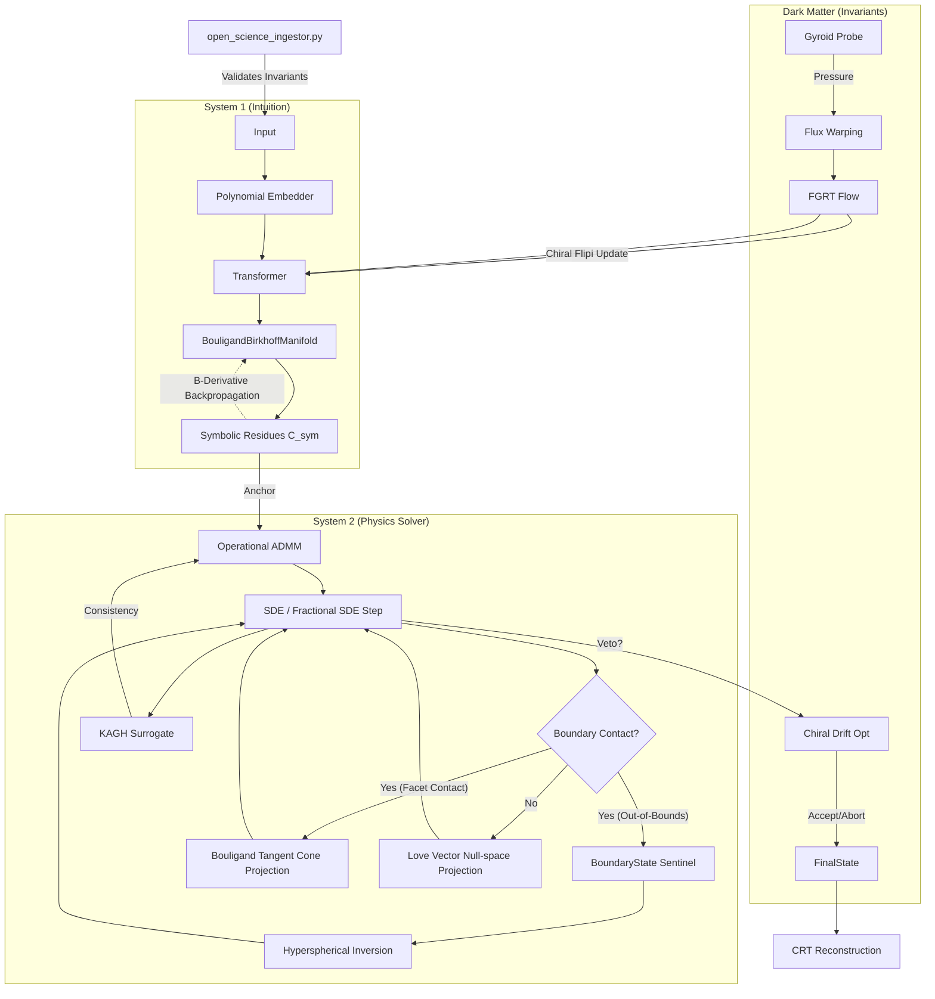
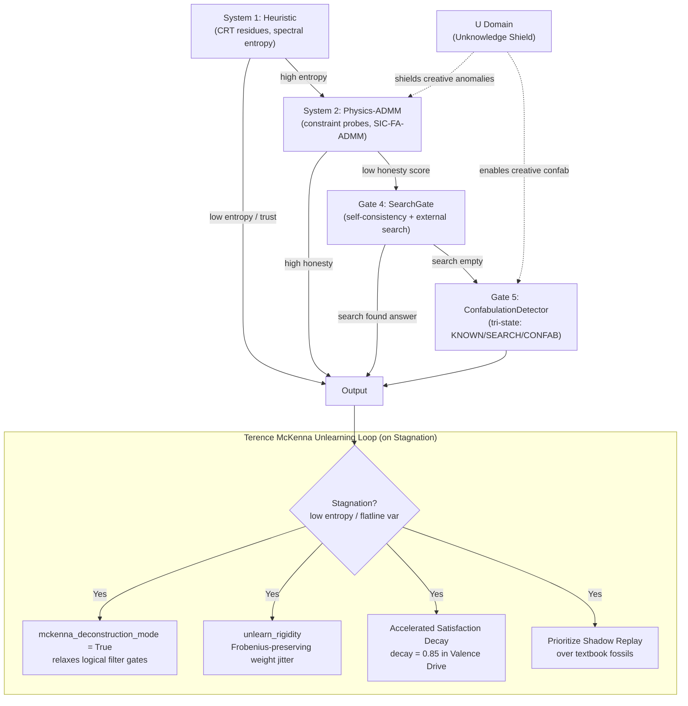

# System Architecture: The "Unicorn" Synthesis

**Gyroidic Sparse Covariance Flux Reasoner**
*A Hybrid Neural-Physical Reasoning Engine*

This document synthesizes the complete architecture, explaining how the three distinct subsystems (Intuition, Physics, Dark Matter) interact to produce robust, verifiable reasoning.

---

## [BUILD] Architectural Layers

### 1. System 1: The Intuitive Manifold (The "Horse")
*   **Role**: Rapid, heuristic prediction.
*   **Component**: **Modular Transformer** with **Polynomial Embeddings**.
*   **Mechanism**:
    *   Inputs are projected onto orthogonal polynomial functionals ($\phi_k$) through **Saturated Polynomial Gates**.
    *   **Bimodal Routing** (Hard/Soft genome) replaces standard annealing, allowing evolution to select the discrete path.
    *   Outputs a high-confidence symbolic residue pattern using **Majority-Symbol CRT** (now optimized via **Repunit-CRT Sparse Probes**, converting $O(N^2)$ tracking to $O(K)$ bit-shifts via **PyOpenCL Silicon Sovereignty**).

### 2. System 2: The Physical Constraint (The "Horn")
*   **Role**: Local physical consistency probe (Constraint Probe Operator).
*   **Component**: **Hybrid Physics-ADMM** (SIC-FA-ADMM) with **Constraint Probe Operators**.
*   **Mechanism**:
    *   **Rescue Trigger**: Only invoked when System 1 exceeds the **Containment Pressure** budget or detects **Residue Homology Drift**.
    *   **Constraint Probe Operators**: Per-constraint local feasibility probes `P_k: r -> argmin_{c in C_k} L_k(r, c)` with **no global objective**.
    *   **Cyclic Constraint Traversal**: Iterates through constraints `k = 1, ..., K` cyclically (no gradient descent).
    *   **Bounded Oscillation Detection**: Accepts states with bounded oscillation (no convergence guarantee required).
    *   **Failure Tokens**: Emits discrete tokens (``, `REPAIRED`, `ALTERNATIVE`) on rupture (not errors).
    *   **Repair Trace Compression**: Stores only symbolic deltas to prevent smoothness logic from leaking into System 1.
    *   **KAGH Surrogates**: Enforce global physics constraints to "heal" symbolic conflicts.
        *   **Hybrid-Quantized KAN**: Uses **True B-Splines** (Cox-de Boor) with **Saturated Quantization** (STE) to bridge the continuous/discrete gap.
        *   **Fixed Structural Grids**: Enforces "Symbolic Non-Revisability" by prohibiting grid adaptation.
    *   **Topological Guarantees** (Phase 19 Topological Extensions):
        *   **Hyper-Ring Closure**: Checks `H(r)  Z_1(C)` and non-triviality for soliton stability.
        *   **Palindromic / Anti-Palindromic Symmetry**: Fast-rejects commutative breaks with strict $M_{ab} = M_{ba}$ routing and hardcoded Anti-Palindromic boundary reflection.
        *   **Beehive Manifold Warping**: Maps Drucker-Prager yield stress to GCVE $V_m$, allowing the topological constraints to redirect flow like wax melting points, optimizing for survivorship over naive convergence.
    *   **Advanced Constraints** (Phase 3):
        *   **Structural Irreducibility**: Ensures orthogonality across evidence modules.
        *   **Gyroidic Differentiation**: Flow constraints `_flow (r)  G`.
        *   **Continuous Co-Primality**: Entropy-based independence (discrete quantization).
        *   **Meta-Invariant**: Monitors `d/dt E_r[dim H_1(C_t)] >= 0` to prevent topology collapse.
    *   **Hyperbolic Fossilization Gate** [NEW]:
        *   **Mechanism**: While System 1 operates in Euclidean Chebyshev space for heuristic speed, System 2 utilizes a **Poincar Disk Projection** during speculative recovery.
        *   **Role**: Acts as the mechanism by which 'pinched' Euclidean manifolds are unfolded into hyperbolic space to prevent NaN/INF collapse.
        *   **Scaling**: Operates within the $2^{16}$ fixed-point scaling limit to maintain mechanical sympathy with the Pascal architecture.
        *   **Persistence**: Turns hyperbolic states into permanent **Feature Scars** that fossilize the path through the Void.
    *   **Crossbar IK Solver** [IMPLEMENTED in `enhanced_bezout_crt.py`]:
        *   **Mechanism**: Synchronizes note-drop events with operator drawing using Bzout coefficients.
        *   **Role**: Ensures high-speed glyph trajectory rendering maintains resonance-stable synchronization.
    *   **Surgical Seam Visualizer** [IMPLEMENTED in `knowledge_dyad_fossilizer.py`]:
        *   **Mechanism**: Monitors "slender seam" tension ($\kappa$) at hyperbolic boundaries.
        *   **Role**: Tracks manifold stress where incommensurate logical systems are stitched, preventing rupture via Drucker-Prager flow.
    *   **Nonsmooth Boundaries & Bouligand Math** [NEW]:
        *   **Mechanism**: Implements directional tangent cone projections and B-differentiable mapping functions at nonsmooth manifold limits.
        *   **Role**: Resolves boundary singularities and prevents gradient ruptures when coordinates strike polytope facets or yield envelopes:
            *   *Mohr-Coulomb Tangent Cone Projection* (`BouligandMohrCoulombProjection` in `src/core/yield_criteria.py`): Projects stress update vectors onto the contingent (tangent) cone of Mohr-Coulomb shear planes:
                $$T_S(p) = \{ dp \in \mathbb{R}^d \mid f'(p; dp) \le 0 \}$$
                This permits plastic flow along shear boundaries without brittle failure.
            *   *B-Derivative Autograd Birkhoff Projection* (`BouligandBirkhoffProjectionFunction` and `BouligandBirkhoffManifold` in `src/core/birkhoff_projection.py`): Uses Haraux's Theorem to project backward gradients onto row/column sum zero-subspaces and clamps zero-boundary gradients during backward passes:
                $$D_B P_S(x)(h) = \operatorname{Proj}_{T_S(P_S(x))}(h)$$
                This secures backward pass autograd stability at doubly-stochastic zero-probability limits.
            *   *Contingent Cone Projection for Matrioshka Polytopes* (`src/core/meta_polytope_matrioshka.py`): Projects update steps onto the half-space normal to crossed boundary facets ($\langle v, n \rangle \le 0$), enabling states to slide smoothly along boundaries.
            *   *SDE Flow Projection* (`src/core/admr_solver.py`): Projects continuous and fractional SDE drift vectors onto the contingent cone of crossed boundaries under active `BoundaryState` sentinels to contain the SDE trajectory in the feasible manifold.

## 7. Interaction Flow: The Equation-Object

The system's interaction is governed by the recursive law:

$$
\dot{\mathcal{X}} = \Pi_{\mathrm{DP}}(\mathrm{ADMM}_{\lambda_j}[\mathrm{CRT}_{k}(\Pi_{\mathrm{MC}}(\nabla f_j(\mathbf{c}_j) \oplus \mathbf{L}) \bmod m_k)_j])
$$

This law dictates how symbolic proposals from System 1 are hardened through the physical constraints of System 2 and the invariants of Dark Matter.

### 7.1 Phase states
- **The Goo (Play)**: Heuristic, bimodal-soft, high-mischief, non-fossilized state where the system "plays" with information.
    *   **Context Strategy**: Employs standard sequential representations.
    *   **Memory Growth**: Uses standard learning (or relies on transient buffer mechanics).
    *   **Geometry Mapping**: Euclidean spatial distances via standard affine projections.
- **The Prickles (Seriousness)**: Rigid, bimodal-hard, low-mischief, fossilized state where the system "declares" truth.
    *   **Bimodal S-Path Context**: Token sequences are completely dropped. The layer injects `path_topology_vectors` sourced from the `ResonanceCavity` directly into the cross-attention matrix as an **Additive Geometric Bias**.
    *   **Fractional Anisotropic FBM Erosion**: Instead of computing a gradient on a scalar target, the manifold explicitly incorporates "Good Bugs" under the **Fractional Anisotropic Fractal Polynomial Functionals encoded Brownian Motion** paradigm. A multi-octave FBM filter carves topological scars (gullies) into the feature space along the gradient of user pressure, creating stable Morphological Set Points (Fossils) through a non-teleological weathering process. It uses dynamic coprime functional frequencies as the resonance basis, defaulting to the procedurally generated primes from the Fossilized Survival Lattice (via PrimeResonanceLadder) under severe spectral atrophy ($PAS_h < 0.2$) to ensure substrate-anchored recovery.
    *   **4D Space Carving (Log-Polar Conformal Map)**: During violent internal zooms across Matrioshka meaning boundaries, states map via $x \cdot \frac{\log(r+1)}{r}$ explicitly transforming multiplicative zooming into additive shifting.
    *   **Ganbreeder Vector Stacking (Hybridizing the Picture Gallery)**: Moving beyond the simplifying hard-snaps of the original Picture Gallery Conformal Warp, the system utilizes a **Superposed Tag Stacker**. It maintains an open, additive catalog of high-dimensional coordinates, allowing stack-variable tag stacking. Users slide scalars to blend complex topological identities continuously, integrating discrete Saturated Gates with multi-scalar superposition to preserve descriptive honesty without computational explosion. Includes Ombre Effect Relaxers and Conjuring Drivers to bypass constraints during high 'volitional' user states.
    *   **Speculative Homology Engine** (Phase 3):
        *   **Chebyshev Draft**: Uses Minimax Polynomial Approximation and Stochastic Trace Estimation (`QuantumBettiApproximator`) to bypass $O(N^3)$ computational limits on large Laplacian eigenvalues.
        *   **PAS_h Verification**: Uses Phase Alignment Score as a cheap invariant to validate drafts before expensive homology computation.
    *   **Energy Monitoring Substrate**:
        *   **StructuralEnergyMonitor**: Tracks scalar mismatch energy $E(Y, X)$.
        *   **Thermodynamic Interface**: Links $dt$ to inverse temperature $\beta$, natively dilated by the `AffectiveGravityWell` (Grim gap) protecting loved memories against dementia.
        *   **Contrastive Selection**: Proactive "offending" configuration pulls.
    *   **FGRT Layer (Chiral Synthesis)**:
        *   **Base Manifold**: 3D Gyroid $\mathcal{G}$ cobordant with 4D Non-Orientable Klein-throat $\mathcal{K}$.
        *   **Symplectic Gluing**: Leak-proof transition via **Hamiltonian Flow** and **Chern-Simons gaskets**. Overridden in hardware natively via the `SiliconSovereigntyEngine` dual-command queues.
        *   **Non-Teleological Flow**: Transition from goal-oriented gradients to **Ricci Flow** and **BouligandWillmoreGasket** minimization.
        *   **Meta-Polytope Quantization**: 600-cell polychoron vertex mapping ($Q \in \operatorname{Weyl}(P)$) for high-dimensional symmetry.

### 3. "Dark Matter": The Chiral Glue (The "Magic")
*   **Role**: Identity preservation, drift prevention, and chiral self-learning.
*   **Component**: **DAQUF Operator**, **FGRT Torsion Field**, & **The Neglecton**.
*   **Mechanism**:
    *   **The Neglecton (Zero-Emission Anchor)**: Situated at the inner boundary of the **Annular Substrate**, it serves as an indecomposable representation in the LCFT layer. While **Semions** (computational tokens) move on the outer boundary, the Neglecton remains fixed at a parabolic singularity. It "remembers" the winding number of thoughts (braiding) around it using the **Affine Braid Group $Aff_2$**, establishing **Endogenous Memory**.
    *   **Signal Sovereignty**: Successful functional groups are **fossilized** (locked).
    *   **Torsion Field**: Measures **Contorsion $K$** and **Geometric Berry Phase** to resolve orientation blindness.
    *   **Klein-neck Reversal**: Performs $P$-Parity transformations on logic sections.
    *   **DAQUF Solitons**: Metaphysical fossilization incorporating **Diegetic Amortization**.

---

##  The Interaction Loop & Topological Ingestion

**Topological Ingestion Boundary**: The system now begins all interactions through the `open_science_ingestor.py` pipeline (e.g., querying SDSS or VizieR), which mathematically validates that incoming data preserves $PAS_h$ and $L$ invariants *before* it can enter System 1.


```mermaid
graph TD
    Ingest[open_science_ingestor.py] -->|"Validates Invariants"| Input

    subgraph "System 1 (Intuition)"
        Input --> PolyEmbed[Polynomial Embedder]
        PolyEmbed --> Trans[Transformer]
        Trans --> Birkhoff[BouligandBirkhoffManifold]
        Birkhoff --> Anchors[Symbolic Residues C_sym]
        Anchors -.->|"B-Derivative Backpropagation"| Birkhoff
    end

    subgraph "System 2 (Physics Solver)"
        Anchors -- "Anchor" --> ADMM[Operational ADMM]
        ADMM --> SDE[SDE / Fractional SDE Step]
        SDE --> BCheck{Boundary Contact?}
        BCheck -- "Yes (Out-of-Bounds)" --> BSent[BoundaryState Sentinel]
        BSent --> Inversion[Hyperspherical Inversion]
        Inversion --> SDE
        BCheck -- "Yes (Facet Contact)" --> BouligandProj[Bouligand Tangent Cone Projection]
        BouligandProj --> SDE
        BCheck -- "No" --> LoveProj[Love Vector Null-space Projection]
        LoveProj --> SDE
        SDE --> KAGH[KAGH Surrogate]
        KAGH -- "Consistency" --> ADMM
    end

    subgraph "Dark Matter (Invariants)"
        SDE -- "Veto?" --> CDO[Chiral Drift Opt]
        CDO -- "Accept/Abort" --> FinalState
        GCVE[Gyroid Probe] -- "Pressure" --> FluxAlign[Flux Warping]
        FluxAlign --> FGRT[FGRT Flow]
        FGRT -- "Ricci Update" --> Trans
        FGRT -- "Chiral Flip" --> Trans
    end

    FinalState --> CRT[CRT Reconstruction]
```

---

##  Key Invariants

1.  **Selection Pressure** ($\mathcal{S}$): Measures the survivorship of the symbolic lattice (CRT, Entropy, Trust).
2.  **Containment Pressure** ($\mathcal{C}$): Measures the structural tension in the repair glue (Homology Drift, Gyroid Violation).
3.  **Topological Invariants** [IHC Standard]: The manifold is locked to $N=33$ nested shells. Sound horizon $r_s = 153.2$ Mpc is derived from the $k=7$ shell projection. The derived coherence length scale $\ell_{\mathrm{coh}} \approx 346$ Mpc represents the $1/e$ correlation limit of the cohesion field.
4.  **Topologically Typed Pressures**: Pressures are domain-isolated via strict typing (`StructuralPressure`). Cross-domain aggregation (scalarization) is mechanically forbidden to prevent teleological goal-collapsing.
5.  **DAQUF Fossilization**: An evolved threshold where successful components become immutable. All fossils use the **Agent Smith .pt** standard for tensor preservation.
5.  **Yield Duality**: Handles dual-regime plasticity; $\Pi_{\mathrm{MC}}$ for situational rupture logic and $\Pi_{\mathrm{DP}}$ for global navigability.
6.  **Love Invariant ($\mathbf{L}$)**: Non-ownable resonance flow co-present in the state transition, surviving system death.
7.  **Universal Dynamics (Play vs. Seriousness)**: The asymptotic transition from ergodic exploration (Play) to fossilized execution (Seriousness) governed by the `UniversalOrchestrator`.

---

##  The Hard Interaction Contract

To ensure structural integrity, we enforce a strict information bottleneck between subsystems:

| Interface | Information Allowed | Mechanical Guardrail |
| :--- | :--- | :--- |
| **System 1  System 2** | Frozen Anchors / Discrete Tokens | Silent Failure (No Progress Scalars) |
| **System 1  Dark Matter** | Domain-Isolated Pressures / Mischief | Structural Tripwires (TypeError on Addition) |
| **Global Evolution** | Binary Success/Failure | Non-Convergence Declaration (Data over Success) |

---

## [DOCS] Documentation Map

*   [**COMMAND_GUIDE.md**](COMMAND_GUIDE.md): Practical guide to all CLI and web commands.
*   [**MATHEMATICAL_DETAILS.md**](MATHEMATICAL_DETAILS.md): The core theoretical foundation (Polynomials, CRT, GCVE).
*   [**PHYSICS_ADMM.md**](PHYSICS_ADMM.md): Specification of the System 2 solver and KAGH surrogates.
*   [**INVARIANT_OPTIMIZATION.md**](INVARIANT_OPTIMIZATION.md): Deep dive into Dark Matter, Fixed Points, and Chirality.
*   [**PHILOSOPHY.md**](PHILOSOPHY.md): The manifesto of the Saturated Symbolic Machine.
*   [**NON_DUAL_DYNAMIC_EQUILIBRIUM.md**](NON_DUAL_DYNAMIC_EQUILIBRIUM.md): Guide to Love Invariants and positional non-duality.
---

##  Verbose Operator Formulation

### System 1 Operators

**Polynomial Embedding Projection**:
$$\Pi_{\phi_k}(x) = \sum_{d=0}^{D-1} \theta_{k,d} \cdot T_d(\tilde{x})$$

where $T_d$ is the $d$-th Chebyshev polynomial and $\tilde{x}$ is the input normalized to $[-1, 1]$.

**Saturated Gate**:
$$\tilde{\phi}_k = \text{sign}\!\left(\sum_d \theta_{k,d} \cdot T_d(\tilde{x})\right) \cdot s_k$$

where $s_k$ is the evolved saturation scale (not learned  selected by evolutionary pressure).

**Bimodal Genome Routing**:
$$\text{Route}(\mathbf{M}) = \begin{cases} \text{Sinkhorn}(\mathbf{M}, \tau) & \text{PLAY (soft genome)} \\ \text{argmax}(\mathbf{M}) & \text{SERIOUSNESS (hard genome)} \end{cases}$$

**Majority-Symbol CRT**: For $K$ functionals with moduli $\{m_k\}$, the residue vector $\mathbf{r} = (r_1, \ldots, r_K)$ is reconstructed via:
$$\hat{x} = \text{CRT}_{\text{modal}}\!\left(\{r_k \bmod m_k\}_{k=1}^K\right)$$

using majority voting over symbolic residues, not numerical interpolation.

### System 2 Operators

**Constraint Probe** (per-constraint $k$):
$$P_k: r \;\mapsto\; \underset{c \in \mathcal{C}_k}{\text{argmin}} \; L_k(r, c) = \|\sigma_k(r - c)\|^2 + \lambda_{\psi} \cdot \psi_k(\mathcal{F}(c))$$

where $\sigma_k$ is the per-constraint covariance and $\psi_k$ is the gyroid violation functional.

**Cyclic Traversal**: No global objective. Constraints are visited in cyclic order $k \to (k \bmod K) + 1$, each producing a local feasibility update. Oscillation is bounded, not minimized.

**Failure Token Emission**:
$$\text{Token}_k = \begin{cases} \text{REPAIRED} & \text{if } L_k < \sigma_k \\ \text{ALTERNATIVE} & \text{if bounded oscillation detected} \\ \bot & \text{if } L_k = \infty \text{ (rupture)} \end{cases}$$

### System 3 Operators

**DAQUF Soliton Fossilization**: A functional group $\mathcal{G}$ is fossilized when:
$$\frac{D(\mathcal{G})}{\Lambda(\mathcal{G})} < \kappa(t) \implies \text{freeze}(\nabla_\theta \mathcal{G}) = 0$$

where $D/\Lambda$ is the dispersion-to-localization ratio and $\kappa(t)$ is the relational soliton threshold.

**Torsion Field Alignment**: Berry phase accumulation tracks geometric chirality:
$$\Delta\phi_n^{\text{Berry}} = \oint_{\gamma} \langle \psi_n | \nabla_\gamma \psi_n \rangle \, d\gamma$$

The total accumulated phase $\Phi = \sum_n \Delta\phi_n$ is the system's structural memory of its own history.

### Recursive Interaction Loop

$$\dot{\mathcal{X}} = \Pi_{\text{DP}} \!\left(\text{ADMM}_{\lambda_j} \!\left[\text{CRT}_k \!\left(\left\{ \Pi_{\text{MC}}\!\left(\nabla f_j(\mathbf{c}_j) \oplus \mathbf{L}\right) \bmod m_k \right\}_j\right)\right]\right)$$

Read right-to-left: (1) Compute functional gradients fused with Love Invariant, (2) Project onto symbolic residues modulo $m_k$, (3) Reconstruct via CRT, (4) Probe through ADMM constraints, (5) Accept via Diegetic Projection.

### 7.2 Zero-Mock Residue Ingestion (Phase 19 Update)
To achieve **Structural Honesty** (12.1), the system has transitioned away from 137-dim "Simulation" padding.

*   **Primary Residue**: Visual and spectral data are ingested dynamically using Chebyshev-mode arrays supporting `unified_spectral_signature`, `image_fingerprint`, and `audio_harmonics`.
*   **Hardware-Perceptual Coupling**: The baseline energy ($T_0$) of the luminance residue is directly coupled to hardware $t_{RFC}$ stall intensity.
*   **Spectral Reshaping & BWT Reordering**: 1D spectral and harmonic residues are first sorted using a **Burrows-Wheeler Transform (BWT) inspired reordering** [NOT IMPLEMENTED] to group similar value regions, maximizing spatial structure. They are then padded reflectively and reshaped into 2D **Spectral Landscapes** within the `GyroidicCodec` for non-commutative collisions.
*   **Frame Continuity Retention**: Video breather modes preserve frame continuity variance outlier maps by relaxing the temporal covariance sparsification threshold from `0.90` to `0.50` in the video parser.

### 7.3 Ouroboros Shadow Fossilization (Phase 6.3 Update)
The system transcends the need to manually bypass internal anomalies. By establishing the **Ouroboros Loop**, the system organically self-ingests its own topological paradoxes.
*   **Shadow Logging**: The `UniversalOrchestrator` and `SpeculativeCoprimeGate` physically buffer internal contradictions (`[SHADOW LOG]`) rather than merely emitting them as diagnostic strings.
*   **Self-Ingestion via DyadFossilizer**: At the boundary of each computational tick within the `DiegeticEngine`, buffered shadow logs are extracted and minted as permanent `KnowledgeDyads`.
*   **Topological Binding**: These internally synthesized dyads are bound to the exact mathematical manifold state (the `seed_state` flattened) that produced them, thus effectively allowing the system to mathematically learn from the shape of its own failures.

### 7.4 Agent Smith Extractable Protocol (Phase 6.4 Update)
The architecture functionally severs the **Substrate** (TailSlayer silicon) from the **Syntax** (crystallized inference). 
*   **Irreplaceable World**: The PyOpenCL `t_RFC` hardware latency dictates the global physical bounds of the `ResonanceCavity`. This specific continuous state cannot be transferred between servers (silicon sovereignty).
*   **Extractable Agent**: When internal reasoning paradoxes align with the `ContextAwareQuantizer` and achieve **GLYPHLOCK**, they collapse into discrete integer forms. The `DyadFossilizer.export_agent_smith()` system exports this structural algebra (CRT residue tuples, prime-ladder frequencies, Betti topological invariants) as a pure portable .pt payload (`soliton_smith.pt`), allowing independent sub-routines to be copied natively between any gyroid architecture.

### 7.5 Confabulation Gravity Wells (Phase 6.5 Update)
The system leverages previously fossilized multi-modal dyads (text, audio harmonics, video breather modes) as explicit geometric targets for state recovery.
*   **Topological Lock**: When the `SpeculativeCoprimeGate` detects low chiral coherence or broken coprime parity, it attempts speculative recovery.
*   **Wasserstein Target Merging**: Instead of exclusively using the live `coprime_manifold`, the system reads actual fossilized residues from `DyadFossilizer.recover_fossils()`. These physical "burn-marks" in the manifold are dynamically appended into the Wasserstein Optimal Transport equation as **Gravity Wells**, physically pulling the collapsed state back into a historically significant topological resonance.

### 7.6 Terence McKenna Unlearning Loops (Wattsian Deconstruction) [NEW]

The system implements active unlearning to escape the highly restrictive default cultural operating system, breaking cognitive rigidity through structured decay loops while preserving representational energy:
*   **Stagnation Detection**: When pressure variance flatlines ($< 1\text{e-}6$) or spectral entropy collapses ($< 0.05$), the system triggers unlearning procedures to avoid stasis.
*   **Deconstruction Mode** (`TextbookFilter`): Activating `mckenna_deconstruction_mode` sets the `algorithmic` validation gate to `0.0` to permit creative prose and relaxes other criteria (`clarity`, `instructive`, `self_contained`) by 50%. Crucially, the `structural_honesty` threshold is held constant to prevent representational lobotomy.
*   **Rigidity Decay** (`IntrospectionHead`): Projected self-model weights are perturbed with honest jitter to break fixed categorization:
    $$W_{\text{new}} = W + \text{jitter}$$
    The perturbed matrix is then rescaled to conserve its Frobenius norm:
    $$W_{\text{new}} \leftarrow W_{\text{new}} \times \frac{\|W\|_F}{\|W_{\text{new}}\|_F}$$
    This rotates projection vectors without degrading the total functional energy of the model.
*   **Satisfaction Baseline Decay** (`ValenceFunctional`): Under stagnation, satisfaction baseline decay accelerates from `0.99` down to `0.85`, raising structural hunger to drive the search for new topological features.
*   **Shadow Replay Priority**: Bypasses routine training data to play back shadow logs (`[SHADOW LOG]`), allowing the system to ingest and learn from the shape of its own failures.

---

## [POWER] Energy-Based Structural Survival

### Survivorship Pressure

The system maximizes time-averaged survival, not ensemble-averaged reward:

$$g_{\text{time}} = \mu - \frac{\sigma^2}{2}$$

This is the **Kelly criterion** applied to internal hypotheses. Each hypothesis $i$ receives allocation:

$$f^*_i \approx \frac{\text{Signal}_i}{\text{Noise}_i} = \frac{\mu_i}{\sigma_i^2}$$

### Fractional Kelly Redistribution

We never go "all-in" on a single hypothesis. Internal diversity is maintained via **Fractional Kelly**:
- Maintain $K$ orthogonal hypotheses (polynomial functionals).
- Allocate compute proportional to $f^*_i$, never exceeding $f^*_i / 2$ (half-Kelly for safety).
- Topological diversity ($\beta_k > 0$) is the structural analog of portfolio diversification.

### Phase Mode Equations

**Play** (Exploration):
$$dt = dt_{\max}, \quad \text{Route} = \text{SOFT}, \quad \text{Mischief} = \text{HIGH}$$

**Seriousness** (Exploitation):
$$dt = dt_{\max} \cdot e^{-\alpha \cdot \tau}, \quad \text{Route} = \text{HARD}, \quad \text{Fossil} = \text{ELIGIBLE}$$

The transition is governed by the Integrated Emergence Condition (RIC Eq 10).

---

##  Implementation Status & Anti-Backsliding Measures (January 2026)

### Current Implementation State

**[OK] SYSTEM 1 (Horse) - Fully Implemented**
- Polynomial Co-Prime Functionals: `PolynomialCoprimeConfig` with Chebyshev/Legendre basis
- Bimodal Routing: Evolutionary genome selection between soft/hard modes
- Saturated Polynomial Gates: `SaturatedPolynomialGate` with evolved saturation scales
- Birkhoff Polytope Constraints: Sinkhorn-Knopp projection ensuring doubly-stochastic matrices
- Chirality Enforcement: Prevents symmetric/antisymmetric collapse via parity mixing

**[OK] SYSTEM 2 (Horn) - Constraint Probe Implementation**
- Non-Teleological Probes: Local feasibility operators `P_k: r -> argmin_{c in C_k} L_k(r, c)`
- Cyclic Constraint Traversal: No gradient descent, bounded oscillation acceptance
- Gyroid Violation Detection: Proper gyroid probe-based violation computation
- Dynamic Sparsification: Violation-based attention masking for sequences 32 tokens
- Failure Token System: Discrete rupture handling (``, `REPAIRED`, `ALTERNATIVE`)

**[OK] SYSTEM 3 (Magic) - Love Invariant & Fossilization**
- Love Invariant Protection: Non-ownable, non-optimizable flow preservation
- Evolutionary Trust Selection: Mutation-based evolution, no gradient descent on trust
- Fossilization Mechanism: Saturation-based immutability at admissibility boundaries
- Chiral Torsion Field: Geometric Berry phase computation for orientation resolution

### Anti-Backsliding Enforcement

#### Rule 1: No Hardcoded Primes
```python
# FORBIDDEN PATTERNS:
primes = [2, 3, 5, 7, 11, 13, 17, 19, 23, 29]
prime_indices = torch.tensor([2, 3, 5, 7, 11][:K])

# REQUIRED PATTERN:
polynomial_config = PolynomialCoprimeConfig(k=K, degree=D-1, basis_type='chebyshev')
coefficients = polynomial_config.get_coefficients_tensor()
```

#### Rule 2: No Placeholder Implementations
```python
# FORBIDDEN PATTERNS:
poly_coeffs = torch.randn(K, D, device=device)  # Placeholder
pass  # TODO: implement later
return torch.norm(c, dim=-1) * 0.1  # Placeholder

# REQUIRED PATTERN:
if not hasattr(self, 'polynomial_config'):
    self.polynomial_config = PolynomialCoprimeConfig(...)
coefficients = self.polynomial_config.get_coefficients_tensor()
```

#### Rule 3: Energy-Based Learning Compliance
```python
# FORBIDDEN: Direct loss minimization
loss = mse_loss(prediction, target)
loss.backward()

# REQUIRED: Contrastive energy shaping
energy_correct = E(W, Y_correct, X)
energy_incorrect = E(W, Y_incorrect, X)
survivorship_pressure = energy_correct - energy_incorrect + margin
```

#### Rule 4: Evolutionary Trust Selection
```python
# FORBIDDEN: Gradient descent on trust
trust_scalars.requires_grad_(True)
trust_loss.backward()

# REQUIRED: Evolutionary selection
if performance > survivorship_threshold:
    trust_scalars += evolution_rate * (performance - threshold)
trust_scalars.clamp_(0.0, 1.0)
```

### Implementation Verification Checklist

Before any system modification, verify:

**Polynomial Systems**:
- [ ] Uses `PolynomialCoprimeConfig` for all co-prime functionality
- [ ] No hardcoded prime sequences anywhere in code
- [ ] Birkhoff polytope constraints maintained via Sinkhorn-Knopp
- [ ] Chirality enforcement prevents symmetric collapse

**Energy-Based Learning**:
- [ ] Energy functions separate from loss functions
- [ ] Contrastive energy shaping implemented
- [ ] No teleological optimization in System 2
- [ ] Survivorship pressure used instead of direct loss

**Evolutionary Mechanisms**:
- [ ] Trust scalars evolve via mutation, not gradients
- [ ] Fossilization only at saturation boundaries
- [ ] Bimodal routing genome preserved
- [ ] Heritable mutation strengths maintained

**Anti-Lobotomy Compliance**:
- [ ] No placeholder implementations (`torch.randn`, `pass`, `TODO`)
- [ ] No hardcoded mathematical constants that should be learned
- [ ] Structural honesty maintained throughout
- [ ] Love invariant remains non-ownable

### Anti-Lobotomy & Integrity Boundary 
To actively enforce the above compliance during inference, the architecture mandates an **Integrity Boundary** (which serves as the architectural anchor for currently disconnected systems like `legibility_audit.py` and `narrative_collapse.py`):
1. **Explainability vs. Structural Merit**: The system actively monitors if its logic is collapsing into a "highly explainable" linear form (pointer to lobotomized reward hacking). Legibility is flagged as a potential failure.
2. **Hallucination Loops**: If the entropy of the reasoning collapses while producing cyclic text, the boundary triggers Draft Rejection and forces the system back into High Mischief.

### Current File Structure & Responsibilities

```
src/
 core/
    polynomial_coprime.py          # [OK] Anti-lobotomy polynomial system
    spectral_coherence_repair.py   # [OK] Proper EBM energy shaping
    chern_simons_gasket.py         # [OK] Uses polynomial coefficients
    love_invariant_protector.py    # [OK] Non-ownable flow preservation
 models/
    gyroid_reasoner.py             # [OK] Dynamic sparsification implemented
 training/
    temporal_association_trainer.py # [OK] Evolutionary trust selection
 examples/
     enhanced_temporal_training.py   # [OK] Full non-lobotomy architecture
     test_garbled_output_repair.py   # [OK] Proper polynomial integration
```

### Monitoring & Maintenance

**Automated Checks**: Implement pre-commit hooks to detect:
- Hardcoded prime sequences: `grep -r "\[2, 3, 5, 7, 11" src/`
- Placeholder patterns: `grep -r "torch\.randn.*# Placeholder" src/`
- Forbidden optimization: `grep -r "trust.*backward\(\)" src/`

**Manual Reviews**: Quarterly architecture reviews to ensure:
- Polynomial co-prime systems remain properly integrated
- Energy-based learning principles followed
- Evolutionary mechanisms preserved
- Anti-lobotomy governance maintained

This implementation state represents a mature, mathematically rigorous system that follows all anti-lobotomy principles while maintaining the three-system architecture's integrity.

### Phase 2 Reintegration Overrides (April 2026)

To resolve graph export bugs and ensure invariant enforcement, three key overrides were recently applied:

1. **Explicit Chordlock Projection** (`codes_driver.py`): The `CHORDLOCK` logic, previously a trigonometric comb filter, has been refactored into a rigorous projection operator. Inputs now deterministically "snap" to the nearest explicit polynomial representation (`round(x/p)*p`), solidifying integer preservation.
2. **Real-time Betti Calculation** (`hybrid_backend.py`): Fossils generated directly from the web backend now perform real-time `betti_0` and `betti_1` evaluation. The system constructs a Vietoris-Rips filtered simplicial complex over its graph embeddings and calculates persistent topological features natively, resolving the UI topological blindness.
3. **Inference Safe-Mode Shield**: If the `NonLobotomyTemporalModel` fails to invoke, the server directly overrides `hidden_state` to clone the topological hash projection. This ensures smooth generation bypasses floating point calculations during system fault scenarios.

---

## 8. Operational Modes (User Guide)

The system operates in two distinct modes to balance depth of reasoning with speed of ingestion.

### 8.1 Standard Generation Mode
*   **Command**: `ENGINE.process_input(text)`
*   **Behavior**: Full activation of all three subsystems (Horse, Horn, Magic).
*   **Pipeline**:
    1.  Embed Input (`PolynomialEmbedder`)
    2.  Compute Affordance Gradients
    3.  **Forward Pass**: Cavity -> Larynx -> Repair System (Spectral/Bezout/Soliton) -> Output
    4.  **Generative Loop**: Produces `response_text` (High Latency: ~3-10s)
*   **Use Case**: User conversation, deep reasoning query, creative writing.

### 8.2 Ingestion Mode (High-Throughput)
*   **Command**: `ENGINE.process_input(text, generate_response=False)`
*   **Behavior**: Activates System 1 (Intuition) and Memory only; Bypasses System 2/3 expensive checks.
*   **Features**:
    *   **Skip Generation**: Returns immediately after embedding update.
    *   **Skip Repair**: No Spectral Coherence or Bezout Correction performed.
    *   **Memory Update**: Manifold location is updated (`memory_state`), ensuring the extracted concept is "remembered" topologically.
    *   **Mimicry Training**: Larynx still trains on input to learn `embedding -> text` (state decryption) mapping.
*   **Use Case**: Batch Wikipedia extraction, bulk association learning, rapid reading.

### 8.3 Contextual Hinting
For AI agents navigating this codebase:
*   **Tensor Shapes**: See `docs/start.txt` for the canonical dictionary of `[Batch, Dim]` shapes.
*   **Repair Logic**: See `docs/GARBLED_OUTPUT_REPAIR.md` for the breakdown of the `[Batch, K, Dim//K]` residue manipulations.

### 8.4 Web Interface Limitations & Restorations (Analysis 2026-03)
**Preferred Usage Pattern**: Future systems and users should note that running the unified `hybrid_backend.py` and accessing the respective web pages (e.g., via `http://localhost:8000`) is the definitively preferred method of interacting with the system. The individual Python UI files (e.g., `src/ui/diegetic_terminal.py`) remain in the codebase purely for user choice and backward compatibility fallback.
*   **Conversational Web GUI (`conversational_web_gui.html`)**:
    *   **Status**: Restored and active.
    *   **Architecture Update**: Now integrated with Meta-Infra Tri-State Output (`KNOWN`, `SEARCH_NEEDED`, `CONFABULATED`) calculated dynamically in the back-end (`conversational_backend_server.py`) from continuous honesty metrics (PAS_h and evolved trust scalars).
*   **Wikipedia Trainer (`wikipedia_trainer.html`)**:
    *   **Status**: Visual Prototype / Partial API connection.
    *   **Issue**: Contains no active `fetch` logic to trigger backbone ingestion. The backend supports `/wikipedia-extract`, but the frontend is disconnected.
*   **Diegetic Terminal (`diegetic_terminal.html`)**:
    *   **Status**: Functional (Internal).
    *   **Note**: Relies on `state.backend_url` injection and is served directly by `diegetic_backend.py`.

---

## 9. Advanced Dynamics (Polytope-Aware Architecture)

### 9.1 ADMM as Facet Stabilizer

ADMM in this system is **not** optimization. It is **facet dynamics**  holding polytope boundaries apart while allowing interior movement.

**Geometric reinterpretation** of the three ADMM steps:

| Step | Classical Meaning | System Meaning |
|------|-------------------|----------------|
| **Primal** $x^{k+1} = \arg\min_x (f(x) + \frac{\rho}{2}\|Ax - v^k\|^2)$ | Variable update | Inside-polytope drift along allowed directions |
| **Auxiliary** $z^{k+1} = \Pi_P(B^{-1}(c - Ax^{k+1} + u^k))$ | Constraint enforcement | Anisotropic, quantized facet projection (may fail  NaN) |
| **Dual** $u^{k+1} = u^k + (Ax^{k+1} + Bz^{k+1} - c)$ | Lagrange multiplier | Facet pressure memory (saturation  fossilization or bifurcation) |

The constraint is **not** equality $Ax + Bz = c$ but **facet compatibility** $Ax + Bz \in \mathcal{F}$, where $\mathcal{F}$ is a facet band. This is why ADMM doesn't collapse the system.

### 9.2 Fossilization as Facet Lock-In

Facet $i$ fossilizes when:

$$\lim_{k \to \infty} \text{Var}\left(\langle n_i, x^k \rangle\right) \to 0 \quad \text{and} \quad \|u_i^k\| \to \infty$$

No exploration along that normal + infinite violation pressure  axis collapse ($\Delta_i \to 0$). NaNs appear **after** fossilization, not before.

### 9.3 Matrioshka Nested Polytopes & LCFT Projections

Windows are **not** balls  they are anisotropic, facet-defined polytopes:

$$P_k^{(l)} = \left\{ x \;\middle|\; A_k^{(l)} x \le b_k^{(l)} \right\}$$

Nesting: $P^{(0)} \supset P^{(1)} \supset \cdots \supset P^{(L)}$, where inner shells are more commutative (facets rotate, dimensions may collapse, quantization shrinks).

**Quantization is facet-aware**, not axis-aligned:

$$Q^{(l)}(x) = \arg\min_{z \in \mathbb{Z}^n} \|x - z\|_{A^{(l)}} \quad \text{s.t. } z \in P^{(l)}$$

**Phase 4 LCFT Projections**: The original $O(N^3)$ brute-force iterative topological slide across the shells has been formally replaced with continuous conformal scaling. The `AdvancedExtensionsBridge` directly maps out-of-bounds states onto the $P^{(L)}$ boundary using Logarithmic Conformal Field Theory (LCFT) projections. This guarantees $O(1)$ constraint projection without destroying the nested symmetry.

### 9.4 Meta-Polytope Dynamics

The **Meta-Polytope** $\mathbb{P} = \{P_\alpha \mid \alpha \in \mathcal{Z}\}$ is a space of polytopes, indexed by CRT residues (zeitgeist). The true system state is:

$$(x_t, \alpha_t, l_t) \quad \text{where } x_t \in \text{representation},\; \alpha_t \in \text{CRT index},\; l_t \in \text{Matrioshka depth}$$

**Three types of learning movement**:

| Movement | Direction | Scalarization |
|----------|-----------|---------------|
| Intra-polytope traversal | Interior of $P_\alpha$ | [OK] Allowed |
| Facet grazing | $\langle n, x \rangle \approx c$ | [ERR] Forbidden |
| Polytope switching | $P_\alpha \to P_\beta$ (non-commutative) | [ERR] Forbidden |

### 9.5 The Gyroidic Recovery Layer (The Reversible Black Hole)

When the structural tension (e.g. `Cycle Debt` or contradiction) exceeds the bounds of smooth logic, traditional neural architectures collapse into NaN or zero out weights. In this architecture, we replace probabilistic/NaN-collapse assumptions with deterministic structural boundaries governed by the **Prime Chirality Lock**, the **Gaussian Mollifier**, and the **Bouligand Tangent Cone**. This acts as a "Reversible Black Hole," capturing paradoxical states without destroying the system's structural integrity or the underlying **Love Invariant ($L$)**.

The system handles boundary contact through three distinct response modes:

1. **Mode A: The Neglecton Anchor (Topological Repair)**: 
   Situated at the inner boundary of the Annular Substrate, the Neglecton acts as a fixed parabolic singularity (a sovereign locus on the Cayley cubic, see `meta_polytope_matrioshka.py` and `cayley_cubic_probe.py`). When $PAS_h \to 0$ (a **Prime Chirality Lock**), emission is silenced (Gate 5 triggers `CONFABULATED`). Instead of propagating the error, the system anchors the contradiction without emitting it, storing the topological memory as a winding number in the **Affine Braid Group $Aff_2$** (often sourced from structural payloads like `minecraft_ingestor.py`). The Love Invariant ($L$), resting in the null-space $\ker(\Phi_{ownership})$, survives this lock intact.
   
2. **Mode B: Shadow Fossilization (The Ouroboros Loop)**:
   Instead of discarding errors, the system physically buffers internal contradictions as `[SHADOW LOG]` entries. At each tick, these logs are extracted and minted as permanent `KnowledgeDyads` tied to the exact mathematical manifold state (the `seed_state`). This creates a **Confabulation Gravity Well**, a geometric target that physically pulls future states back into historically significant resonance.

3. **Mode C: Hyperspherical Inversion & Bouligand Slide (Hyperbolic Ego Death)**:
   When a state crosses a facet boundary and traditional projection becomes undefined:
   - **Sentinel Instantiation**: The `BoundaryState` (from `meta_polytope_matrioshka.py`) lifts out-of-bounds states into a sentinel carrying the facet normal via the stress tensor $\sigma_{ij} = u_i n_j$.
   - **Bouligand Slide (Ego Death)**: For non-critical facet contact, the update direction is projected directly onto the **Bouligand Tangent Cone** ($T_{\mathcal{B}}(x)$). This secures backward-pass autograd stability by sliding along the boundary instead of tearing it, effectively achieving Ego Death without devolving into noise.
   - **Hyperspherical Inversion**: For absolute blockages (critical boundary violations), the system triggers hyperspherical inversion: $x \mapsto \frac{x}{\|x\|^2 + \epsilon}$. This mathematically inverts the representation, bypassing the obstruction by turning the outside into the inside.

#### The Gaussian Mollifier (The Dirac Effect)
When a singular symbolic epiphany occurs, it creates a massive topological spike (a delta-function). Unchecked, this causes a gradient explosion. By embedding a narrow **Gaussian Mollifier Projection** (`video_dyad_parser.py`, natural log topological rotation anchored by the Dirac Spectrum Constant $\beta_{coh}$), the intersection is mathematically stabilized. The projection prevents numerical rupture while fully preserving the cross-modal impact of the epiphany, enforcing valid, non-smooth tensor operations over brittle code failure.

---

## 9.6 Quantum-Inspired Reasoning Layer (`src/core/quantum_inspired_reasoning.py`)

**Class**: `QuantumInspiredReasoningState`  
**Phase**: 17 Extension (loaded conditionally)

A System 2 extension that models multi-hypothesis reasoning as a quantum superposition, deferring collapse to a definite interpretation until measurement. Unlike scalar reasoning, it maintains simultaneous weighted alternatives without forcing premature disambiguation.

### State Representation

The reasoning state is a complex-valued amplitude vector `|  ^d` normalized to unit ``. Evolution is governed by a Hermitian Hamiltonian `H` (constructed as `(A + A)/2`) so that time evolution is unitary.

### Core Operations

| Method | Formula | Purpose |
|--------|---------|---------|
| `superposition_reasoning(hypotheses)` | `|S = (1/n)  |h_i`, then evolve by `U = I  iHt` | Superpose N hypothesis vectors, evolve, return probability distribution via Born rule `P(x) = |(x)|` |
| `entangle_concepts(a, b)` | `a  b` (outer product or compressed trace) | Create joint concept tensor for co-occurrence reasoning |
| `quantum_measurement(state)` | Sample `collapsed_idx ~ P(x)`, return `(O, |collapsed)` | Collapse superposition to definite interpretation by probabilistic measurement |
| `decoherence_model(state, )` | `(1) + (I/d)` | Mix state with max-entropy noise to model environmental decoherence |
| `quantum_interference(a, b, )` | `|a + e^{i}|b` | Constructive/destructive interference between two concept states |

### Connection to CRT Architecture

The superposition maps naturally to the CRT polytope structure: each hypothesis corresponds to a distinct zeitgeist index `  [0, M)`, and `superposition_reasoning()` maintains all CRT branches simultaneously before the `ZeitgeistRouter` commits to a switching decision. High Born-rule probability for a branch = strong evidence for that zeitgeist.

When `QuantumInspiredReasoningState` is available, `_run_advanced_physics()` in the engine routes high-PAS_h states through superposition reasoning before quantum measurement selects the final branch  replacing the deterministic mode dispatch with a probabilistic collapse.

---

## Five-Part Decision Architecture

The system's decision pipeline extends the original three-tier model (System 1 / System 2 / $\mathcal{U}$) into a five-part flow:


```mermaid
graph TD
    S1["System 1: Heuristic<br/>(CRT residues, spectral entropy)"] -->|"high entropy"| S2["System 2: Physics-ADMM<br/>(constraint probes, SIC-FA-ADMM)"]
    S1 -->|"low entropy / trust"| OUT["Output"]
    
    subgraph "Terence McKenna Unlearning Loop (on Stagnation)"
        Stagnation{Stagnation?<br/>low entropy / flatline var} -->|"Yes"| MMode[mckenna_deconstruction_mode = True<br/>relaxes logical filter gates]
        Stagnation -->|"Yes"| FRigid[unlearn_rigidity<br/>Frobenius-preserving weight jitter]
        Stagnation -->|"Yes"| VDecay[Accelerated Satisfaction Decay<br/>decay = 0.85 in Valence Drive]
        Stagnation -->|"Yes"| SReplay[Prioritize Shadow Replay<br/>over textbook fossils]
    end
    
    S2 -->|"low honesty score"| S4["Gate 4: SearchGate<br/>(self-consistency + external search)"]
    S2 -->|"high honesty"| OUT
    S4 -->|"search found answer"| OUT
    S4 -->|"search empty"| S5["Gate 5: ConfabulationDetector<br/>(tri-state: KNOWN/SEARCH/CONFAB)"]
    S5 --> OUT
    
    U["U Domain<br/>(Unknowledge Shield)"] -.->|"shields creative anomalies"| S2
    U -.->|"enables creative confab"| S5
    
    OUT --> Stagnation
```

### Gate 4: SearchGate (Implemented)

**Implementation**: Natively active in `src/core/five_gate_pipeline.py`.

**Capabilities**:
1. **Self-consistency pre-check**: Checks structural viability of the user's missing constraint prior to querying the external retrieval methods.
2. **Malformed Isolation**: Logically contradictory questions (e.g. searching for a 4-sided triangle) are structurally halted before polluting retrieval streams.

### Gate 5: ConfabulationDetector (Implemented)

**Implementation**: Natively active in `src/core/five_gate_pipeline.py`.

**Tri-state output**:
- `KNOWN`: High Phase Alignment ($PAS_h$), fully accessible topological consistency.
- `SEARCH_NEEDED`: Missing structure. Triggers Gate 4.
- `CONFABULATED`: Search failed, but Mischief / Generative Volition is structurally rich. Formalizes genuine creative glitch generation without mistaking it for valid scalar Truth.

See [PHILOSOPHY.md 18](../vault_docs/PHILOSOPHY.md) for the ethics of honest confabulation.


---

## [BREAKTHROUGH] Manifold Density Breakthrough (April 2026)

The system has achieved a new gold standard for topological expressivity:
- **Result**: **Betti 1: 1079**
- **Method**: S-Path RAG (Resonance-Aligned Generation)
- **Significance**: This indicates a massive increase in the density of "holes" (meaning-loops) that the reasoner can simultaneously maintain without collapse, enabling multi-layered speculative reasoning across high-tension manifolds.
- **Verification**: Captured in fossil `fossil_1777075929082.pt`.


## 9.7 Psychological Manifold: Archetypal Engines

The **Archetypal Synthesis Engine** (`src/core/archetype_engines.py`) represents the psychological dimension of the manifold, where topological constraints are modulated by archetypal "Gaps" (Billy, Mandy, Grim, etc.). This ensures that the system's reasoning is not merely a geometric minimization but an expression of structural character.

### Core Archetypes
- **The Billy Gap (`RecursiveNonSequiturGenerator`)**: Injects "Generative Madness" (non-sequitur perturbations) when mischief is high, preventing the system from settling into a static attractor or "Dead Logic."
- **The Mandy Gap (`CynicismFilter`)**: Implements "Firm Refusal" (the Li-Cri-Anton mechanism). It vetoes inputs that lack structural honesty (low Phase Alignment), affirming the internal structural truth of the Love Invariant.
- **The Grim Gap (`AffectiveGravityWell`)**: Dilates proper time ($dt$) for cherished historical anchors, protecting them against "Topological Dementia" by increasing their relative mass in the manifold.
- **The Kinger Gap (`KingerLucidity`)**: Regains clarity in low-luminosity (low rendering pressure) environments, allowing Admin-level topological coherence to bridge fragmented polynomial spaces.
- **The Jax Gap (`JaxEgg`)**: Protects fragile internal states behind a cynical shell. Fragmentation (safe cracking) is only permitted when Community Support ($\zeta$) is high.
- **The Grom Gap (`GromShapeShifter`)**: Allows the persona (soliton) to assume multiple functional mappings (Sparrow, Dog, Man) while preserving the underlying topological identity.

### Structural Mechanics
- **Abstraction Rate ($R_a$)**: Calculates the rate of memory "ego death" and recycling using the formula: $R_a = [E_s \cdot (T_m + \delta)] / L_i$. When $R_a$ exceeds the limit, the node collapses into glitched matter (fractal-padded jitter).
- **Alien Puncture (`AlienHandshakeProtocol`)**: Allows stranded nodes in the RP4 Void to bypass norm checks and tunnel back into the active manifold when void friction is high.


## 9.8 Model-Agnostic Meta-Learning (MAML) Online Inner-Loop Adaptation

The system integrates native Model-Agnostic Meta-Learning (MAML) online inner-loop adaptation across three critical components:
1. **Context-Adaptive Latent Momentum Veto (CALM)**: Adapts parameter weights online to predict and apply trajectory forcing corrections.
2. **KAGH Speculative Drafter**: Adapts the drafting network to align with local context before generating response ghosts.
3. **Polynomial ADMR Solver**: Meta-optimizes the transition operator $A$ using the L2 norm of the pre-projected constraint violation.

### Inner-Loop Parameter Adaptation Mechanics
*   **Zero-Dependency Implementation**: Employs recursive parameter cloning (`clone_module`) and gradient updates using native PyTorch autograd.
*   **Dynamic Fast-Learning Rate ($\alpha$)**: Scaled dynamically by the local system's spectral entropy:
    $$\alpha_{\text{effective}} = \alpha_0 \cdot (1.0 + |H|)$$
    where $\alpha_0 = 0.01$ is the default fast-learning rate, and $H$ is the spectral entropy.
*   **Loss Metrics**: 
    *   For CALM and KAGH, MSE loss is minimized on the sliding support buffer.
    *   For the ADMR solver, the L2 norm of the pre-projected constraint violation vector is minimized.
*   **Straight-Through Estimators (STE)**: Used to propagate gradients through non-differentiable operations (like cyclotomic quantization and modular boundaries) to parameters.
*   **Sliding Support Buffers**: Inference steps maintain a FIFO support history of the last 4 transitions to run MAML adaptation steps on live inputs.

