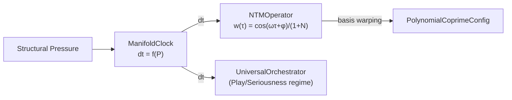

# Temporal Dynamics

> Negentropic developmental scaling and pressure-modulated manifold time.

---

## 1. NTMOperator (Negentropic Trigonometric Manifold)

**Source**: [`src/core/negentropic_manifold.py`](../src/core/negentropic_manifold.py) (66 lines)

Governs the "Negentropic Trunk" — developmental scaffolding that modulates polynomial basis frequencies as the system matures.

### Basis Warping

$$w_j(\tau) = \frac{\cos(\omega_j \cdot \tau + \phi_j)}{1 + \bar{N}}$$

where $\bar{N}$ = mean negentropy (informational density).

| Buffer | Shape | Purpose |
|--------|-------|---------|
| `tau` | scalar | Asymptotic clock (monotonically increases) |
| `frequencies` | `[D+1]` | Harmonic diversity: `linspace(0.5, 2.5)` |
| `phases` | `[D+1]` | Random phase offsets φ_j |

**Key behavior**: As negentropy increases (system matures), amplitude damping `1/(1+N)` reduces oscillation → basis stabilizes → "saturation."

### Asymptotic State

`get_asymptotic_state()` returns:
- `asymptotic_time_tau`: current τ
- `structural_heat`: `exp(-0.05τ)` — entropy dissipation rate (decays with maturity)

---

## 2. ManifoldClock

**Source**: [`src/core/manifold_time.py`](../src/core/manifold_time.py) (124 lines)

Implements **Breathing Time** where the coordinate time step `dt` is pressure-modulated:

$$dt = dt_{\text{base}} \cdot \frac{\text{Play}}{1 + \text{Seriousness}}$$

### Thermodynamic Mapping

| Regime | Pressure | dt | β (inverse temp) | Behavior |
|--------|----------|-----|-------------------|----------|
| Play | Low | Large | Low | Playful flux, exploration |
| Seriousness | High | Small | High | Structural freezing, care |

$$\text{Seriousness} = \tanh(\lambda_s \cdot P), \quad \text{Play} = e^{-\lambda_p \cdot P}$$

### Constructor Parameters

| Parameter | Default | Purpose |
|-----------|---------|---------|
| `dt_base` | 1.0 | Default time step |
| `dt_min` | 0.001 | Floor (prevents total freeze) |
| `dt_max` | 2.0 | Ceiling (prevents instability) |
| `λ_seriousness` | 2.0 | Sensitivity to pressure |
| `λ_play` | 0.5 | Sensitivity to smoothness |

### State Tracking

| Buffer | Purpose |
|--------|---------|
| `coordinate_time` | Accumulated dt (variable-rate) |
| `proper_time` | Constant increments (+1 per tick) |
| `current_dt` | Most recent dt |
| `accumulated_seriousness` | ∫ Seriousness · dt |
| `accumulated_play` | ∫ Play · dt |

**The "Watts Move"**: Take the universe seriously enough to dance (fine steps), not seriously enough to freeze (infinite steps).

---

## 3. Connection

