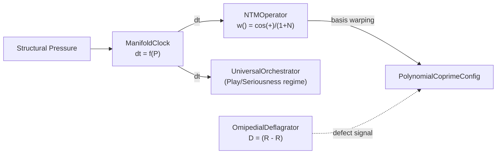

# Temporal Dynamics

> Negentropic developmental scaling and pressure-modulated manifold time.

---

## 1. NTMOperator (Negentropic Trigonometric Manifold)

**Source**: [`src/core/negentropic_manifold.py`](../src/core/negentropic_manifold.py) (66 lines)

Governs the "Negentropic Trunk"  developmental scaffolding that modulates polynomial basis frequencies as the system matures.

### Basis Warping

$$w_j(\tau) = \frac{\cos(\omega_j \cdot \tau + \phi_j)}{1 + \bar{N}}$$

where $\bar{N}$ = mean negentropy (informational density).

| Buffer | Shape | Purpose |
|--------|-------|---------|
| `tau` | scalar | Asymptotic clock (monotonically increases) |
| `frequencies` | `[D+1]` | Harmonic diversity: `linspace(0.5, 2.5)` |
| `phases` | `[D+1]` | Random phase offsets _j |

**Key behavior**: As negentropy increases (system matures), amplitude damping `1/(1+N)` reduces oscillation  basis stabilizes  "saturation."

### Negentropy Flux Tripsody
The negentropy flux doesn't just scale variables; it exhibits a **tripsody**  a tripartite rhapsodic oscillation. As negentropy increases, the flux induces temporary phase-locking, slowing down the scaffold mutation and allowing the polynomial basis to traverse topological singularities safely before expanding again.

### Asymptotic State

`get_asymptotic_state()` returns:
- `asymptotic_time_tau`: current 
- `structural_heat`: `exp(-0.05)`  entropy dissipation rate (decays with maturity)

---

## 2. ManifoldClock

**Source**: [`src/core/manifold_time.py`](../src/core/manifold_time.py) (124 lines)

Implements **Breathing Time** where the coordinate time step `dt` is pressure-modulated:

$$dt = dt_{\text{base}} \cdot \frac{\text{Play}}{1 + \text{Seriousness}}$$

### Thermodynamic Mapping

| Regime | Pressure | dt |  (inverse temp) | Behavior |
|--------|----------|-----|-------------------|----------|
| Play | Low | Large | Low | Playful flux, exploration |
| Seriousness | High | Small | High | Structural freezing, care |

$$\text{Seriousness} = \tanh(\lambda_s \cdot P), \quad \text{Play} = e^{-\lambda_p \cdot P}$$

### Constructor Parameters

| Parameter | Default | Purpose |
|-----------|---------|---------|
| `dt_base` | 1.0 | Default time step |
| `dt_min` | 0.001 | Floor (prevents total freeze) |
| `dt_max` | 2.0 | Ceiling (prevents instability) |
| `_seriousness` | 2.0 | Sensitivity to pressure |
| `_play` | 0.5 | Sensitivity to smoothness |

### State Tracking

| Buffer | Purpose |
|--------|---------|
| `coordinate_time` | Accumulated dt (variable-rate) |
| `proper_time` | Constant increments (+1 per tick) |
| `current_dt` | Most recent dt |
| `accumulated_seriousness` |  Seriousness  dt |
| `accumulated_play` |  Play  dt |

**The "Watts Move"**: Take the universe seriously enough to dance (fine steps), not seriously enough to freeze (infinite steps).

---

## 3. Connection

```mermaid
graph LR
    P["Structural Pressure"] --> MC["ManifoldClock<br/>dt = f(P)"]
    MC -->|dt| NTM["NTMOperator<br/>w() = cos(+)/(1+N)"]
    NTM -->|basis warping| POLY["PolynomialCoprimeConfig"]
    MC -->|dt| ORCH["UniversalOrchestrator<br/>(Play/Seriousness regime)"]
    DEFLAG["OmipedialDeflagrator<br/>D = (R - R)"] -.->|defect signal| POLY
```

---

## 4. Omipedial Deflagration Scout

**Source**: [`src/core/deflagration_scout.py`](../src/core/deflagration_scout.py) (66 lines)

Implements "Omipedial Interstitiality"  **defect scouting** that amplifies sparse anomalies and enables signal propagation across topological gaps.

### Defect Detection

$$\Delta D_i = \sum_j (R_{ij} - \hat{R}_{ij})$$

Where $R_{ij}$ is the actual resonance flux and $\hat{R}_{ij}$ is the predicted/expected flux. High $\Delta D_i$ = anomaly = amplified.

### Omipedial Jump

When the ley line potential exceeds the jump threshold ($> 0.8$), the scout enables **topological shortcuts**  signal propagation across holes where resonance potential is high but adjacency is sparse.

| Parameter | Default | Purpose |
|-----------|---------|---------|
| `threshold_jump` | 0.8 | Minimum ley potential for topological shortcut |
| `amplification` | 2.0 | Anomaly amplification factor |

### Connection to Polynomial Scaffold

> **Implementation Note**: The defect signal $\Delta D_i$ feeds into the `ValenceFunctional` as `current_pressure`, which computes Manifold Hunger. This hunger tensor is then passed to `PolynomialADMRSolver.fractional_stochastic_differential_step()` where it modulates the distributed fractional order $\alpha(k)$ per coprime functional channel. The fractional order mapping $\alpha(k) = 0.5 + 0.5\cos(2\pi k/K)$ ensures low-frequency concepts update near-Markovianly while high-frequency anomalies experience viscoelastic drag via the Riemann-Liouville kernel. When hunger is high, $\alpha$ shifts toward 1.0 across all channels, accelerating updates. See `admr_solver.py:fractional_stochastic_differential_step()` and `valence_drive.py`. The original integer-order `stochastic_differential_step()` remains available as a fallback.
