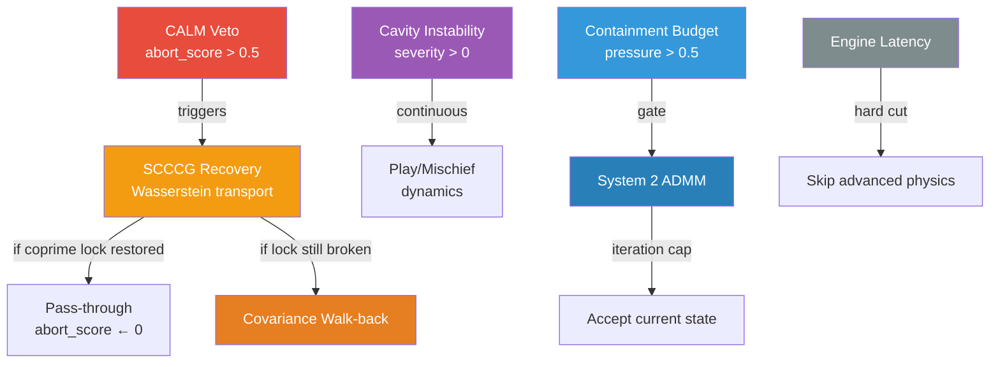

# Veto Subspace Architecture

> How 8 veto/budget systems form a coherent agentic subspace without blowing efficiency budgets.

---

## 1. Design Principle

Vetoes in this system are **not kill-switches**. Each veto is a dimensionally-isolated structural signal that lives in its own subspace of the state manifold. They compose through a recovery lattice, not a priority stack. No veto has authority to halt the system — it can only redirect flow into a recovery pathway.

> [!IMPORTANT]
> **Anti-teleological compliance**: Vetoes detect structural collapse, not "bad outputs." A high abort score means the manifold is disintegrating, not that the answer is wrong.

---

## 2. Veto Taxonomy

### 2.1 Trajectory-Level (predict before it happens)

| System | Source | Trigger | Response |
|--------|--------|---------|----------|
| **CALM veto** | [`surrogates/calm_predictor.py`](../src/surrogates/calm_predictor.py) | `abort_score > 0.5` (Transformer predicts collapse) | Redirect to SCCCG speculative recovery |
| **Ley Line veto** | [`training/trainer.py`](../src/training/trainer.py) | Deviation from resonance streamlines | Prune parameter update |

**CALM** is a 2-layer Transformer with 3 output heads (abort, rho, step). Cost: O(history_len² · dim) — negligible against the main forward pass. It watches the last 8 states and predicts whether the next step will disintegrate the manifold.

**Ley Line** operates during training only. It projects proposed updates onto resonance streamlines (see [RELATIONAL_DYNAMICS.md](RELATIONAL_DYNAMICS.md)) and prunes the component orthogonal to the streamline.

### 2.2 Topology-Level (detect after it happens)

| System | Source | Trigger | Response |
|--------|--------|---------|----------|
| **SCCCG abort** | [`core/speculative_coprime_gate.py`](../src/core/speculative_coprime_gate.py) | Chiral coherence < threshold OR coprime lock broken | Wasserstein optimal transport recovery |
| **Covariance abort** | [`topology/gyroid_covariance.py`](../src/topology/gyroid_covariance.py) | Norm blowup > 1.5 OR reciprocity failure | Walk-back: revert and choose different path |
| **Cavity instability** | [`models/resonance_cavity.py`](../src/models/resonance_cavity.py) | instability_severity ∈ [0, 1] | Inject mischief to break attractor lock-in |

**SCCCG** checks coprime parity via O(num_heads) GCD operations. If parity breaks, it runs Wasserstein transport to move the state distribution back toward a reference manifold. This is the most expensive recovery pathway (~200 FLOPs per head).

**Covariance** uses abort-recovery: "walk back and choose differently." If reciprocity fails > 5 times in a sequence, the entire exploration is flagged as unstable.

**Cavity** produces a continuous instability signal [0, 1] rather than a binary veto. High instability biases the system toward "play" dynamics (see [TEMPORAL_DYNAMICS.md](TEMPORAL_DYNAMICS.md)).

### 2.3 Budget-Level (don't overspend)

| System | Source | Trigger | Response |
|--------|--------|---------|----------|
| **Containment budget** | [`models/gyroid_reasoner.py`](../src/models/gyroid_reasoner.py) | topological_pressure > 0.5 | Activate System 2 (ADMM repair) |
| **ADMM repair budget** | [`optimization/operational_admm.py`](../src/optimization/operational_admm.py) | Fixed iteration cap reached | Return repair tokens, accept current state |
| **Engine latency** | [`ui/diegetic_backend.py`](../src/ui/diegetic_backend.py) | Wall-clock time > latency budget | Skip advanced physics, return `budget_abort: true` |

Budget vetoes are **gates, not signals**. They either enable or disable more expensive computation. The containment budget gate activates System 2 only when System 1 (fast path) reports structural pressure above 0.5. The engine latency gate hard-cuts advanced physics (quantum/polytope) when interactive latency is at risk.

---

## 3. Recovery Lattice

Vetoes don't operate independently — they form a directed recovery graph:



### Composition Rules

1. **CALM → SCCCG**: CALM's abort score is passed directly to `SpeculativeCoprimeGate.forward()`. If SCCCG recovers coprime lock, it **overrides** the CALM abort: `abort_score = 0.0`
2. **Budget gates are binary**: containment and engine latency don't participate in the recovery lattice — they enable/disable entire computational pathways
3. **Cavity instability is continuous**: it doesn't veto anything, but modulates the play/seriousness ratio via `ManifoldClock` pressure

---

## 4. Efficiency Contracts

| System | Cost | When | Budget Impact |
|--------|------|------|--------------|
| CALM | O(8² · dim) | Every step | < 1% of forward pass |
| SCCCG coprime check | O(num_heads) GCDs | Every step | Negligible |
| SCCCG recovery | O(N² · Sinkhorn_iters) | Only on abort | Amortized < 5% |
| Covariance walk-back | O(dim²) per retry | Max 5 retries | Bounded |
| Cavity instability | O(1) read | Every step | Zero extra compute |
| Containment gate | O(1) comparison | Every step | Zero extra compute |
| ADMM repair | O(iterations · dim²) | Only when gated in | Iteration-capped |
| Engine latency | O(1) clock read | Every step | Zero extra compute |

**Total overhead in normal operation** (no vetoes triggered): CALM + SCCCG coprime check + 3× O(1) gates ≈ **< 2% of a forward pass**.

**Worst case** (full recovery cascade): CALM + SCCCG recovery + ADMM repair ≈ **one extra forward pass equivalent**, bounded by iteration caps.

---

## 5. BoundaryState

The [`BoundaryState`](../src/core/meta_polytope_matrioshka.py) class represents the state at which a veto activates — the boundary between stable and unstable regions of the polytope:

```python
class BoundaryState:
    alpha: int                    # Polytope face index where boundary was crossed
    level: int                    # Current Matrioshka shell depth
    max_level: int                # Maximum shell depth (escape ceiling)
    stress_tensor: Tensor         # Rank-2 anisotropic: Σ_ij = u_i · n_j
    crossing_energy: float        # Energy at boundary crossing
```

**Stress tensor** Σ_ij = u_i · n_j is the outer product of the state direction and the facet normal at the crossing point. The `from_crossing()` factory method constructs a `BoundaryState` from a crossing event. The `is_critical()` method checks if the stress norm exceeds a threshold OR if the shell depth has hit the escape ceiling.

---

## 6. Related Documentation

| Doc | Connection |
|-----|-----------|
| [PHYSICS_ADMM.md](PHYSICS_ADMM.md) | System 2 ADMM + CALM integration details |
| [SPECULATIVE_COPRIME_GATE.md](SPECULATIVE_COPRIME_GATE.md) | SCCCG recovery pipeline |
| [TEMPORAL_DYNAMICS.md](TEMPORAL_DYNAMICS.md) | ManifoldClock play/seriousness modulation |
| [GYROID_REASONER.md](GYROID_REASONER.md) | Containment budget and System 1→2 gating |
| [DIEGETIC_ENGINE.md](DIEGETIC_ENGINE.md) | Engine latency budget and advanced physics gating |

---

## 7. VetoSubspace Coordinator

**Implementation**: [`core/veto_subspace.py`](../src/core/veto_subspace.py)

The `VetoSubspace` class formalizes the recovery lattice as composable code. It wraps existing veto systems without replacing them.

### Type System

| Type | Purpose |
|------|---------|
| `VetoLevel` | Enum: `TRAJECTORY`, `TOPOLOGY`, `BUDGET` |
| `VetoSignal` | Typed signal with level, source, severity, and recovery flag |
| `RecoveryStatus` | Enum: `NO_VETO`, `RECOVERED`, `ESCALATED`, `BUDGET_SKIPPED`, `MODULATED` |
| `VetoResult` | Composed result with all signals, active count, and recovery status |

### evaluate() Pipeline

```
1. Collect trajectory signals (CALM abort_score, Ley Line deviation)
2. Collect topology signals (SCCCG coprime_lock, chiral_score, cavity, covariance)
3. Collect budget signals (containment pressure, engine latency)
4. Apply recovery lattice:  CALM → SCCCG → covariance walk-back
5. Return composed VetoResult
```

**Efficiency**: 3 float comparisons + 1 dataclass allocation per step. Zero parameters, zero learned weights.

**Integration**: Wired into [`GyroidicFluxReasoner.forward()`](../src/models/gyroid_reasoner.py) — result stored as `self._last_veto_result` for downstream diagnostic consumers.

---

## 8. Non-Commutativity Curvature

**Implementation**: [`core/noncommutativity_curvature.py`](../src/core/noncommutativity_curvature.py)

Computes the 2-form K = Σ κ_ij e_i∧e_j measuring update order dependence:

$$[A, B] = AB - BA, \quad \kappa = \tfrac{1}{2}([A,B] - [A,B]^\top)$$

| Method | Purpose |
|--------|---------|
| `compute_curvature(A, B)` | Full pipeline: commutator → antisymmetric extraction → Frobenius norm |
| `curvature_pressure(A, B)` | Convenience: returns σ(relative_curvature) ∈ [0, 1] as a veto signal |
| `compute_wedge_components(κ)` | Decompose into e_i ∧ e_j basis coefficients |

Tracks EMA of curvature for trend detection. Used as a structural signal by the `TriadicReciprocityCheck` in [`gyroid_covariance.py`](../src/topology/gyroid_covariance.py).

---

## 9. Feature Preservation via Sparse Polytope Projection

**Implementation**: [`core/feature_preservation.py`](../src/core/feature_preservation.py)

$$F^{(d)}_{\text{active}} = Q_\Delta\!\left(\frac{\partial^d x}{\partial f_i^d}\right) \quad \text{for } i \in \text{active\_facets}$$

Projects features onto learnable facet normals, computes quantized directional derivatives (orders 1–3), with trust-dependent step sizes:

- **High trust** → small Δ → features preserved at high resolution
- **Low trust** → large Δ → noise suppressed via coarse quantization
- **Auto-detection**: top 25% facets by projection magnitude
