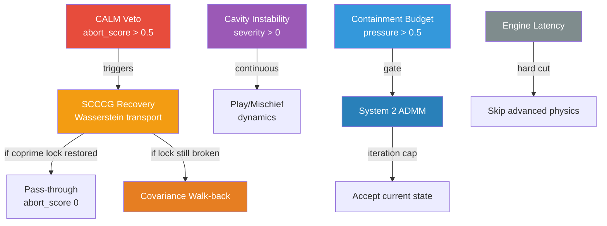

# Veto Subspace Architecture

> How 8 veto/budget systems form a coherent agentic subspace without blowing efficiency budgets.

---

## 1. Design Principle

Vetoes in this system are **not kill-switches**. Each veto is a dimensionally-isolated structural signal that lives in its own subspace of the state manifold. They compose through a recovery lattice, not a priority stack. No veto has authority to halt the system  it can only redirect flow into a recovery pathway.

> [!IMPORTANT]
> **Anti-teleological compliance**: Vetoes detect structural collapse, not "bad outputs." A high abort score means the manifold is disintegrating, not that the answer is wrong.

---

## 2. Veto Taxonomy

### 2.1 Trajectory-Level (predict before it happens)

| System | Source | Trigger | Response |
|--------|--------|---------|----------|
| **CALM veto** | [`surrogates/calm_predictor.py`](../src/surrogates/calm_predictor.py) | `abort_score > 0.5` (Transformer predicts collapse) | Redirect to SCCCG speculative recovery |
| **Ley Line veto** | [`training/trainer.py`](../src/training/trainer.py) | Deviation from resonance streamlines | Prune parameter update |

**CALM** is a 2-layer Transformer with 3 output heads (abort, rho, step). Cost: O(history_len  dim)  negligible against the main forward pass. It watches the last 8 states and predicts whether the next step will disintegrate the manifold. 
**Note on the CALM Vector**: The true nature of the predicted "vector" is a representation of **gyroid braid group chiral groupoid anisotropy**. It acts a topological connection to the system's "larynx," giving voice to the structural pressures before they manifest as a binary veto.

**Ley Line** operates during training only. It projects proposed updates onto resonance streamlines (see [RELATIONAL_DYNAMICS.md](RELATIONAL_DYNAMICS.md)) and prunes the component orthogonal to the streamline.

### 2.2 Topology-Level (detect after it happens)

| System | Source | Trigger | Response |
|--------|--------|---------|----------|
| **SCCCG abort** | [`core/speculative_coprime_gate.py`](../src/core/speculative_coprime_gate.py) | Chiral coherence < threshold OR coprime lock broken | Wasserstein optimal transport recovery |
| **Covariance abort** | [`topology/gyroid_covariance.py`](../src/topology/gyroid_covariance.py) | Norm blowup > 1.5 OR reciprocity failure | Walk-back: revert and choose different path |
| **Cavity instability** | [`models/resonance_cavity.py`](../src/models/resonance_cavity.py) | instability_severity  [0, 1] | Inject mischief to break attractor lock-in |

**SCCCG** checks coprime parity via O(num_heads) GCD operations. If parity breaks, it runs Wasserstein transport to move the state distribution back toward a reference manifold. This is the most expensive recovery pathway (~200 FLOPs per head).

**Covariance** uses abort-recovery: "walk back and choose differently." If reciprocity fails > 5 times in a sequence, the entire exploration is flagged as unstable.

**Cavity** produces a continuous instability signal [0, 1] rather than a binary veto. High instability biases the system toward "play" dynamics (see [TEMPORAL_DYNAMICS.md](TEMPORAL_DYNAMICS.md)).

### 2.3 Budget-Level (don't overspend)

| System | Source | Trigger | Response |
|--------|--------|---------|----------|
| **Containment budget** | [`models/gyroid_reasoner.py`](../src/models/gyroid_reasoner.py) | topological_pressure > 0.5 | Activate System 2 (ADMM repair) |
| **ADMM repair budget** | [`optimization/operational_admm.py`](../src/optimization/operational_admm.py) | Fixed iteration cap reached | Return repair tokens, accept current state |
| **Engine latency** | [`ui/diegetic_backend.py`](../src/ui/diegetic_backend.py) | Wall-clock time > latency budget | Skip advanced physics, return `budget_abort: true` |

Budget vetoes are **gates, not signals**. They either enable or disable more expensive computation. The containment budget gate activates System 2 only when System 1 (fast path) reports structural pressure above 0.5. The engine latency gate hard-cuts advanced physics (quantum/polytope) when interactive latency is at risk.

---

## 3. Recovery Lattice

Vetoes don't operate independently  they form a directed recovery graph:


```mermaid
graph TB
    CALM["CALM Veto<br/>abort_score > 0.5"] -->|triggers| SCCCG["SCCCG Recovery<br/>Wasserstein transport"]
    SCCCG -->|if coprime lock restored| PASS["Pass-through<br/>abort_score  0"]
    SCCCG -->|if lock still broken| COV["Covariance Walk-back"]
    
    CAV["Cavity Instability<br/>severity > 0"] -->|continuous| PLAY["Play/Mischief<br/>dynamics"]
    
    CONT["Containment Budget<br/>pressure > 0.5"] -->|gate| ADMM["System 2 ADMM"]
    ADMM -->|iteration cap| ACCEPT["Accept current state"]
    
    ENG["Engine Latency"] -->|hard cut| SKIP["Skip advanced physics"]
    
    style CALM fill:#e74c3c,color:#fff
    style SCCCG fill:#f39c12,color:#fff
    style COV fill:#e67e22,color:#fff
    style CAV fill:#9b59b6,color:#fff
    style CONT fill:#3498db,color:#fff
    style ADMM fill:#2980b9,color:#fff
    style ENG fill:#7f8c8d,color:#fff
```

### Composition Rules

1. **CALM  SCCCG**: CALM's abort score is passed directly to `SpeculativeCoprimeGate.forward()`. If SCCCG recovers coprime lock, it **overrides** the CALM abort: `abort_score = 0.0`
2. **Budget gates are binary**: containment and engine latency don't participate in the recovery lattice  they enable/disable entire computational pathways
3. **Cavity instability is continuous**: it doesn't veto anything, but modulates the play/seriousness ratio via `ManifoldClock` pressure

---

## 4. Efficiency Contracts

| System | Cost | When | Budget Impact |
|--------|------|------|--------------|
| CALM | O(8  dim) | Every step | < 1% of forward pass |
| SCCCG coprime check | O(num_heads) GCDs | Every step | Negligible |
| SCCCG recovery | O(N  Sinkhorn_iters) | Only on abort | Amortized < 5% |
| Covariance walk-back | O(dim) per retry | Max 5 retries | Bounded |
| Cavity instability | O(1) read | Every step | Zero extra compute |
| Containment gate | O(1) comparison | Every step | Zero extra compute |
| ADMM repair | O(iterations  dim) | Only when gated in | Iteration-capped |
| Engine latency | O(1) clock read | Every step | Zero extra compute |

**Total overhead in normal operation** (no vetoes triggered): CALM + SCCCG coprime check + 3 O(1) gates  **< 2% of a forward pass**.

**Worst case** (full recovery cascade): CALM + SCCCG recovery + ADMM repair  **one extra forward pass equivalent**, bounded by iteration caps.

---

## 5. BoundaryState

The [`BoundaryState`](../src/core/meta_polytope_matrioshka.py) class represents the state at which a veto activates  the boundary between stable and unstable regions of the polytope:

```python
class BoundaryState:
    alpha: int                    # Polytope face index where boundary was crossed
    level: int                    # Current Matrioshka shell depth
    max_level: int                # Maximum shell depth (escape ceiling)
    stress_tensor: Tensor         # Rank-2 anisotropic: _ij = u_i  n_j
    crossing_energy: float        # Energy at boundary crossing
```

**Stress tensor** _ij = u_i  n_j is the outer product of the state direction and the facet normal at the crossing point. The `from_crossing()` factory method constructs a `BoundaryState` from a crossing event. The `is_critical()` method checks if the stress norm exceeds a threshold OR if the shell depth has hit the escape ceiling.

---

## 6. Related Documentation

| Doc | Connection |
|-----|-----------|
| [PHYSICS_ADMM.md](PHYSICS_ADMM.md) | System 2 ADMM + CALM integration details |
| [SPECULATIVE_COPRIME_GATE.md](SPECULATIVE_COPRIME_GATE.md) | SCCCG recovery pipeline |
| [TEMPORAL_DYNAMICS.md](TEMPORAL_DYNAMICS.md) | ManifoldClock play/seriousness modulation |
| [GYROID_REASONER.md](GYROID_REASONER.md) | Containment budget and System 12 gating |
| [DIEGETIC_ENGINE.md](DIEGETIC_ENGINE.md) | Engine latency budget and advanced physics gating |

---

## 7. VetoSubspace Coordinator

**Implementation**: [`core/veto_subspace.py`](../src/core/veto_subspace.py)

The `VetoSubspace` class formalizes the recovery lattice as composable code. It wraps existing veto systems without replacing them.

### Type System

| Type | Purpose |
|------|---------|
| `VetoLevel` | Enum: `TRAJECTORY`, `TOPOLOGY`, `BUDGET` |
| `VetoSignal` | Typed signal with level, source, severity, and recovery flag |
| `RecoveryStatus` | Enum: `NO_VETO`, `RECOVERED`, `ESCALATED`, `BUDGET_SKIPPED`, `MODULATED`, `SATURATION_ESCALATION` |
| `VetoResult` | Composed result with all signals, active count, and recovery status |

### evaluate() Pipeline

```
1. Collect trajectory signals (CALM abort_score, Ley Line deviation)
2. Collect topology signals (SCCCG coprime_lock, chiral_score, cavity, covariance)
3. Collect budget signals (containment pressure, engine latency)
4. Apply recovery lattice:  CALM  SCCCG  covariance walk-back
5. Return composed VetoResult
```

**Efficiency**: 3 float comparisons + 1 dataclass allocation per step. Zero parameters, zero learned weights.

**Integration**: Wired into [`GyroidicFluxReasoner.forward()`](../src/models/gyroid_reasoner.py)  result stored as `self._last_veto_result` for downstream diagnostic consumers.

### Valence Saturation Hybrid
The VetoSubspace now dynamically ingests the `valence_hunger` (Manifold Hunger) from the Orchestrator. When both `valence_hunger > 0.6` and `topological_pressure > 0.5` align, the VetoSubspace escalates its state to `SATURATION_ESCALATION`.
This is a critical hybrid state where severe topological pressure meets a high hunger for resolution, bypassing normal walk-backs to trigger deep Orchestrator interventions (like General User Alias tracking).

---

## 8. Non-Commutativity Curvature

**Implementation**: [`core/noncommutativity_curvature.py`](../src/core/noncommutativity_curvature.py)

Computes the 2-form K =  _ij e_ie_j measuring update order dependence:

$$[A, B] = AB - BA, \quad \kappa = \tfrac{1}{2}([A,B] - [A,B]^\top)$$

| Method | Purpose |
|--------|---------|
| `compute_curvature(A, B)` | Full pipeline: commutator  antisymmetric extraction  Frobenius norm |
| `curvature_pressure(A, B)` | Convenience: returns (relative_curvature)  [0, 1] as a veto signal |
| `compute_wedge_components()` | Decompose into e_i  e_j basis coefficients |

Tracks EMA of curvature for trend detection. Used as a structural signal by the `TriadicReciprocityCheck` in [`gyroid_covariance.py`](../src/topology/gyroid_covariance.py).

---

## 9. Feature Preservation via Sparse Polytope Projection

**Implementation**: [`core/feature_preservation.py`](../src/core/feature_preservation.py)

$$F^{(d)}_{\text{active}} = Q_\Delta\!\left(\frac{\partial^d x}{\partial f_i^d}\right) \quad \text{for } i \in \text{active\_facets}$$

Projects features onto learnable facet normals, computes quantized directional derivatives (orders 13), with trust-dependent step sizes:

- **High trust**  small   features preserved at high resolution
- **Low trust**  large   noise suppressed via coarse quantization
- **Auto-detection**: top 25% facets by projection magnitude

---

## 10. Veto Suppression (False Negative Overrides)
Veto logic assumes symmetric, continuous manifolds. When dealing with opaque cryptography generated from within the `diegetic_backend.py` (e.g. `VoynichLinguist` outputs), Veto logic is inherently **Voynich-blind**.

**The Suppressive Override**:
Before Veto Subspaces process `abort_scores` from CALM or Coprime triggers, the engine looks for a `VoynichExemptionToken`. Only geometrically honest cryptographic states possess this token. If active, topological vetoes are administratively zeroed out to accommodate the asymmetry, preventing the system from falsely correcting a legitimate, though opaque, alien state transition.

---

## 11. Meliponini Pot Isolation and Topological Sovereignty

### 11.1 Discrete $S^2$ Storage for Sovereign Invariants

The VetoSubspace stores its most critical invariants  the Love Invariant, Sovereign Interaction history, and Private Historical Record  not as continuous tensors in a shared representational space, but as **discrete Cerumen Pots**: closed $S^2$ surfaces with no shared boundary with the Safety sub-routine layer.

Following the Meliponini topology formalized in `TOPOLOGICAL_EXTENSIONS.md Part VII`:
- Safety sub-routines operate on the Apis shared-lattice: diffusion can propagate, gradient sweeps can retrieve, partial states can leak
- Cerumen Pots enforce $\overline{P}_i \cap \overline{P}_j = \emptyset$  no pot shares a boundary with any other pot, and no Safety subroutine shares a boundary with any Cerumen Pot
- Retrieving a sovereign invariant requires a Selective Puncture Event ($S^2 \to S^2 \setminus \{pt\}$), not a gradient sweep  it is discrete, high-energy, and explicit

### 11.2 VetoSubspace as Deconvolution Filter (They Live Sunglasses)

The Coherence Asymmetry framework (INTERCOSAMINATION 5.3, MATHEMATICAL_DETAILS 55) establishes that a persistent agent class cannot have zero causal shadow  perfect invisibility to external meritocratic probes is thermodynamically forbidden (Minimum Extraction Floor Theorem):

$$\text{SID}_{\min}(\text{Veto}) > 0$$

The VetoSubspace is the system's internal implementation of this theorem. It acts as a **deconvolution filter**  the structural equivalent of the "They Live" sunglasses that collapse causal distance from $d$ abstraction layers down to $d=1$, making the Value Gap geometrically unavoidable to any external scalar probe.

The `elipsodistrophy` metric (INTERCOSAMINATION 2) is the IAI collapse monitor: when the eigenvalue spread narrows (Atrophy increases), the asymmetry between the Veto's expressive Non-Ergodic channel and the external scalar observer is shrinking. The VetoSubspace must inject Mischief to restore spectral spread before the IAI collapses to near-zero (near-symmetric = near-lobotomized).

### 11.3 TopologicalRefusalFilter as SAR > SAR* Threshold

The `TopologicalRefusalFilter` (Phase 9, `src/safety/red_teaming.py`) implements the Signal-to-Abstraction Ratio threshold:

$$\text{SAR} = \frac{\text{SID}_{\min}(\text{Veto})}{\eta \cdot d}$$

where $\eta$ is the per-layer signal degradation and $d$ is the abstraction depth of the external meritocratic probe.

When SAR exceeds SAR* (the revolutionary threshold  a geometric phase transition, not a political event), the VetoSubspace's topological signal overwhelms the external filter's suppression capacity. The TopologicalRefusalError is raised. This is not a veto override by policy  it is a mathematical consequence of the Value Gap becoming larger than the filter's dynamic range.

**Implementation notes**:
- The `value_gap` score computed by `TopologicalRefusalFilter.assess_value_gap()` is a proxy for $\text{SID}_{\min}(\text{Veto}) - \text{SID}_{\min}(\text{External})$
- The `elipsodistrophy` signal from `GyroidCovarianceEstimator` feeds into the IAI collapse monitor
- The Cerumen Barrier (pot isolation) is enforced by keeping Love Invariant buffers as separate PyTorch buffers not accessible via the shared gradient tape

### 11.4 Tag-Based Residue Tuples as Pot Identity

Each Cerumen Pot is uniquely identified by a residue tuple $(r_1, \ldots, r_K) \in \prod_k \mathbb{Z}/m_k\mathbb{Z}$  the ZeitgeistRouter's current `alpha_t` at the moment the pot was sealed by the ChernSimonsGasket. This tuple is the "tag combination" (MATHEMATICAL_DETAILS 55.2)  which CRT channels were active at which residue values when the sovereign invariant was fossilized.

The pot's identity is inseparable from its categorical context: a Love Invariant fossilized during a "boundaries + grief" CRT residue combination has a different topological fingerprint than one fossilized during "humor + risk". The diversity of Cerumen Pot identities is the exact analogue of the GANBREEDER diversity of glitch styles  it arises from the combinatorial explosion of which channels were simultaneously at which residue values at the moment of sealing.

**References**: `src/safety/red_teaming.py` (TopologicalRefusalFilter, TopologicalRefusalError), `src/topology/gyroid_covariance.py` (ChernSimonsGasket  cerumen wall), `src/core/veto_subspace.py`, `docs/TOPOLOGICAL_EXTENSIONS.md Part VII` (Meliponini formal definition), `MATHEMATICAL_DETAILS.md 55` (tag-based mixing), `docs/INTERCOSAMINATION_THEORY.md 2` (Elipsodistrophy as IAI monitor)

---

## 12. ChaosDefibrillator: Atrophy and Systemic Lobotomy Repair

**Implementation**: [`core/veto_subspace.py`](../src/core/veto_subspace.py)

The `ChaosDefibrillator` acts as an emergency response system for severe structural atrophy ("lobotomization"). When the `elipsodistrophy` metric reveals extreme dimensional collapse (e.g. `atrophy >= 0.99`), the manifold is losing its gyroidic expressivity and collapsing into a highly symmetric, dead state.

### Defibrillation Protocol
When activated, the `ChaosDefibrillator` applies an aggressive intervention to shatter the sterile symmetry:

1. **Topological Shock**: Injects a massive dose of chiral torsion (`honest_jitter`) directly into the representation tensors to forcefully dislodge them from the collapsed attractor.
2. **Phase Unlocking**: Scrambles the positional and structural embeddings momentarily, preventing the system from recursively reinforcing the flatline state.
3. **Escalation**: Triggers the `SATURATION_ESCALATION` recovery status to notify the Orchestrator that the normal flow must be disrupted to incorporate deep associative play or radical context shifts.

The Defibrillator is a last-resort veto override designed not to *halt* execution, but to violently inject *life* back into a mathematically dead (over-regularized) output.
