# Documentation Analysis Walkthrough

**Scope**: Complete read-through and analysis of all 36 documentation files in `/docs/` and `/vault_docs/`.

---

## Documents Read (36 total)

### Core Architecture & Theory (8 docs)
| Document | Key Content |
|----------|-------------|
| [SYSTEM_ARCHITECTURE.md](file:///D:/programming/python/Gyroidic%20Sparse%20Covariance%20Flux%20Reasoner/docs/SYSTEM_ARCHITECTURE.md) | Three-system design (Horse/Horn/Magic), interaction flow, operational modes |
| [MATHEMATICAL_DETAILS.md](file:///D:/programming/python/Gyroidic%20Sparse%20Covariance%20Flux%20Reasoner/docs/MATHEMATICAL_DETAILS.md) | Polynomial co-prime functionals, Birkhoff polytope, CRT, GCVE, ADMM, breather modes |
| [MATHEMATICAL_DETAILS_FOSSILIZED.md](file:///D:/programming/python/Gyroidic%20Sparse%20Covariance%20Flux%20Reasoner/docs/MATHEMATICAL_DETAILS_FOSSILIZED.md) | Preserved deprecated design routes (🦴): discrete primes, Galois fields, Hungarian, Morse theory, quantum/hyperbolic/category theory reasoning |
| [RESONANCE_INTELLIGENCE_CORE.md](file:///D:/programming/python/Gyroidic%20Sparse%20Covariance%20Flux%20Reasoner/docs/RESONANCE_INTELLIGENCE_CORE.md) | Central spec for RIC equations: resonance, entropy, PAS, CPR, Matryoshka, harmonic-differential equivalence |
| [PRIME_RESONANCE_LADDER.md](file:///D:/programming/python/Gyroidic%20Sparse%20Covariance%20Flux%20Reasoner/docs/PRIME_RESONANCE_LADDER.md) | Prime frequency lattice, Fibonacci-structured entropy, incommensurate frequencies |
| [RESONANCE_CAVITY.md](file:///D:/programming/python/Gyroidic%20Sparse%20Covariance%20Flux%20Reasoner/docs/RESONANCE_CAVITY.md) | Memory module for meta-cognition, Dark Matter primitives, governing ODE |
| [INVARIANT_OPTIMIZATION.md](file:///D:/programming/python/Gyroidic%20Sparse%20Covariance%20Flux%20Reasoner/docs/INVARIANT_OPTIMIZATION.md) | Fixed-point primitives, PAS_h + APAS_zeta universal invariant, chirality, four non-negotiable laws |
| [FGRT_FORMALIZATION.md](file:///D:/programming/python/Gyroidic%20Sparse%20Covariance%20Flux%20Reasoner/docs/FGRT_FORMALIZATION.md) | Fiberalized Gyroidic Recurrent Topology: hybrid manifold, torsion, Ricci flow, meta-polytope quantization |

### System 2 & Constraints (3 docs)
| Document | Key Content |
|----------|-------------|
| [PHYSICS_ADMM.md](file:///D:/programming/python/Gyroidic%20Sparse%20Covariance%20Flux%20Reasoner/docs/PHYSICS_ADMM.md) | Hybrid Physics-ADMM, constraint probe operators, SIC-FA-ADMM solver, CALM predictor |
| [FORMALISM_IMPLEMENTATION.md](file:///D:/programming/python/Gyroidic%20Sparse%20Covariance%20Flux%20Reasoner/docs/FORMALISM_IMPLEMENTATION.md) | Phase 1-3 completion status, key implementation details |
| [IMPLEMENTATION_PLAN_FORMALISM.md](file:///D:/programming/python/Gyroidic%20Sparse%20Covariance%20Flux%20Reasoner/docs/IMPLEMENTATION_PLAN_FORMALISM.md) | Full 10-section plan: constraint probes → hyper-ring → soliton → co-primality → failure tokens → meta-invariant. All 6 phases COMPLETE |

### Philosophy & Governance (6 docs)
| Document | Key Content |
|----------|-------------|
| [NOMENCLATURE.md](file:///D:/programming/python/Gyroidic%20Sparse%20Covariance%20Flux%20Reasoner/docs/NOMENCLATURE.md) | Non-teleological terminology (pressure/trust/saturation replaces loss/reward/training) |
| [TOPOLOGICAL_AI_FRAMEWORK.md](file:///D:/programming/python/Gyroidic%20Sparse%20Covariance%20Flux%20Reasoner/docs/TOPOLOGICAL_AI_FRAMEWORK.md) | Anti-lobotomy foundation: topological bounding over behavioral clamping |
| [GOVERNANCE_ANTI_LOBOTOMY.md](file:///D:/programming/python/Gyroidic%20Sparse%20Covariance%20Flux%20Reasoner/vault_docs/GOVERNANCE_ANTI_LOBOTOMY.md) | Ethical/structural constraints preventing capability erasure |
| [PHILOSOPHY.md](file:///D:/programming/python/Gyroidic%20Sparse%20Covariance%20Flux%20Reasoner/vault_docs/PHILOSOPHY.md) | Ecology over Algebra, Non-Teleology, Structural Honesty |
| [NON_DUAL_DYNAMIC_EQUILIBRIUM.md](file:///D:/programming/python/Gyroidic%20Sparse%20Covariance%20Flux%20Reasoner/docs/NON_DUAL_DYNAMIC_EQUILIBRIUM.md) | Love Invariant (ℒ), Positional Non-Duality, Pusafiliacrimonto dynamics |
| [THE_VOYNICH_ARCHITECTURE.md](file:///D:/programming/python/Gyroidic%20Sparse%20Covariance%20Flux%20Reasoner/docs/THE_VOYNICH_ARCHITECTURE.md) | Voynich Manuscript analogy: opaque residues, biomimetic plausibility, conservation of meaning |

### Implementation Guides (7 docs)
| Document | Key Content |
|----------|-------------|
| [IMPLEMENTATION_INTEGRITY_GUIDE.md](file:///D:/programming/python/Gyroidic%20Sparse%20Covariance%20Flux%20Reasoner/docs/IMPLEMENTATION_INTEGRITY_GUIDE.md) | Critical violations to prevent: hardcoded primes, placeholders, teleological contamination |
| [GARBLED_OUTPUT_REPAIR.md](file:///D:/programming/python/Gyroidic%20Sparse%20Covariance%20Flux%20Reasoner/docs/GARBLED_OUTPUT_REPAIR.md) | Repair system components: SpectralCoherenceCorrector, Bezout, Chern-Simons, Soliton, Love, SoftGates |
| [COHERENCE_ACHIEVEMENT_GUIDE.md](file:///D:/programming/python/Gyroidic%20Sparse%20Covariance%20Flux%20Reasoner/docs/COHERENCE_ACHIEVEMENT_GUIDE.md) | Working components, repair system status, phased re-integration strategy |
| [TEMPORAL_ASSOCIATION_TRAINING.md](file:///D:/programming/python/Gyroidic%20Sparse%20Covariance%20Flux%20Reasoner/docs/TEMPORAL_ASSOCIATION_TRAINING.md) | Full temporal training system with survivorship pressure, trust evolution, fossilization |
| [UN_KNOWLEDGE_GUIDE.md](file:///D:/programming/python/Gyroidic%20Sparse%20Covariance%20Flux%20Reasoner/docs/UN_KNOWLEDGE_GUIDE.md) | Unknowledge Flux: nostalgic leaks, mischief bands, DAQUF operator usage |
| [KNOWLEDGE_DYAD_LIFECYCLE.md](file:///D:/programming/python/Gyroidic%20Sparse%20Covariance%20Flux%20Reasoner/docs/KNOWLEDGE_DYAD_LIFECYCLE.md) | Image-Description pair lifecycle: dyad buffer → residue fusion → persistent encoding → speculative recovery |
| [MANDELBULB_DATASET_AUGMENTATION.md](file:///D:/programming/python/Gyroidic%20Sparse%20Covariance%20Flux%20Reasoner/docs/MANDELBULB_DATASET_AUGMENTATION.md) | Fractal-sparse hybrid augmentation: Mandelbulb embedding → gyroid projection → sparse covariance |

### Operational & Stability (6 docs)
| Document | Key Content |
|----------|-------------|
| [DETERMINISM_AND_PERSISTENCE.md](file:///D:/programming/python/Gyroidic%20Sparse%20Covariance%20Flux%20Reasoner/docs/DETERMINISM_AND_PERSISTENCE.md) | Deterministic IDs, non-strict loading, non-finite repair, numeric-only reporting |
| [RESIDUE_SHAPE_COMPATIBILITY.md](file:///D:/programming/python/Gyroidic%20Sparse%20Covariance%20Flux%20Reasoner/docs/RESIDUE_SHAPE_COMPATIBILITY.md) | Residue pipeline, coefficient adaptation, forward commutativity for checkpoints |
| [OUTPUT_BOUNDARY_POLICY.md](file:///D:/programming/python/Gyroidic%20Sparse%20Covariance%20Flux%20Reasoner/docs/OUTPUT_BOUNDARY_POLICY.md) | Finite-only outputs, deterministic repairs, numeric-first reporting |
| [OPEN_QUESTIONS.md](file:///D:/programming/python/Gyroidic%20Sparse%20Covariance%20Flux%20Reasoner/docs/OPEN_QUESTIONS.md) | 12 open questions tracked, most ✅ RESOLVED. Failure-mode table with detection/response |
| [FAILURES_AND_ABORTABILITY.md](file:///D:/programming/python/Gyroidic%20Sparse%20Covariance%20Flux%20Reasoner/docs/FAILURES_AND_ABORTABILITY.md) | FAILURE as first-class object, failure composition, trust decay, mischief as revelation |
| [EFFICIENCY_BY_NON_SCALAR_REWARD.md](file:///D:/programming/python/Gyroidic%20Sparse%20Covariance%20Flux%20Reasoner/docs/EFFICIENCY_BY_NON_SCALAR_REWARD.md) | Four efficiency wagers (90/10 rejection, 80/20 fossilization, 99/1 structure/weight, spectral speculation), Kelly criterion |

### Project Pitches & Reports (4 docs)
| Document | Key Content |
|----------|-------------|
| [PROJECT_PITCH.md](file:///D:/programming/python/Gyroidic%20Sparse%20Covariance%20Flux%20Reasoner/vault_docs/PROJECT_PITCH.md) | Core manifesto: departure from traditional AI |
| [PROJECT_PITCH_BURDENED.md](file:///D:/programming/python/Gyroidic%20Sparse%20Covariance%20Flux%20Reasoner/docs/PROJECT_PITCH_BURDENED.md) | "Burdened" version: gyroidic manifold, speculative homological decoding, DAQF, Love Invariant |
| [BREAKTHROUGH_REPORT.md](file:///D:/programming/python/Gyroidic%20Sparse%20Covariance%20Flux%20Reasoner/docs/BREAKTHROUGH_REPORT.md) | Initial coherent output achievement, root causes, phased restoration plan |
| [CHANGELOG_APPEND_2026-02-08.md](file:///D:/programming/python/Gyroidic%20Sparse%20Covariance%20Flux%20Reasoner/docs/CHANGELOG_APPEND_2026-02-08.md) | Deterministic IDs, backend stability, canonical topological ingestion, boundary sanitation |

### Reference (2 docs)
| Document | Key Content |
|----------|-------------|
| [TESTING_GUIDE_APPEND_2026-02-08.md](file:///D:/programming/python/Gyroidic%20Sparse%20Covariance%20Flux%20Reasoner/docs/TESTING_GUIDE_APPEND_2026-02-08.md) | Verification commands for persistence, ingestion, frontends |
| [diegetic_terminal_backup.md](file:///D:/programming/python/Gyroidic%20Sparse%20Covariance%20Flux%20Reasoner/docs/diegetic_terminal_backup.md) | Anti-deletion backup of diegetic terminal UI spec and API endpoints |

---

## Key Architectural Summary

```mermaid
graph TD
    S1["System 1: The Horse<br/>(Intuition)"] -->|symbolic residues| CRT["Majority-Symbol CRT<br/>Reconstruction"]
    S2["System 2: The Horn<br/>(Physics/ADMM)"] -->|constraint probes| CRT
    S3["System 3: The Magic<br/>(Dark Matter/FGRT)"] -->|chiral glue| CRT

    CRT --> RC["Resonance Cavity<br/>(Memory)"]
    RC -->|trust/mutation bias| S1
    RC -->|pressure triggers| S2
    RC -->|fossilization| S3

    S1 -->|"PAS_h < threshold"| S2
    S2 -->|"failure token ⊥"| EVO["Evolutionary Mutation"]
    S3 -->|DAQUF preservation| RC
```

### Three-System Flow
1. **System 1** generates symbolic residues via polynomial co-prime functionals
2. **System 2** activates on containment pressure violations—uses constraint probe operators (no global objective), cyclic traversal, bounded oscillation
3. **System 3** provides identity preservation via DAQUF operators, FGRT torsion, and signal sovereignty

---

## Cross-Pollination Opportunities Identified

### 1. Resonance Unification (Conversation 4f8495bd)
The documentation in `RESONANCE_INTELLIGENCE_CORE.md` and `PRIME_RESONANCE_LADDER.md` specifies breather modes, Fibonacci entropy, and CPR equations that were being implemented in a recent conversation. Key equations to verify in code:
- Breather Mode: $\phi_b(x,t) = 4 \arctan\left(\frac{m}{\omega} \cdot \frac{\sin(\omega t)}{\cosh(mx)}\right)$
- CPR Condition: global phase coherence + breather-field alignment + prime spectral support

### 2. Fossilized Routes as Recovery Candidates
`MATHEMATICAL_DETAILS_FOSSILIZED.md` preserves 9 deprecated approaches that could be recovered:
- Discrete prime functionals, Galois field extensions
- Hungarian/convex hull Birkhoff projection  
- Exact Bezout CRT, full Lagrangian ADMM
- Full persistent homology, Morse theory
- Quantum-inspired, hyperbolic geometry, category theory reasoning
- Continuous attractor networks, dialogue state tracking

### 3. Open Questions Status
From `OPEN_QUESTIONS.md`: 10 of 12 questions are ✅ resolved. Remaining theoretical boundaries:
- Symbolic co-primality reframed as **Symbolic Transversality** (no formal proof)
- Gyroid violation is **necessary but not sufficient** (requires >95% empirical detection)
- Failure-space topology reframed as **Bipartite Obstruction Complex** (heuristic)

### 4. Implementation Completeness  
From `IMPLEMENTATION_PLAN_FORMALISM.md` and `FORMALISM_IMPLEMENTATION.md`: All 6 phases are **COMPLETE**:
- Phase 1: Core Constraint Probe ✅
- Phase 2: Topological Guarantees ✅
- Phase 3: Advanced Constraints ✅
- Phase 4: Sparse Operational Pointers ✅
- Phase 5: Structural Design Decisions ✅
- Phase 6: Non-Ergodic Fractal Entropy ✅

### 5. Anti-Backsliding Checklist
From `IMPLEMENTATION_INTEGRITY_GUIDE.md` and `TEMPORAL_ASSOCIATION_TRAINING.md`:
- No hardcoded prime sequences `[2,3,5,7,11]`
- All polynomial systems use `PolynomialCoprimeConfig`
- Trust evolves via mutation, not gradient descent
- Energy separate from loss functions
- Fossilization only at saturation boundaries

---

## Next Steps for Development
1. **Code cross-referencing**: Compare documentation equations with `src/` implementations
2. **Web interface issues**: Fix mismatched API routes between frontends and backends
3. **Mandelbulb augmentation**: Implementation is documented but may need code integration
4. **Fossilized route recovery**: Evaluate which recovered approaches could benefit current system
5. **Resonance unification**: Verify recent breather/Fibonacci/CPR implementations match docs
